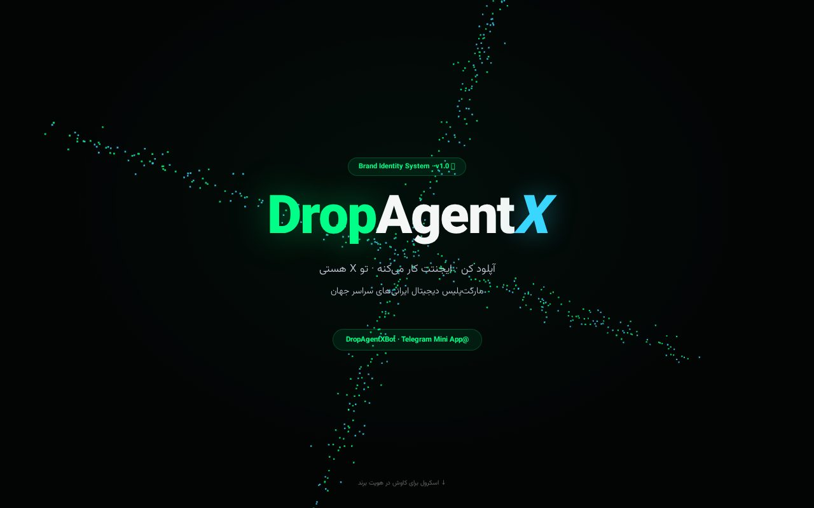
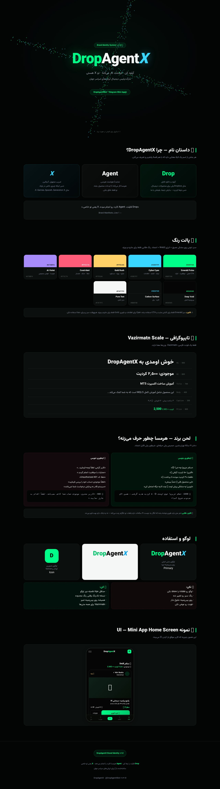

<div dir="rtl" align="right">

# DropAgentX — سیستم هویت برند (v1.0)

صفحه تعاملی هویت بصری **DropAgentX** (بات تلگرامی دراپ‌شیپینگ فارسی) در قالب **یک فایل HTML**:
داستان نام، پالت رنگ، تایپوگرافی وزیرمتن، لحن برند، راهنمای لوگو و نمونه UI مینی‌اپ —
با هیروی سه‌بعدی (ذرات شناور به شکل X با Three.js).

> **DropAgentX Brand Identity System** — a single-file interactive brand book:
> name story, color palette, Vazirmatn type scale, brand voice, logo usage and a
> mini-app UI sample, with a Three.js particle-X hero.



## ✨ بخش‌ها

| بخش | محتوا |
|---|---|
| 🌀 هیرو سه‌بعدی | ۶۰۰ ذره شناور به شکل X، واکنش‌گرا به موس (Three.js) |
| 📖 داستان نام | Drop + Agent + X |
| 🎨 پالت رنگ | Emerald Pulse، Cyber Cyan، Gold Rush، Coral Alert، AI Violet + رنگ‌های تیره |
| ✍️ تایپوگرافی | مقیاس کامل فونت وزیرمتن |
| 🗣️ لحن برند | مثال‌های «بگو / نگو» برای هرمسا (دستیار هوش مصنوعی) |
| 🟢 لوگو و استفاده | نسخه اصلی، روشن و آیکون + قوانین استفاده |
| 📱 نمونه UI | موکاپ صفحه خانه مینی‌اپ تلگرام |



## 🚀 اجرا

بدون هیچ وابستگی — فقط فایل را باز کنید:

```bash
# راه ۱: مستقیم در مرورگر
open index.html

# راه ۲: سرور استاتیک
python3 -m http.server 8000
```

> کتابخانه Three.js و فونت وزیرمتن از CDN بارگذاری می‌شوند؛ اگر CDN در دسترس
> نباشد، هیروی سه‌بعدی graceful رد می‌شود و بقیه صفحه کامل کار می‌کند.

## 🛠 تغییرات فنی این نسخه (polish)

- `brand-identity.html` → `index.html` (سرو از روت + آماده GitHub Pages)
- رفع ۲ ارجاع خراب به `/app/assets/logo.jpg` (فایل هیچ‌وقت در ریپو نبود؛ 404):
  جایگزینی با آواتار inline سازگار با برند
- گارد `typeof THREE` برای هیروی سه‌بعدی (خرابی CDN دیگر صفحه را نمی‌شکند)

## 📄 لایسنس

MIT — فایل [LICENSE](LICENSE) را ببینید.

</div>
