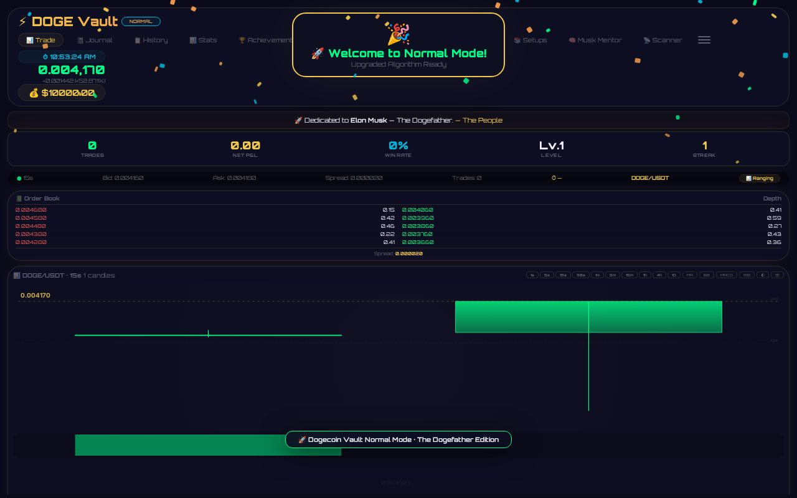
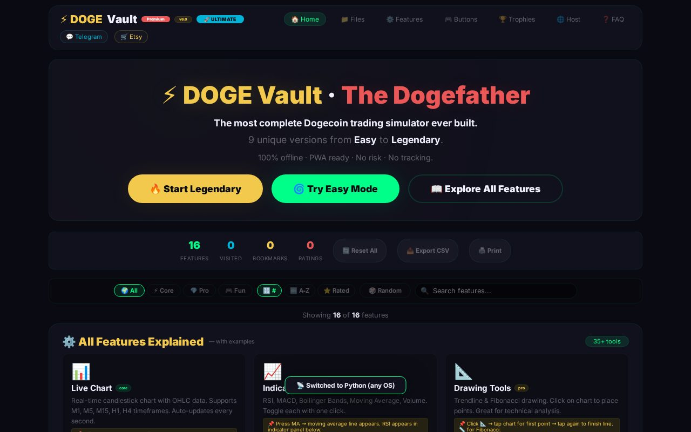
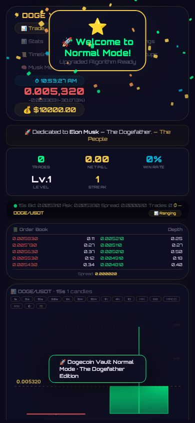
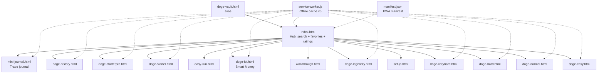

# 🐕 DOGE Vault Premium — 9 Trading Simulators in One PWA

<div align="center">


**Nine offline Dogecoin trading simulators — from Easy to Legendary — plus journal, academy, and gamification. No server. No build. No dependencies.**

[🚀 **Live Demo**](https://imxforever.github.io/DOGE/) *(enable Pages — see below)*

</div>

<p align="center">
  
</p>
<p align="center">
  
  
</p>

## ✨ Features

| | |
|---|---|
| 🎮 **9 simulators** | Easy → Normal → Hard → VeryHard → Legendary + ICT (Smart Money) + Starter I/II + History mode |
| 📊 **Real sim engine** | Live tick simulation, multi-timeframe candles, order book + depth, spread, P&L, win-rate |
| 🧠 **Musk Mentor + Scanner** | Pattern detection, mentor guidance feed, market scanner |
| 📓 **Trade journal** | Log trades with notes/screenshots, tags, strategies, daily notes, psychology log |
| 🏆 **Gamification** | XP levels, streaks, achievements, Elon-signal events, confetti 🎉 |
| 📱 **True PWA** | Installable, works fully offline (service worker v5), app shortcuts |
| 🔍 **Hub** | Search, favorites, ratings, visit tracking across everything |

## 🎮 The 9 dashboards

| # | Page | Mode |
|---|---|---|
| 1 | `doge-starter.html` | 🟢 Starter trainer |
| 2 | `doge-starterpro.html` | 🟢 Starter Pro (120+ features) |
| 3 | `doge-easy.html` | 🟢 Easy |
| 4 | `doge-normal.html` | 🟡 Normal |
| 5 | `doge-hard.html` | 🟠 Hard |
| 6 | `doge-veryhard.html` | 🔴 Very Hard (RTM Pro) |
| 7 | `doge-legendry.html` | 🟣 Legendary (RTM Pro PWA) |
| 8 | `doge-ict.html` | 🔵 ICT Smart Money Concepts |
| 9 | `doge-history.html` | 📜 History mode |
| + | `mini-journal.html` | 📓 Standalone trade journal |
| + | `index.html` | 🏠 Hub · `setup.html` guide · `walkthrough.html` academy · `easy-run.html` quick start |

## 🚀 Run

**Option A — GitHub Pages (1 minute, free):** Settings → Pages → Deploy from branch → `main` / root → open `https://imxforever.github.io/DOGE/`

**Option B — locally:**

```bash
git clone https://github.com/ImXforever/DOGE.git
cd DOGE
python3 -m http.server 8000
# → http://localhost:8000
```

> 📲 On the live site you can **Install App** (floating button, Chromium) — full offline afterwards.

## 🏗 Architecture



Every page is a **self-contained single file** (HTML+CSS+JS, zero dependencies) sharing one PWA shell: `localStorage` for persistence, canvas for charts, service worker for offline.

## 📁 Repository layout

```
├── index.html              🏠 hub (1.7K lines)
├── doge-easy|normal|hard|veryhard|legendry|history.html   🎮 6 full sims (~4.9K lines each)
├── doge-ict.html           🔵 smart-money sim (3.1K)
├── doge-starterpro.html    🟢 pro trainer (3.4K)
├── doge-starter.html       🟢 trainer (939)
├── mini-journal.html       📓 journal (1.1K)
├── setup|walkthrough|easy-run.html   📚 guides + academy
├── doge-vault.html         🔗 backwards-compatible alias → index
├── service-worker.js       📦 fault-tolerant offline cache (v5)
├── manifest.json           📱 PWA manifest + shortcuts
├── doge-config.json        ⚙️ shared config
├── assets/                 🖼️ screenshots
└── LICENSE                 📄 MIT
```

~52K lines · 25 files · 100% vanilla · 0 dependencies · 0 console errors.

## 🛠 Debug v1.1 — what was fixed

Audited + fixed with automated QA (15/15 pages green, corrupt-storage reload test passes):

1. Created missing `doge-vault.html` (was 404 → broke **all** offline caching + PWA shortcut + 1 link)
2. Service worker is now fault-tolerant (one bad URL can never kill the cache again) + cache v5
3. Relative SW registration (absolute path broke on GitHub Pages)
4. Fixed dead icons incl. case-sensitivity bug (`Icon-*.png` 404 on Linux/Pages)
5. Storage reads hardened (`safeParse` — corrupt data can no longer white-screen the app)
6. All user content escaped (`esc()` ×234 — journal notes, pairs, tags, strategies)
7. Fixed Latin-1 bytes → proper UTF-8 (tab title showed `�`)
8. Global error toast + background-tab clock guard
9. 🆕 **NEW:** floating 📲 Install App button (PWA `beforeinstallprompt`)

## 🧪 Testing

```bash
# headless QA over every page (console + page errors must be 0)
python3 -m http.server 8125 &  # then run the playwright QA script
```

## 🤝 Contributing

Bug reports and PRs welcome. Rules: keep pages dependency-free and offline-first; keep `service-worker.js` cache list in sync with new files.

## 📄 License

[MIT](LICENSE) © 2026 ImXforever
