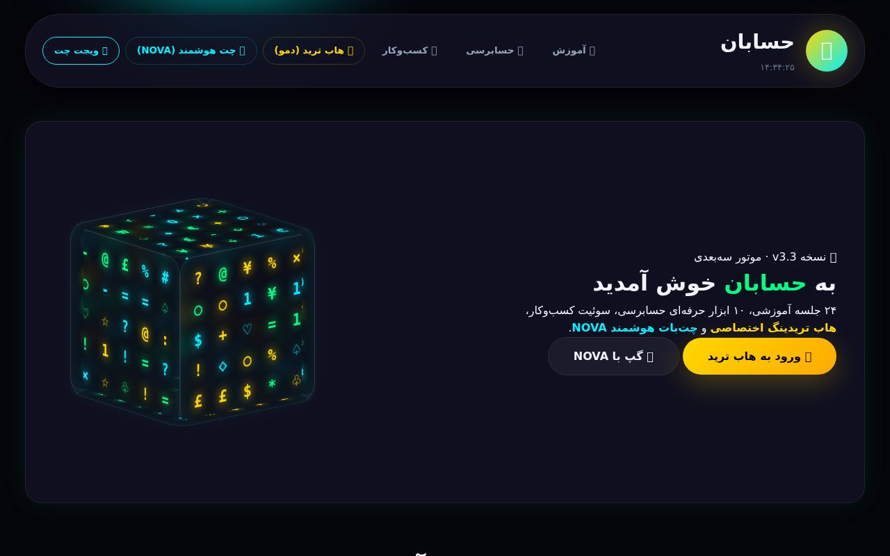
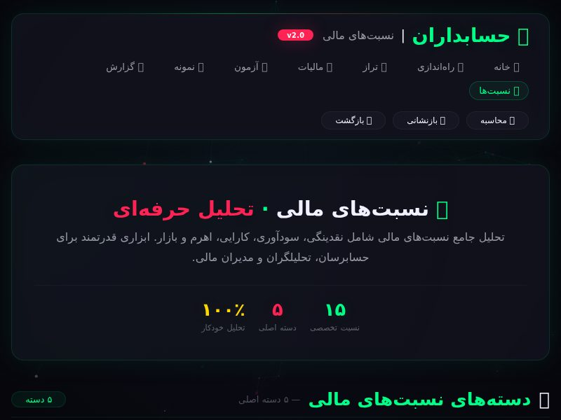
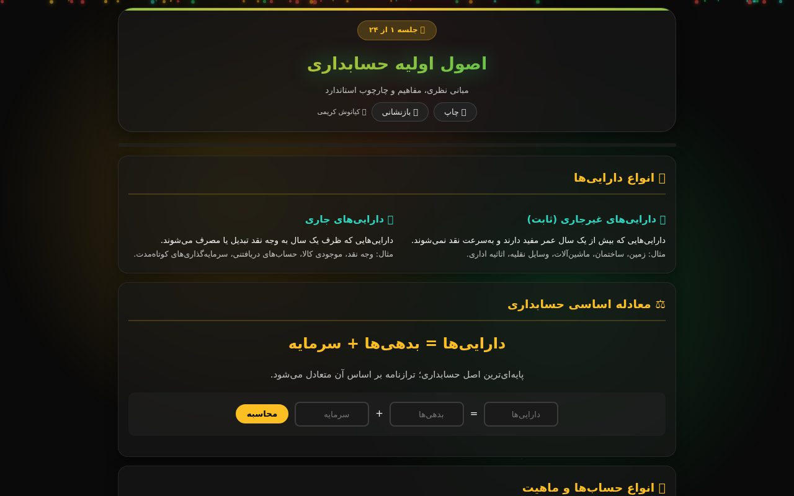

<div dir="rtl" align="right">

# حسابان | Hesaban — سوئیت یکپارچه حسابداری (v3.3)

سوئیت آموزشی و کاربردی حسابداری به زبان فارسی: **۲۴ جلسه آموزشی**، **۸ مینی‌اپ کسب‌وکار**، **۱۰ ابزار حسابرسی**، **هاب ترید** و **چت‌بات هوشمند NOVA** — همه آفلاین، راست‌به‌چپ و بدون نیاز به بک‌اند.

> **Hesaban** is a Persian (RTL, offline-first) accounting super-suite: 24 course sessions, 8 business mini-apps, 10 audit tools, a trading hub and the NOVA AI chat — pure static frontend, zero backend required.



## ✨ امکانات

| بخش | مسیر | توضیح |
|---|---|---|
| 🏠 داشبورد یکپارچه | `index.html` | موتور سه‌بعدی (Three.js)، ناوبری سراسری، PWA |
| 📚 آموزش (۲۴ جلسه) | `education/Session/` | از اصول اولیه تا صورت‌های مالی + کوئیز و ابزار |
| 🏪 سوئیت کسب‌وکار (۸ اپ) | `business_suites/` | حسابک، دفتر، انبارک، فاکتورساز، حقوق‌ساز، بودجه‌بان، پروفایل مشتری، هدایا |
| 🔍 ابزار حسابرسی (۱۰ ابزار) | `audit_tools/` | تراز آزمایشی، نسبت‌ها، نمونه‌گیری، مالیات، تقلب و… |
| 📈 هاب ترید | `trading_hub/` | داشبورد ترید (حالت دمو) |
| 💬 چت هوشمند NOVA | `ai_chat/` | دستیار حسابداری |




## 🚀 اجرا

بدون هیچ وابستگی — فقط یک سرور استاتیک:

```bash
# راه ۱: سرور آماده پروژه (فقط کتابخانه استاندارد پایتون)
python3 server.py
# → http://localhost:8000

# راه ۲: هر سرور استاتیک دیگری
npx serve .
```

> مستقیم با `file://` باز نکنید؛ ماژول‌های ES و Service Worker به `http(s)://` نیاز دارند.

## 📦 انتشار روی GitHub Pages

این ریپو کاملاً Pages-ready است (مسیرهای نسبی، مانیفست و Service Worker سازگار). کافی است در تنظیمات ریپو، Pages را روی شاخه `main` فعال کنید.

## 🛠 تغییرات فنی این نسخه (polish)

- رفع **۴۲ لینک خراب**: یکدست‌سازی پسوند `.HTML` → `.html` (سازگاری با لینوکس/Pages)
- اصلاح ۸ لینک بازگشت سوئیت‌های کسب‌وکار به داشبورد اصلی
- اصلاح مسیرهای `manifest` و آیکون‌ها در `trading_hub` و `audit_tools`
- **بازیابی `three.min.js` + OrbitControls + CSS2DRenderer** (فایل‌ها خالی بودند) و رفع ایمپورت ESM ناسازگار با بیلد UMD — پس‌زمینه سه‌بعدی داشبورد دوباره کار می‌کند
- ساخت `favicon.ico` از آیکون PWA، نسبی‌سازی `manifest.json` و `sw.js` برای Pages
- حذف `how_to_use.html` خالی و `fav.png` بلااستفاده؛ افزودن `allow_reuse_address` به `server.py`
- افزودن `LICENSE` (MIT) و همین README

## 📄 لایسنس

MIT — فایل [LICENSE](LICENSE) را ببینید.

</div>
