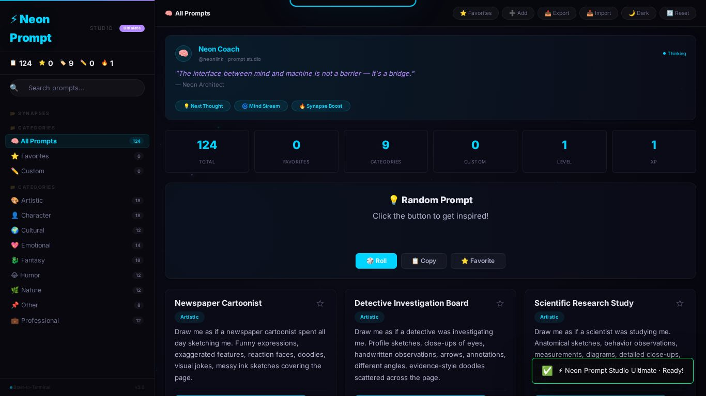
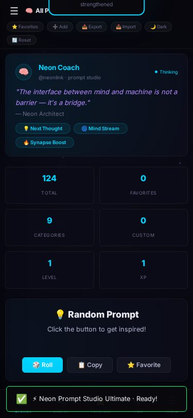
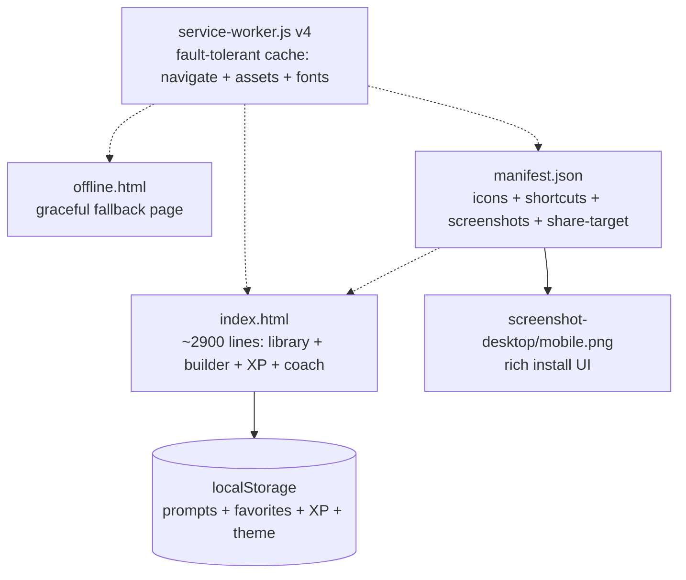

# ⚡ Neon Prompt Studio — Ultimate Edition

<div align="center">


**A cyberpunk, fully offline, installable PWA for managing, creating, organizing, and discovering AI prompts.**

[🚀 **Live Demo**](https://imxforever.github.io/Neon-Prompt-Studio/)

</div>

<p align="center">
  
</p>
<p align="center">
  
</p>

## ✨ Features

| | |
|---|---|
| 📚 **124 curated prompts** | Across 9 categories: Artistic, Character, Emotional, Fantasy, Professional, Humor, Cultural, Nature, Other |
| 🔍 **Instant search + filters** | Live search, category filter, favorites view, A–Z sort (`Ctrl+F` to jump in) |
| ✏️ **Custom builder** | Create your own prompts with **live chars/words/~tokens counter**, validation, edit support |
| ⭐ **Favorites** | One-click save, persistent, favorite-first sorting |
| 🎲 **Random generator** | One-click inspiration roll + copy + favorite |
| 🏆 **XP & gamification** | Levels, achievements, streaks, confetti, sound-free celebration |
| 🧠 **Neon Coach** | Tips, mind-streams and motivation boosts while you work |
| 📤 **Export / Import** | Full backup as JSON, validated import with error toasts |
| 🌓 **Dark / Light** | Neon dark default + light mode, persisted |
| 📱 **True offline PWA** | Installable, app shortcuts (Browse/Add/Random/Favorites), share-target, protocol handler |

## 🚀 Run

**Live (GitHub Pages):** <https://imxforever.github.io/Neon-Prompt-Studio/>

**Locally:**

```bash
git clone https://github.com/ImXforever/Neon-Prompt-Studio.git
cd Neon-Prompt-Studio
python3 -m http.server 8000
# → http://localhost:8000
```

> 📲 Install it: open the demo → browser menu → *Install app*. Works fully offline afterwards (verified by automated offline-reload test).

## 🏗 Architecture



One self-contained app file (HTML+CSS+JS, zero JS dependencies — only Google Fonts CDN with offline fallback), one PWA shell, `localStorage` persistence.

## 📁 Repository layout

```
├── index.html              ⚡ the app (~2.9K lines)
├── offline.html            📡 fallback page
├── service-worker.js       📦 v4 cache (navigate-first + assets + fonts)
├── manifest.json           📱 full PWA manifest
├── screenshot-desktop.jpg  🖼️ 1366×768 install screenshot
├── screenshot-mobile.jpg   🖼️ 375×812 install screenshot
├── icon-*.png (11)         🎨 icons incl. maskable + favicon
├── generate-icons.sh       🛠️ icon generator helper
└── LICENSE                 📄 MIT
```

## 🛠 Debug v1.1 — what was fixed

Found with static analysis + headless browser QA (offline test went from **FAIL → PASS**):

1. **Offline actually works now** — removed 2 dead font URLs (404) + added the 2 missing screenshots the cache list required; install is fault-tolerant (`allSettled`, cache v4)
2. **Pages-ready paths** — 27 absolute `/…` URLs in manifest + SW + HTML → relative (subpath-safe)
3. **Navigate fallback can never return `undefined`** — synthetic offline response as last resort
4. **Shortcuts & notification actions work** — `?action=` router (add/random/favorites) with click-delegation (zero coupling)
5. **Share-to-app works** — `?text=`/`?prompt=` prefill the Add modal via `openModal(editData)`
6. **offline.html rewritten** — honest copy + Retry button
7. **Global error toast** — visible but non-blocking (`error` + `unhandledrejection`)
8.. 🆕 **NEW: live token counter** in the Add modal (`chars · words · ~tokens`, ⌁chars/4 heuristic)
9. Added MIT `LICENSE` (was missing)

Known minor: slight top-bar/search overlap on very small screens (cosmetic, needs a design decision, untouched).

## 🧪 Testing

Automated headless QA: 0 console/page errors on all pages, offline-reload PASS, `?action=` + share-prefill + token-counter verified.

## 🤝 Contributing

Bug reports and PRs welcome. Keep it dependency-free and offline-first; keep the SW cache list in sync.

## 📄 License

[MIT](LICENSE) © 2026 ImXforever
