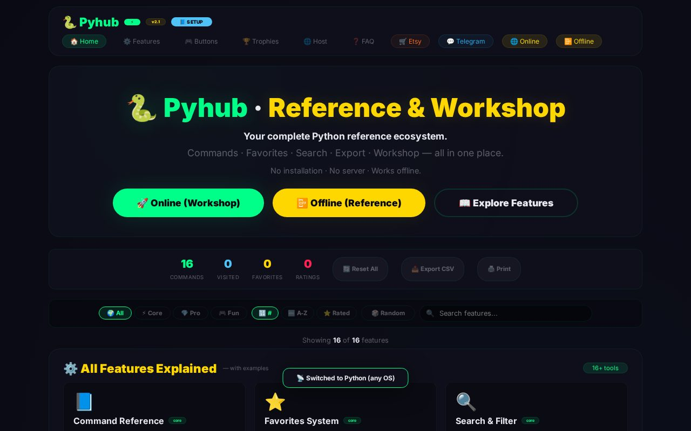
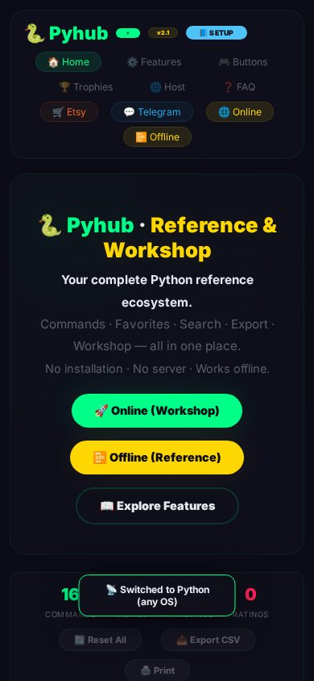

# 🐍 Pyhub — Python Reference & Workshop

<div align="center">


**Your complete Python reference ecosystem — commands, favorites, search, export, and an interactive workshop in one place.**

[🚀 **Live Demo**](https://imxforever.github.io/Pyhub/) •
[🧪 Workshop](https://imxforever.github.io/Pyhub/index_online.html) •
[📘 Offline Reference](https://imxforever.github.io/Pyhub/index_offline.html)

</div>

<p align="center">
  
</p>
<p align="center">
  
</p>

## ✨ Features

| Feature | Description |
|---------|-------------|
| 📘 **Command Reference** | 100+ Python commands with syntax, description, and examples. Categorized (Basics, Strings, Lists, OOP, etc.). |
| ⭐ **Favorites System** | Star your most-used commands. Access them instantly from the Favorites tab. |
| 🔍 **Search & Filter** | Search commands by name, syntax, or description. Filter by category. |
| 🧪 **Interactive Workshop** | Write and run Python code in the browser (Pyodide). Challenges with starter code and solution checking. |
| 📤 **Export** | Export all commands to JSON or CSV for backup, analysis, or sharing. |
| ℹ️ **Detail Modal** | Click any command for full syntax, description, and example. Copy syntax with one click. |
| 📱 **PWA Ready** | Install on any device (phone, tablet, desktop) as a native app. Works offline via service worker. |
| 🏆 **Achievements** | 12+ trophies to unlock: First Command, First Favorite, Search Master, First Run, and more. |
| 🎲 **Random Discovery** | Hit 🎲 Random to discover a new command. Great for learning. |
| 🌓 **Dark Neon Theme** | Built-in dark theme with neon green accents. |

## 🚀 Live demo

Hosted free on **GitHub Pages** — no server, no build step:

- 🏠 Hub: <https://imxforever.github.io/Pyhub/>
- 🧪 Online Workshop (needs internet for Pyodide CDN): <https://imxforever.github.io/Pyhub/index_online.html>
- 📘 Offline Reference: <https://imxforever.github.io/Pyhub/index_offline.html>

> 💡 Installable as an app: open the demo on your phone → *Add to Home Screen*.

## 🖥️ Run locally

```bash
git clone https://github.com/ImXforever/Pyhub.git
cd Pyhub
python3 -m http.server 8000
# → http://localhost:8000
```

## 📁 Structure

```
├── index.html            landing hub (links to workshop + reference)
├── index_online.html     interactive Pyodide workshop
├── index_offline.html    offline command reference
├── service-worker.js     offline caching
├── manifest.json         PWA manifest
└── icon-*.png            app icons
```

## 🛠 Tech stack

Vanilla HTML/CSS/JS · Pyodide (in-browser Python) · Service Worker · Web App Manifest — **zero dependencies, zero backend.**

## 📄 License

[MIT](LICENSE) © 2026 ImXforever
