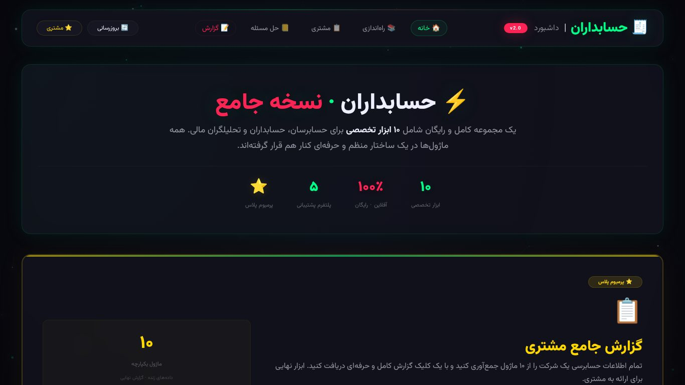
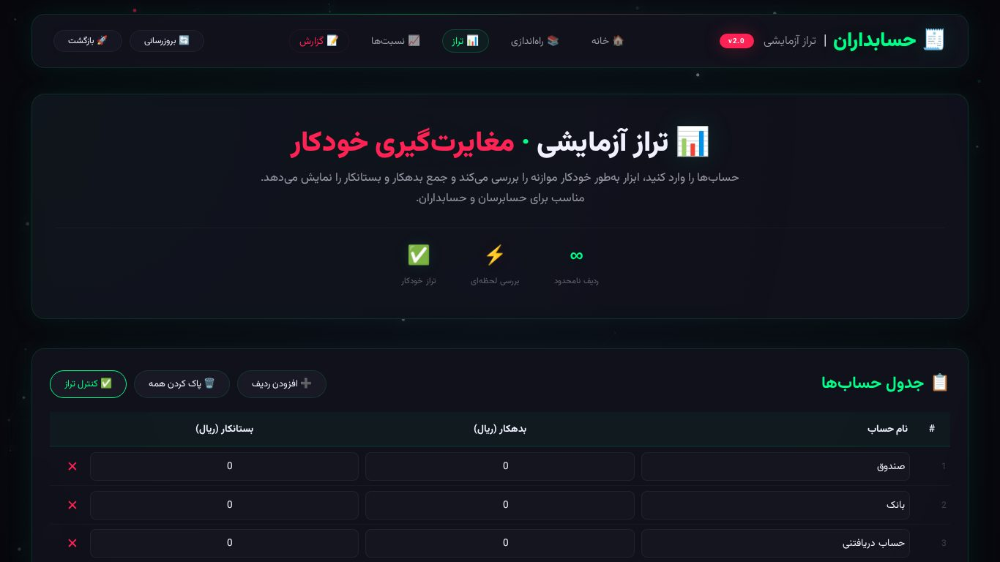
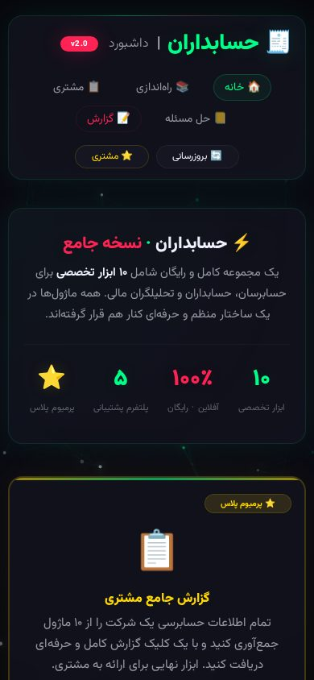

# 🧮 حسابداران | ابزار حسابرسی

> مجموعه‌ی ۱۰ ابزار حسابرسی و حسابداری — کاملاً فارسی و راست‌به‌چپ،
> بدون نیاز به بک‌اند، با پشتیبانی آفلاین (PWA).
>
> *Persian RTL audit toolkit: 10 self-contained tools, zero dependencies, PWA with offline support.*


| داشبورد اصلی | تراز آزمایشی |
|---|---|
|  |  |

| موبایل |
|---|
|  |

## 🧰 ابزارها

| # | ابزار | فایل |
|---|---|---|
| 1 | تراز آزمایشی | `trial_balance.html` |
| 2 | تعدیلات حسابرسی | `adjustments.html` |
| 3 | نسبت‌های مالی | `ratios.html` |
| 4 | کنترل داخلی (ICQ) | `icq.html` |
| 5 | آزمون‌های محتوا | `substantive.html` |
| 6 | نمونه‌گیری آماری | `sampling.html` |
| 7 | کشف تقلب | `fraud.html` |
| 8 | تطبیق مالیات | `tax.html` |
| 9 | گزارش حسابرسی | `report.html` |
| 10 | حل مسئله حسابداری | `accounting_problem_solver.html` |
| ⚙️ | راه‌اندازی + خروجی مشتری | `setup.html` · `client_output.html` |

## 🚀 اجرا

بدون بیلد، بدون دیتابیس — فقط یه سرور استاتیک:

```bash
python3 -m http.server 8000
# → http://localhost:8000/index.html
```

یا روی GitHub Pages (مسیرها نسبی‌اند و با ساب‌فولدر هم کار می‌کنند).

**نصب به‌عنوان اپ (PWA):** با Chrome/Edge موبایل یا دسکتاپ باز کن ← گزینه‌ی Install.
بعد از اولین بازدید، همه‌ی صفحات آفلاین هم کار می‌کنند؛
اگه صفحه‌ای در کش نباشه، صفحه‌ی آفلاین فارسی (`offline.html`) نمایش داده می‌شود.

## 🛠 تکنولوژی

| | |
|---|---|
| فرانت | HTML + CSS + Vanilla JS (تک‌فایل برای هر ابزار) |
| فونت | وزیرمتن (Vazirmatn) از Google Fonts با فالبک Tahoma |
| آفلاین | Service Worker (کش اول) + Web App Manifest + آیکون maskable |
| داده | همه‌چیز داخل مرورگر شما (localStorage) — هیچ داده‌ای به جایی ارسال نمی‌شود |

## 📁 ساختار

```
accounting/
├── index.html                  # داشبورد + لینک ۱۰ ابزار
├── trial_balance.html ...      # هر ابزار یک فایل مستقل
├── offline.html                # صفحه‌ی آفلاین (فارسی)
├── manifest.json               # PWA manifest
├── service-worker.js           # کش + فالبک آفلاین
├── icon-192.png / icon-512.png # آیکون‌های مربعی PWA
└── docs/                       # اسکرین‌شات‌های بالا
```

## 🎯 نکته‌ها

- خروجی چاپی گزارش مشتری (`client_output.html`) در پنجره‌ی جدا باز می‌شود و آماده‌ی چاپ است.
- آیکون‌ها از لوگوی اصلی کراپ مربعی شده‌اند تا شرط نصب PWA را پاس کنند.

## 📄 لایسنس

MIT — فایل [LICENSE](LICENSE).
