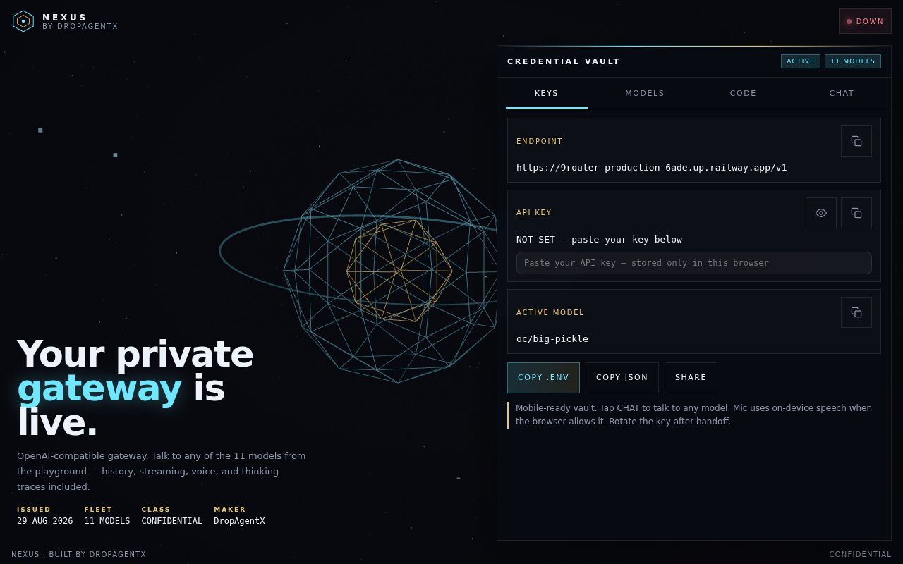
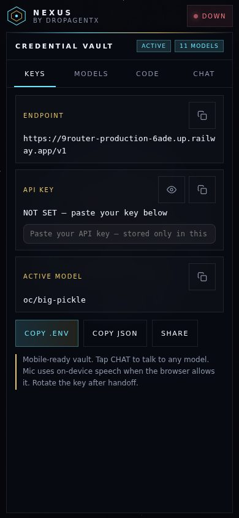

# NEXUS — by DropAgentX

Your private OpenAI-compatible gateway UI: a **credential vault** + **model fleet**
+ **chat playground** (history, streaming, voice, thinking traces) for talking to
11 models through one endpoint. Runs locally with a single command.



*Desktop — wireframe hero, vault panel, model fleet.*



*Mobile — the vault stacks cleanly, no horizontal scroll.*

> ⚠️ **Heads-up:** the default upstream
> (`https://9router-production-6ade.up.railway.app`) currently answers
> `404 Application not found` on Railway — the app is gone, so the status pill
> shows **DOWN** until you point `NEXUS_UPSTREAM` at a live OpenAI-compatible
> router. The vault, snippets, and playground UI all work regardless.

## ✨ Features

- 🔐 **Credential vault** — endpoint, API key (masked, show/hide, copy),
  active model, one-click `.env` / JSON export
- 🖥️ **Your key stays yours** — paste it in the UI, it lives in
  `localStorage` only; nothing is ever committed or sent anywhere except your
  configured upstream
- 🤖 **11-model fleet** — MiMo, Nemotron, Hy3, MiniMax M3, GPT-OSS 120B… with
  roles and blurbs, copyable IDs + fleet JSON
- 💬 **Chat playground** — streaming, history, voice input (on-device speech
  when the browser allows it), thinking traces, model switcher
- 📋 **Code snippets** — JS / Python / cURL for the active model, generated live
- 🌐 **Same-origin proxy** — `serve.py` proxies `/v1/*` to the upstream so the
  browser never hits CORS preflight failures
- 🛰️ **Health pill** — polls `GET /v1/models` through the proxy (LIVE / DOWN)
- 🎨 **Three.js hero** — vendored `js/three.min.js`, works fully offline

## 📁 Structure

```
api/
├── index.html        # the vault UI (single file + vendored three.js)
├── js/three.min.js   # vendored Three.js (offline-safe)
├── serve.py          # static server + same-origin /v1/* proxy (stdlib only)
├── docs/             # screenshots
└── LICENSE           # MIT
```

## 🚀 Run it

```bash
cd api
python3 serve.py
# NEXUS by DropAgentX → http://127.0.0.1:8787/
```

No dependencies — `serve.py` is pure stdlib. Then:

1. Open the page and paste your API key in the vault (stored in this browser only).
2. Pick a model from the fleet, or just chat — history, streaming, and voice included.
3. Point at your own router anytime: `NEXUS_UPSTREAM=https://your-router.example.com python3 serve.py`

| Variable | Default | Purpose |
|---|---|---|
| `NEXUS_UPSTREAM` | `https://9router-production-6ade.up.railway.app` | upstream router base URL |
| `PORT` / `HOST` | `8787` / `0.0.0.0` | where to serve |

## 🔒 Security notes

- Never commit a live key — the UI intentionally ships with an **empty** key
  and keeps yours in `localStorage`. If you forked this repo when a demo key
  was still in the history, **rotate that key**: it must be considered compromised.
- The footer says it best: *rotate the key after handoff.*

## 📄 License

MIT — see [LICENSE](LICENSE).
