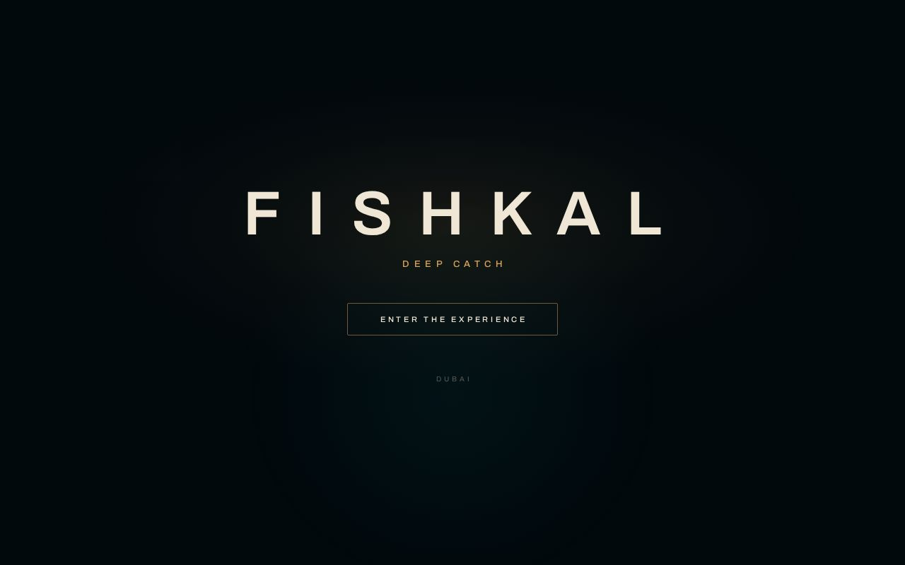
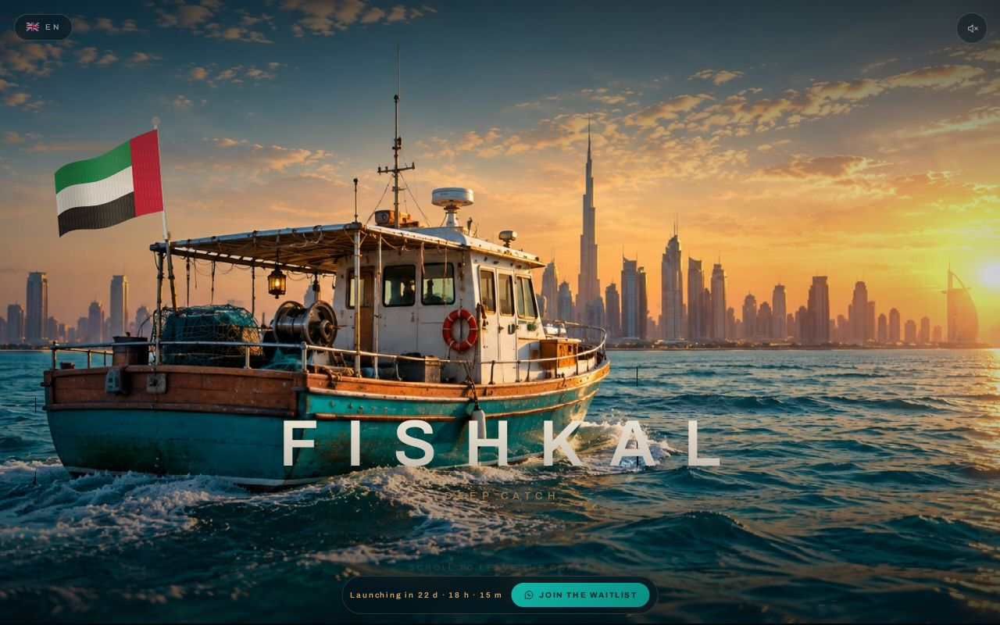
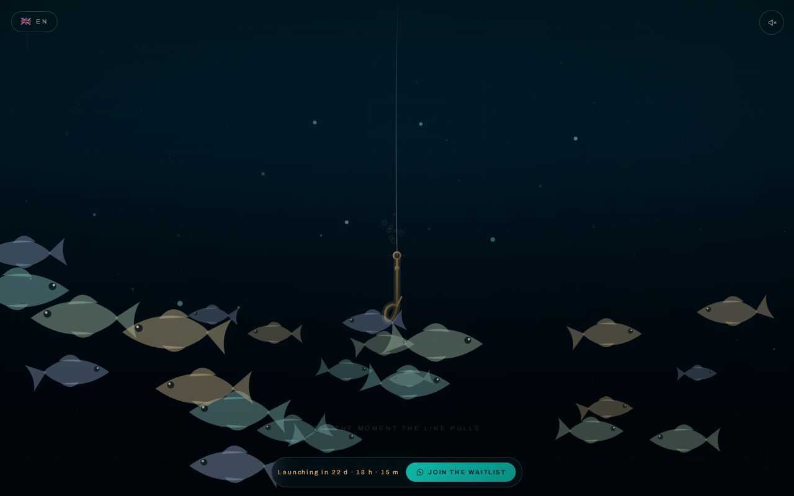

# FISHKAL — Deep Catch

A cinematic, scroll-driven fishing experience from the Dubai coast into deep water.

---

## Quick Start

1. Clone or download the project.
2. Serve the root folder with any HTTP server (or upload to cPanel).
3. Open `index.html` in a browser.

For a local development server:

    npx serve .

---

## What Is This?

FISHKAL is a single-page interactive experience built with:

- **Canvas 2D** for the entire world (above and below water)
- **Inline SVG** for the hook, sonar, halo and HUD
- **WebAudio** for a fully synthesised soundtrack (no audio files)
- **Vanilla JavaScript** — no frameworks, no build step

The user scrolls to descend from a fishing boat on the Dubai coast
into the Arabian Gulf, drops the hook, waits for a fish, and strikes
at the right moment.

---

## Screenshots

| Landing | Dubai dhow | Underwater descent |
|---|---|---|
|  |  |  |

---

## Project Structure

    fishkal/
    ├── index.html              # Light landing page
    ├── deep-catch/index.html   # The main experience
    ├── assets/
    │   ├── css/style.css
    │   ├── js/                 # 12 modules
    │   ├── img/                # Hero image + icons
    │   └── data/i18n.json
    ├── tools/                  # Build helpers
    ├── .htaccess
    ├── robots.txt
    └── sitemap.xml

See `INSTALL.md` for the full deployment guide.

---

## Configuration

All client-editable settings live in **`assets/js/config.js`**:

- WhatsApp number
- Email and phone
- Launch countdown date
- Hero image paths
- Default language
- Analytics IDs

No coding knowledge required.

---

## Languages

The experience ships with 5 languages:

| Code | Language | Direction |
|------|----------|-----------|
| `ar` | العربية  | RTL       |
| `en` | English  | LTR       |
| `fr` | Français | LTR       |
| `es` | Español  | LTR       |
| `tr` | Türkçe   | LTR       |

Users can switch at any time via the language dropdown.
The default language is set in `config.js`.

---

## Browser Support

| Browser             | Version |
|---------------------|---------|
| Chrome / Edge       | 90+     |
| Safari (iOS/macOS)  | 15+     |
| Firefox             | 88+     |
| Samsung Internet    | 15+     |

Canvas 2D, WebAudio, CSS Custom Properties and
`backdrop-filter` are required.

---

## Performance

Optimised for mobile:

- Hero image extracted from HTML (saves ~5 MB)
- Preload hints on the hero image
- Gradient caching
- Pre-computed sine lookup table
- Adaptive quality (drops detail before dropping frames)
- OffscreenCanvas for static layers
- Pooled particles (no per-frame allocation)

---

## Deployment

See `INSTALL.md`.

---

## License

Proprietary — © FISHKAL. All rights reserved.
