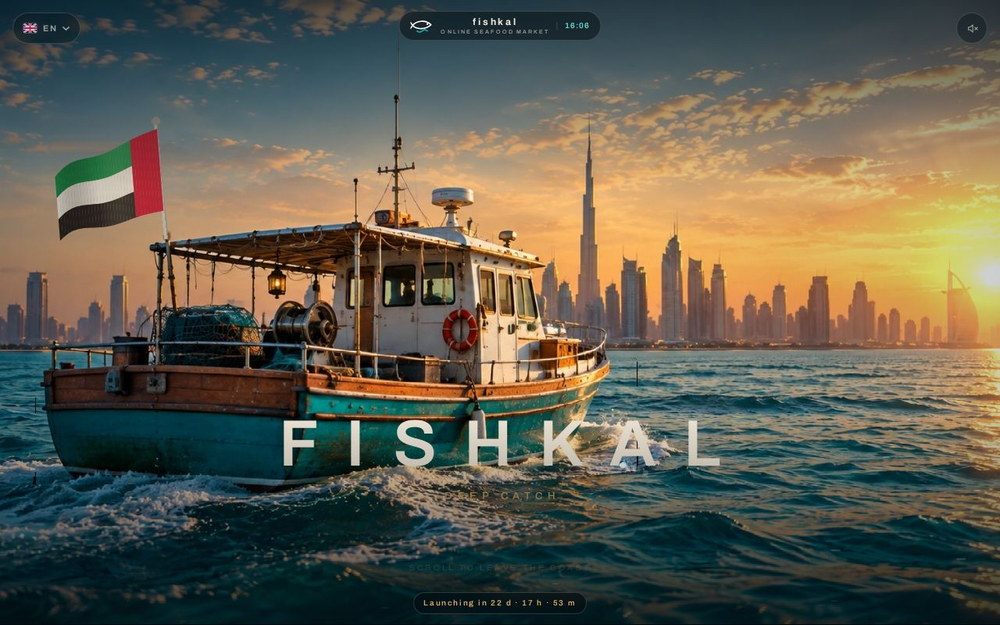
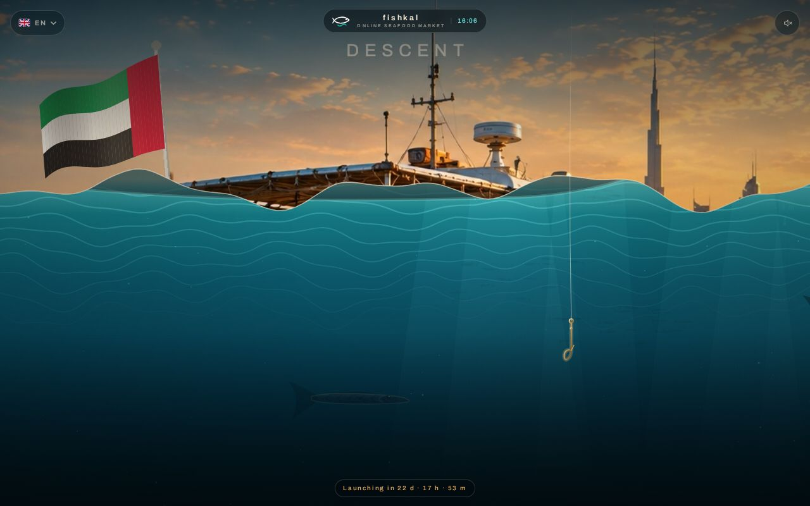
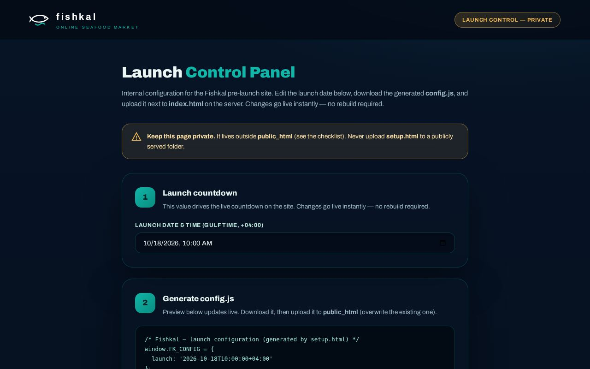

# 🐟 fishkalv1 — FISHKAL v0.1 Launch Package

Pre-launch site for **FISHKAL — Online Seafood Market (Dubai)**: cinematic
scroll descent from the dhow at sunset into deep water, live launch countdown,
plus a private launch-control page. No database, no build step — upload to
cPanel and go.

> 🚀 Deploy guide: [`README-LAUNCH.md`](README-LAUNCH.md)

## Screenshots

| Hero | Descent | Launch control (private) |
|---|---|---|
|  |  |  |

## Contents

```text
public_html/        # → upload ALL contents to cPanel public_html (site root)
├── index.html      # pre-launch experience (countdown + descent + game)
├── config.js       # the ONE file the business edits (launch date)
├── biz.js / biz.css
├── manifest.webmanifest + sw.js + icons   # PWA
└── .htaccess       # HTTPS redirect, caching, compression, MIME
private/
└── setup.html      # PRIVATE launch-control page — keep OUTSIDE public_html
```

## How it works

1. Open `private/setup.html` locally, edit the launch date.
2. Click **Download config.js**, upload it over `public_html/config.js`.
3. Changes go live instantly — no rebuild. Run AutoSSL for HTTPS (required
   for the install prompt + service worker).
