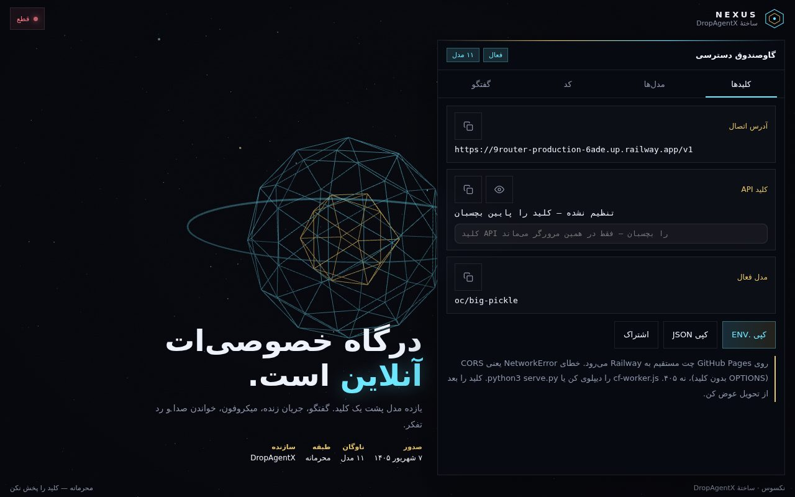
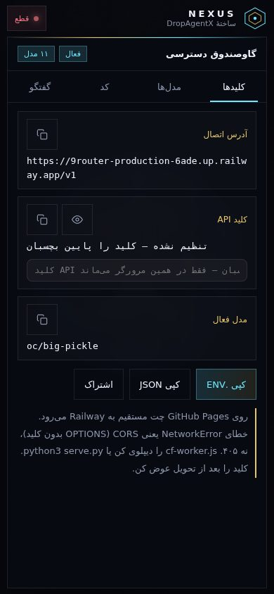

<div dir="rtl">

# نکسوس — ساختهٔ DropAgentX

رابط فارسی و راست‌به‌چپ درگاه خصوصی سازگار با OpenAI: **گاوصندوق دسترسی** +
**ناوگان ۱۱ مدل** + **زمین‌بازی گفتگو** (تاریخچه، استریم زنده، میکروفون، خواندن
صدا و رد تفکر). فقط با یک دستور اجرا می‌شود.



*دسکتاپ — هیروی سه‌بعدی، پنل گاوصندوق، تب‌ها.*



*موبایل — چیدمان تمیز و بدون اسکرول افقی.*

> ⚠️ **توجه:** آپ‌استریم پیش‌فرض
> (`https://9router-production-6ade.up.railway.app`) در حال حاضر روی Railway
> خطای `404 Application not found` می‌دهد — یعنی آن اپ پاک شده و چراغ وضعیت
> **DOWN** می‌ماند تا `NEXUS_UPSTREAM` را به یک روتر سازگار با OpenAI بدهی.
> خود رابط (گاوصندوق، اسنیپت‌ها، زمین‌بازی) بدون مشکل کار می‌کند.

## ✨ امکانات

- 🔐 **گاوصندوق دسترسی** — اندپوینت، کلید API (ماسک‌شده، نمایش/مخفی، کپی)،
  مدل فعال، خروجی `.env` / JSON با یک کلیک
- 🖥️ **کلیدت پیش خودت می‌ماند** — کلید را در رابط می‌چسبانی و فقط در
  `localStorage` همان مرورگر ذخیره می‌شود؛ هیچ‌وقت کامیت نمی‌شود و جایی جز
  آپ‌استریم خودت فرستاده نمی‌شود
- 🤖 **ناوگان ۱۱ مدل** — میمو، نموتون، Hy3، مینی‌مکس M3، جی‌پی‌تی OSS ۱۲۰ب…
  با نقش و توضیح، آی‌دی‌های کپی‌شدنی + JSON ناوگان
- 💬 **زمین‌بازی گفتگو** — استریم، تاریخچه، ورودی صوتی، خواندن صدا، رد تفکر
- 📋 **اسنیپت کد** — JS / Python / cURL برای مدل فعال، به‌صورت زنده
- 🌐 **پروکسی same-origin** — ‏`serve.py` مسیر `/v1/*‎` را به آپ‌استریم
  می‌رساند تا مرورگر به خطای preflight (CORS) نخورد؛ بایت‌ها تکه‌تکه
  فوروارد می‌شوند تا **استریم/SSE واقعاً زنده** باشد، نه بافری
- 🛰️ **چراغ سلامت** — ‏`GET /v1/models`‎ را از طریق پروکسی می‌زند (LIVE / DOWN)
- ☁️ ‏**`cf-worker.js`** — ورکر Cloudflare آماده برای وقتی که نمی‌توانی
  OPTIONS روتر را درست کنی (مسیر جایگزین برای هاست استاتیک)
- 🎨 **هیروی Three.js** — فایل `js/three.min.js` وندور شده، کاملاً آفلاین

## 📁 ساختار

```
key/
├── index.html        # رابط گاوصندوق (تک‌فایل + three.js وندور شده)
├── js/three.min.js   # Three.js وندور شده (امن برای آفلاین)
├── serve.py          # سرور استاتیک + پروکسی same-origin برای /v1 (فقط stdlib)
├── cf-worker.js      # پروکسی جایگزین روی Cloudflare Workers
├── docs/             # اسکرین‌شات‌ها
└── LICENSE           # MIT
```

## 🚀 اجرا

```bash
cd key
python3 serve.py
# NEXUS by DropAgentX → http://127.0.0.1:8787/
```

بدون هیچ وابستگی — ‏`serve.py` خالص stdlib است. بعد:

1. صفحه را باز کن و کلید API را در گاوصندوق بچسبان (فقط در همین مرورگر می‌ماند).
2. از ناوگان مدل انتخاب کن یا مستقیم چت کن — تاریخچه، استریم و صوت آماده است.
3. هر وقت خواستی به روتر خودت وصل شو:
   `NEXUS_UPSTREAM=https://your-router.example.com python3 serve.py`

| متغیر | پیش‌فرض | کاربرد |
|---|---|---|
| `NEXUS_UPSTREAM` | `https://9router-production-6ade.up.railway.app` | آدرس پایه روتر |
| `PORT` / `HOST` | `8787` / `0.0.0.0` | آدرس سرو |

## 🔒 نکته‌های امنیتی

- هیچ‌وقت کلید واقعی کامیت نکن — رابط عمداً با کلید **خالی** می‌آید و کلید
  تو را فقط در `localStorage` نگه می‌دارد. اگر این ریپو را وقتی فورک کردی که
  هنوز کلید نمایشی در تاریخچه بود، **آن کلید را بچرخان**: compromised حساب می‌شود.
- ته صفحه هم نوشته: *کلید را بعد از تحویل عوض کن.*

## 📄 لایسنس

MIT — ببین [LICENSE](LICENSE).

</div>
