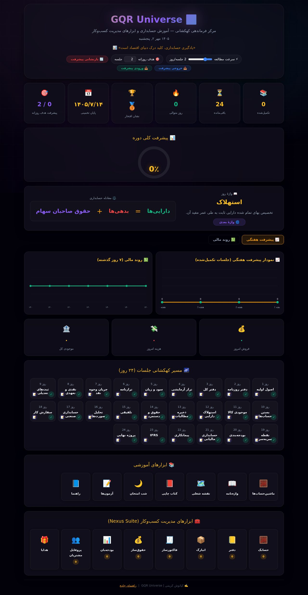
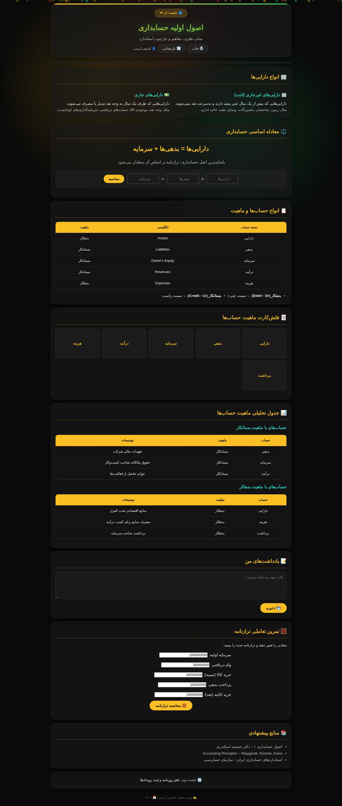
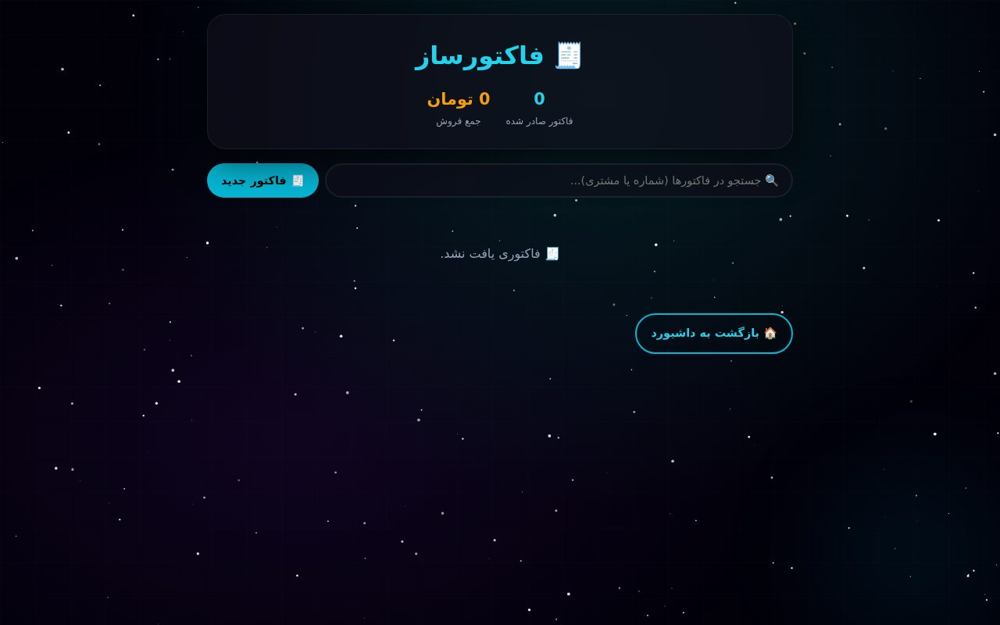
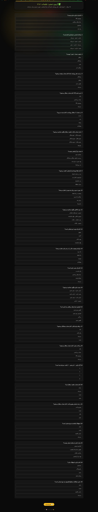
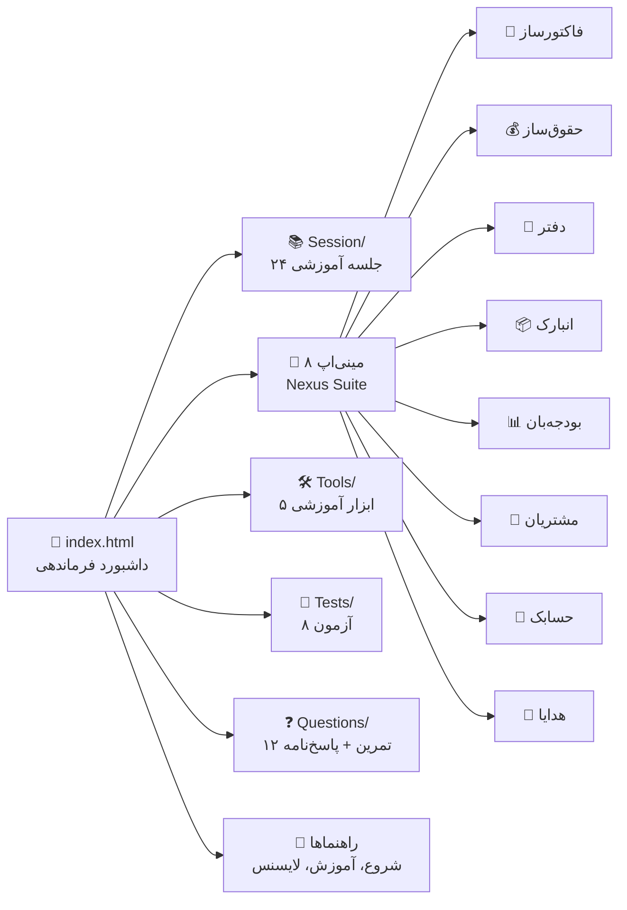

# 🏠 Khaneh Hesabdari — خانه حسابداری

> **English summary:** A Persian (RTL) offline-first accounting academy: a 24-session
> learning path with progress tracking, 8 practical mini-apps (invoicing, payroll,
> ledger, inventory, budgeting, CRM…), 8 quizzes/exams, Q&A drills and study tools.
> Pure HTML/CSS/JS — zero dependencies, zero backend, runs anywhere.
> Live demo (after Pages activation): https://imxforever.github.io/khanehesabdari-v1/

-purple?style=flat)

## 📸 نماها

*داشبورد فرماندهی: مسیر ۲۴ روزه، نمودار پیشرفت، ابزارهای آموزشی و مینی‌اپ‌ها*

*یک جلسه آموزشی (تمام ۲۴ جلسه همین قالب را دارند)*

*مینی‌اپ فاکتورساز: صدور فاکتور رسمی با ذخیره‌سازی محلی*

*آزمون‌های تستی و تشریحی هر ۶ جلسه*

## ✨ ویژگی‌ها

- 📚 **مسیر یادگیری ۲۴ جلسه‌ای** — از اصول اولیه و دفتر روزنامه تا حقوق و دستمزد، مالیات، IFRS و پروژه نهایی
- 📊 **داشبورد پیشرفت** — درصد تکمیل دوره، نمودار هفتگی، شمارش معکوس آزمون، ذخیره خودکار در مرورگر
- 🧰 **۸ مینی‌اپ کاربردی واقعی** — فاکتور، حقوق، دفتر بدهی/طلب، انبار، بودجه، CRM مشتریان و…
- 📝 **۸ آزمون** — تستی و تشریحی برای هر بازه ۶ جلسه‌ای (۱ تا ۲۴)
- ❓ **تمرین‌های پرسش‌وپاسخ** — ۱۲ مجموعه تمرینی + پاسخ‌نامه
- 🛠️ **۵ ابزار آموزشی** — ماشین‌حساب‌ها، واژه‌نامه تخصصی، نقشه راه شغلی، کتاب چاپی و جزوه شب امتحان
- 🌙 **تم کهکشانی تیره** با ایموجی و فارسی کامل، بدون نیاز به اینترنت (به‌جز فونت Vazirmatn که با fallback کار می‌کند)

## 🗺️ نقشه ماژول‌ها

## 📦 ساختار پروژه

| مسیر | محتوا |
|---|---|
| `index.html` | داشبورد فرماندهی (نقطه شروع) |
| `Session/Day1..24.html` | ۲۴ جلسه آموزشی |
| `Anbarak/` `Budjeban/` `Customer_Profiles/` `Daftar/` `Faktorsaz/` `Gifts/` `Hesabak/` `Hoqouqsaz/` | ۸ مینی‌اپ مستقل |
| `Tools/` | ماشین‌حساب‌ها، واژه‌نامه، نقشه شغلی، کتاب چاپی، شب امتحان |
| `Tests/` | ۴ آزمون تستی + ۴ آزمون تشریحی |
| `Questions/` | ۱۲ تمرین (`Q1..Q12`) + پاسخ‌نامه (`AnswerQ`) |
| `Mail/` | ابزار مسیر شغلی و مصاحبه (Career Path) |
| `how_to_start.html` `How_To_Use.html` `Thanks.html` `License.html` | راهنماها و مجوز |
| `docs/` | اسکرین‌شات‌های README |

## 🚀 اجرا

بدون نیاز به نصب هیچ‌چیز — کافی است فایل `index.html` را در مرورگر باز کنید.
(روی GitHub Pages هم آماده انتشار است؛ کافی است Pages را روی شاخه `main` فعال کنید.)

## 🛠️ فناوری

HTML + CSS + JavaScript خالص، بدون هیچ فریم‌ورک یا بک‌اند.
داده‌ها (پیشرفت دوره، فاکتورها، مشتریان و…) در `localStorage` مرورگر ذخیره می‌شود.

## 🔧 آخرین پولیش فنی

- تعمیر **۱۷ لینک خراب**: دکمه «بازگشت به داشبورد» هر ۸ مینی‌اپ و صفحه‌های راهنما (که بعد از تغییرنام `dashboard.html` به `index.html` شکسته بودند) + هر ۵ لینک بخش Tools در داشبورد (اختلاف حروف بزرگ/کوچک که روی لینوکس و GitHub Pages خطای 404 می‌داد)
- یکدست‌سازی پسوندها: هر ۲۶ فایل `.HTML` به `.html` تغییرنام داده شد تا کلاس خطاهای حساسیت به حروف برای همیشه حذف شود (با `git mv` — تاریخچه حفظ شده)
- ممیزی کامل لینک‌ها: **۰ لینک خراب** ✅
- تست اجرای ۴ صفحه کلیدی در مرورگر headless: **۰ خطای جاوااسکریپت** ✅
- افزودن README، دیاگرام ماژول‌ها و اسکرین‌شات‌های JPEG بهینه

## 📜 مجوز

این مجموعه دارای **مجوز اختصاصی** است: استفاده شخصی و آموزشی، بدون بازنشر یا استفاده تجاری بدون اجازه کتبی. متن کامل در صفحه [`License.html`](License.html). تمامی حقوق متعلق به کیانوش کریمی (NexusDigitalArtShop) است — © ۱۴۰۴.

