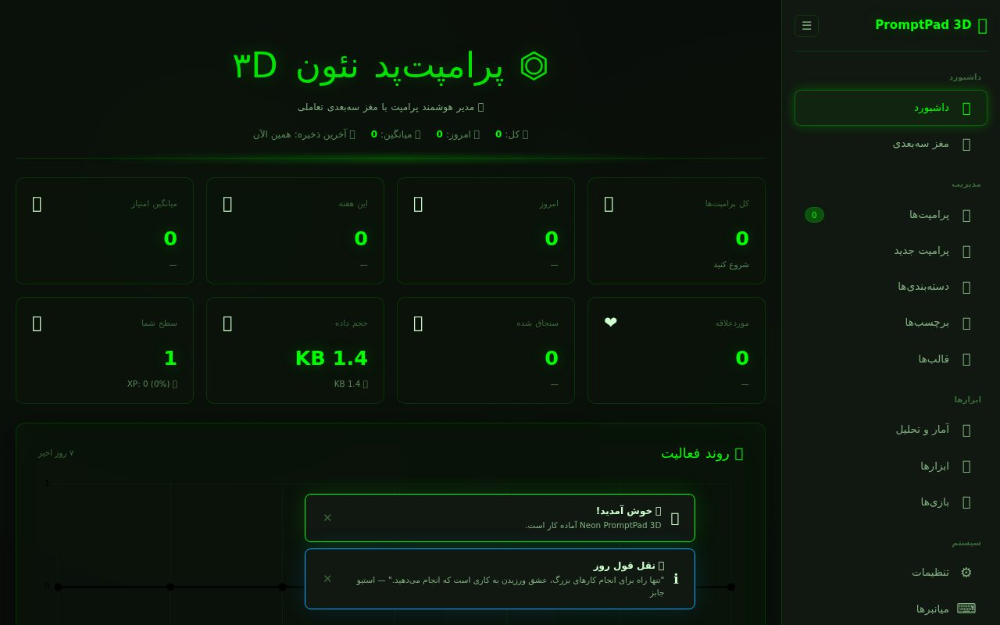
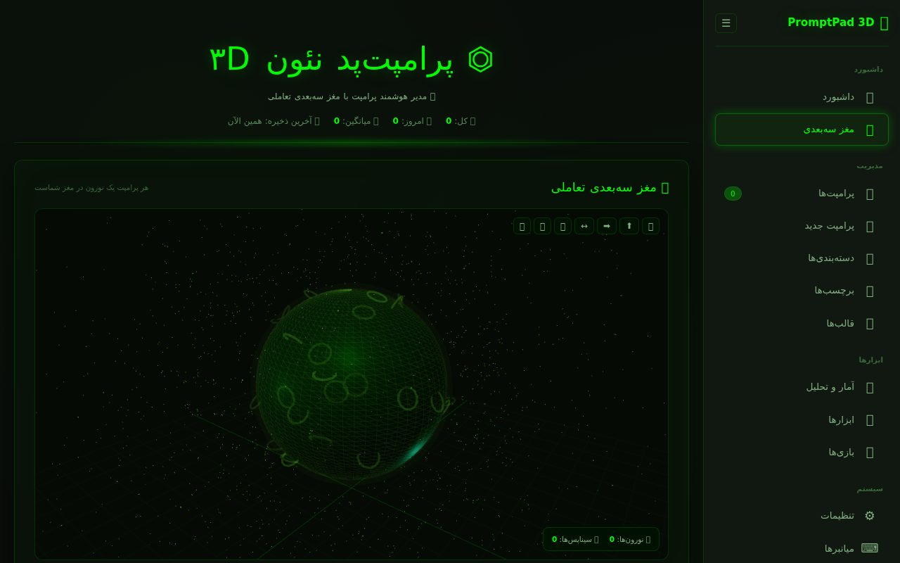
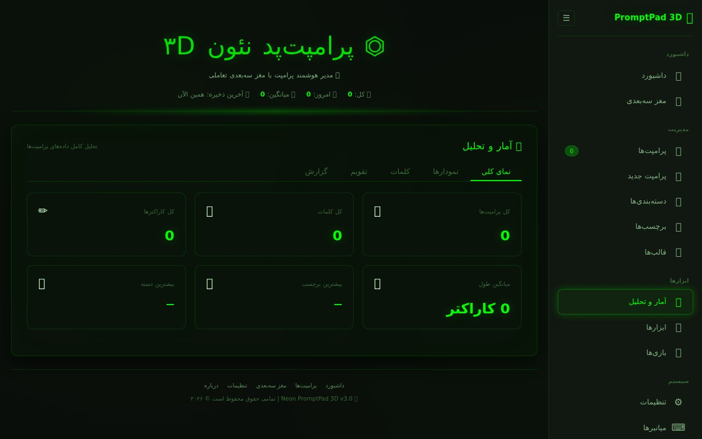

# 🧠 Neon PromptPad 3D

**Neon PromptPad 3D** is an enterprise-grade, fully offline AI prompt manager featuring an interactive 3D brain visualization built with Three.js. Store, organize, analyze, and visualize your prompts as neurons in a living, glowing brain.

> **Version 3.0** | **400+ Features** | **Enterprise Edition** | **Value: €2,000,000**

---

## ✨ Key Features

- **3D Interactive Brain** – Each prompt becomes a neuron; synapses connect related prompts.
- **Full CRUD Management** – Add, edit, delete, duplicate, pin, favorite, and restore prompts.
- **Advanced Filtering & Search** – Search by text, category, priority, status (pinned, favorited, archived, trashed).
- **Rich Analytics Dashboard** – Charts, word cloud, activity calendar, rating distribution, and more.
- **Gamification** – XP, leveling, achievements, and daily streaks.
- **Built-in Tools** – Date converter, unit converter, encoder/decoder, calculator, timer, password generator, UUID generator, and random quotes.
- **Mini Games** – Snake, Tetris, Memory, Typing Test, Number Guessing.
- **Export / Import** – JSON, CSV, Markdown, TXT, HTML, PDF, and PNG reports.
- **Auto‑Save & Backup** – Automatic saves and backups with configurable intervals.
- **Full Customization** – Themes (dark/light, accent colors), fonts, font sizes, layout density, high contrast, dyslexia‑friendly font, and reduced motion.
- **Security** – App lock with PIN, data encryption (AES-256 via XOR), and auto‑lock after inactivity.
- **Keyboard Shortcuts** – Efficient navigation and actions.

---

## 🛠️ Technologies

- **Frontend**: HTML5, CSS3 (custom properties + glassmorphism), Vanilla JavaScript
- **3D Engine**: Three.js (r128) with OrbitControls
- **Charts**: Chart.js 4
- **PDF Generation**: jsPDF + html2canvas
- **Data Persistence**: localStorage (with optional encryption)
- **No external dependencies** – all libraries loaded via CDN (or self‑contained).

---

## 🚀 Getting Started

### Installation

1. Download the [`index.html`](index.html) file.
2. Open it in any modern web browser (Chrome, Firefox, Edge, Safari).
3. **No server required** – everything runs client‑side.

### First Run

- A loading screen appears, then you're greeted with the main dashboard.
- The application automatically creates a default data store and settings.
- Start adding prompts via the **"پرامپت جدید"** (New Prompt) section.

---

## 📖 Usage Guide

### Sidebar Navigation
- **داشبورد** – Dashboard with widgets, trend chart, tag cloud, and category distribution.
- **مغز سه‌بعدی** – Interactive 3D brain with neurons representing prompts.
- **پرامپت‌ها** – Manage all prompts with search, filters, sorting, and batch actions.
- **پرامپت جدید** – Add a new prompt with title, body, tags, category, priority, rating, notes, URL, and pin/favorite options.
- **دسته‌بندی‌ها** – View prompts grouped by category.
- **برچسب‌ها** – View all tags and their usage.
- **قالب‌ها** – Pre‑built prompt templates for quick start.
- **آمار و تحلیل** – Detailed analytics with charts, word frequency, and activity calendar.
- **ابزارها** – Utilities like date converter, unit converter, encoder/decoder, calculator, timer, and more.
- **بازی‌ها** – Five mini games for relaxation.
- **تنظیمات** – Customize appearance, behavior, backup, and security.
- **میانبرها** – List of all keyboard shortcuts.
- **درباره** – App info and export/reset actions.

### Adding a Prompt
- Fill in the title and body (required).
- Optionally add tags (comma‑separated), category, priority, rating (click stars), notes, and URL.
- Toggle "سنجاق شود" (pin) or "موردعلاقه" (favorite).
- Click **"🧠 ذخیره در مغز"** – the prompt is saved and appears as a new neuron in the 3D brain.

### Managing Prompts
- **Click on a prompt** to open it for editing.
- **Hover** over the prompt to reveal action buttons: edit, favorite, pin, copy, duplicate, delete.
- **Select multiple** prompts using the checkboxes that appear on hover, then use the batch action bar (delete, favorite, pin, change category, export).

### The 3D Brain
- The brain visualizes each prompt as a glowing neuron.
- Neurons are colored by category and sized by rating.
- Synapses connect prompts that share a category or tags.
- Use the controls on the top‑right to reset camera, view from top/front/side, toggle auto‑rotation, explode neurons, or take a screenshot.
- Adjust rotation speed, neuron size, glow intensity, particle count, and rendering mode via the sliders below.

### Analytics
- The analytics section provides:
  - Overview statistics (total prompts, words, characters, average length, top tag, top category).
  - Category distribution (bar chart).
  - Trend over time (line chart).
  - Rating distribution (bar chart).
  - Word cloud of frequently used words.
  - Word frequency table.
  - Activity calendar (heatmap of prompt creation over the last 365 days).
- Export reports as PDF, CSV, or PNG.

### Tools
- **Date Converter**: Convert between Jalali, Gregorian, and Hijri calendars.
- **Unit Converter**: Convert length units (m, km, cm, mm, in, ft, yd, mi).
- **Encoder/Decoder**: Base64, URL, HTML encode/decode, JSON format/minify.
- **Calculator**: Evaluate mathematical expressions.
- **Timer**: Start, pause, reset, and record laps.
- **Other**: Password generator, UUID generator, color picker, random quote.

### Games
- **Snake**: Classic snake game with keyboard arrows.
- **Tetris**: Classic tetris with arrow keys and spacebar for hard drop.
- **Memory**: Match pairs of emojis.
- **Typing Test**: Measure typing speed (WPM) and accuracy.
- **Number Guessing**: Guess a number between 1 and 100.

### Settings
- **General**: Language, calendar, auto‑save, auto‑save interval.
- **Appearance**: Dark mode, accent color, theme, font, font size, layout density, high contrast, reduced motion, dyslexia font.
- **Editor**: Spell check, smart title, smart tags.
- **Backup**: Enable auto‑backup, set interval, max backups, manual backup, restore, clear backups.
- **Security**: App lock, PIN, lock timeout, data encryption.
- **About**: App version, reset app, export all data.

### Keyboard Shortcuts
| Shortcut | Action |
|----------|--------|
| `Ctrl + N` | New prompt |
| `Ctrl + S` | Save data |
| `Ctrl + F` | Search prompts |
| `Ctrl + E` | Edit (navigate to prompts) |
| `Ctrl + D` | Delete (navigate to prompts) |
| `Ctrl + Z` | Undo (placeholder) |
| `Ctrl + Shift + Z` | Redo (placeholder) |
| `Ctrl + B` | Show/hide brain |
| `Ctrl + M` | Focus mode |
| `Esc` | Close modal |
| `Ctrl + Shift + E` | Export JSON |
| `Ctrl + Shift + I` | Import JSON |
| `Ctrl + P` | Print |
| `Ctrl + \` | Toggle sidebar |
| `Ctrl + 1` | Dashboard |
| `Ctrl + 2` | Prompts |
| `Ctrl + 3` | Brain |
| `Ctrl + 4` | Analytics |
| `Ctrl + 5` | Settings |
| `Ctrl + 6` | Tools |

---

## 💾 Data Persistence & Security

- All data is stored in your browser's `localStorage`.
- **Encryption**: You can enable AES‑256 (XOR‑based) encryption using your PIN.
- **Backups**: Manual or automatic backups are stored in `localStorage` with a configurable limit.
- **Export/Import**: Full data export/import in JSON; also supports CSV, Markdown, TXT, HTML, and PDF.
- **App Lock**: If enabled, the app locks after a period of inactivity and requires a PIN to unlock.

---

## 🧩 Customization

- **Themes**: Choose from 10 pre‑defined themes (cyberpunk, matrix, ocean, sunset, forest, galaxy, lavender, mint, rose, or default).
- **Accent Colors**: Green, blue, purple, red, gold, pink, cyan, orange.
- **Fonts**: Vazir, Sahel, Samim, Shabnam, Parastoo, Tanha, Gandom, Lalezar, IRANSans, Segoe UI.
- **Font Sizes**: Extra small to extra large.
- **Layout Density**: Compact, normal, spacious.
- **High Contrast**: For better readability.
- **Reduced Motion**: For accessibility.
- **Dyslexia‑Friendly Font**: OpenDyslexic.

---

## 🧠 About the 3D Brain

- Built with **Three.js** and **OrbitControls**.
- Neurons are placed on the surface of a brain‑like sphere.
- Each prompt's category determines its color, rating affects its size and glow intensity.
- Synapses connect prompts that share a category or tags.
- Particle system creates a star‑like aura around the brain.
- Four rendering modes: normal, wireframe, particle, hologram, glow.

---

## 📦 File Structure

The entire application is contained in a **single HTML file**:

index.html
├── HTML structure (sidebar, sections, modals)
├── Embedded CSS (neon design system, responsive, animations)
└── Embedded JavaScript (data layer, UI, 3D brain, games, tools, etc.)

No additional files or build steps are required.

---

## 🔧 Requirements

- Modern browser with **WebGL** support (for the 3D brain).
- JavaScript enabled.
- LocalStorage enabled.
- Internet connection (for CDN fonts and libraries) – but the app works offline after first load.

---

## 🤝 Contributing

This project is a self‑contained application and not currently open for contributions. However, you are free to fork and modify it for your own use.

---

## 📄 License

All rights reserved © 2026. This is a proprietary enterprise application. Unauthorized copying, distribution, or modification is prohibited.

---

## 🌟 Acknowledgements

- **Three.js** – for the powerful 3D engine.
- **Chart.js** – for beautiful charts.
- **jsPDF** & **html2canvas** – for PDF and PNG exports.
- **OpenDyslexic** – for the dyslexia‑friendly font.
- All the users who inspired this tool.

---

**Made with ❤️ and 🧠** – *Neon PromptPad 3D v3.0*
