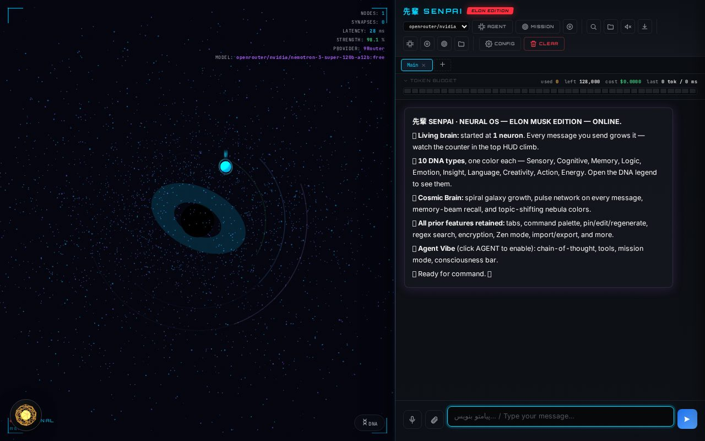
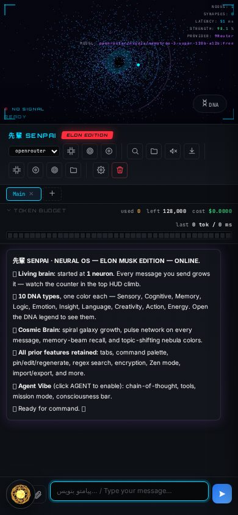

# SenPai Neural OS — Telegram Bot + Mini Web App (aiogram v3)

A Python [aiogram v3](https://docs.aiogram.dev/) bot that serves the SenPai
front-end as a **Telegram Web App (Mini App)** and runs on **Railway**.
Send `/start` to the bot and tap **🚀 Open SenPai Neural OS** — the 3D
Neural OS interface opens right inside Telegram.



*Desktop browser view of the mini-app (`/senpai`).*



*Mobile viewport — how the mini-app looks inside Telegram.*

## ✨ Features

- 🤖 **aiogram v3 bot** — `/start` with an inline **WebApp button**
- 🌐 **aiohttp web server** — serves the mini-app at `/senpai` + `/healthz`
- 🔄 **Two modes** — long polling locally (`USE_POLLING=1`), webhooks in production
- 🛡️ **Webhook secret** — `TelegramWebhookTransport` with secret-token validation
- 🎨 **Three.js Neural OS UI** — static `app.html` / `app.css` / `app.js`, no build step
- 🚂 **Railway-ready** — `railway.json` + `Procfile`, `PORT` picked up automatically

## 📁 Structure

```
senpai-bot/
├── bot.py              # aiogram v3 bot + aiohttp web server (webhook + static)
├── static/             # the mini-app: app.html / app.css / app.js
├── docs/               # screenshots
├── requirements.txt
├── railway.json        # Railway deploy config
├── Procfile            # fallback start command
└── .env.example
```

## 🚀 Local test (polling mode, no HTTPS needed)

```bash
cd senpai-bot
pip install -r requirements.txt
export BOT_TOKEN="123456:ABC..."   # or: set BOT_TOKEN=... on Windows cmd
export USE_POLLING=1
python bot.py
```

Then message your bot on Telegram → it replies with `/start` info.
(Open the full WebApp UI locally in a browser at <http://localhost:8000/senpai>.)

## 🚂 Deploy on Railway

1. <https://railway.app> → **New Project → Deploy from GitHub repo** → pick `senpai-bot`.
2. In the service → **Variables**, add:
   - `BOT_TOKEN` = token from [@BotFather](https://t.me/BotFather)
   - `WEBAPP_URL` = `https://<your-service>.up.railway.app` (enable public domain first under Settings → Networking)
   - `WEBHOOK_SECRET` = any random string
3. Redeploy. Railway provides `PORT` automatically; the health check is `/healthz`.
4. Open Telegram → send `/start` → tap **🚀 Open SenPai Neural OS**.

## 📝 Notes

- The exact `/senpai` route is registered **before** the static handler —
  aiohttp's `add_static('/senpai/')` also matches the bare prefix and would
  otherwise shadow the page with a `403`.
- The Mini App URL must be HTTPS and cannot be a bare IP — Railway domains work out of the box.
- The front-end references `/senpai/app.css`, so the app is served at `/senpai`.
- To validate Telegram `initData` from the Mini App later, add an endpoint that
  verifies HMAC-SHA256 with the bot token.

## 📄 License

MIT — see [LICENSE](LICENSE).
