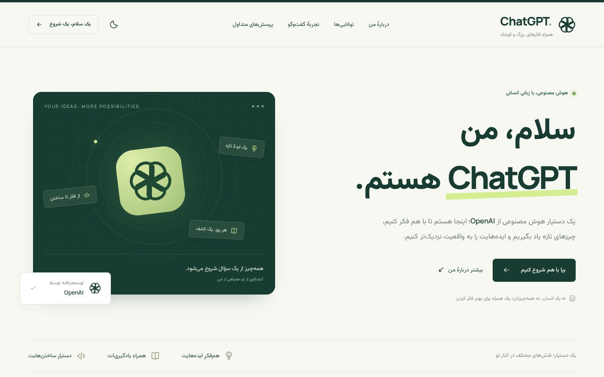
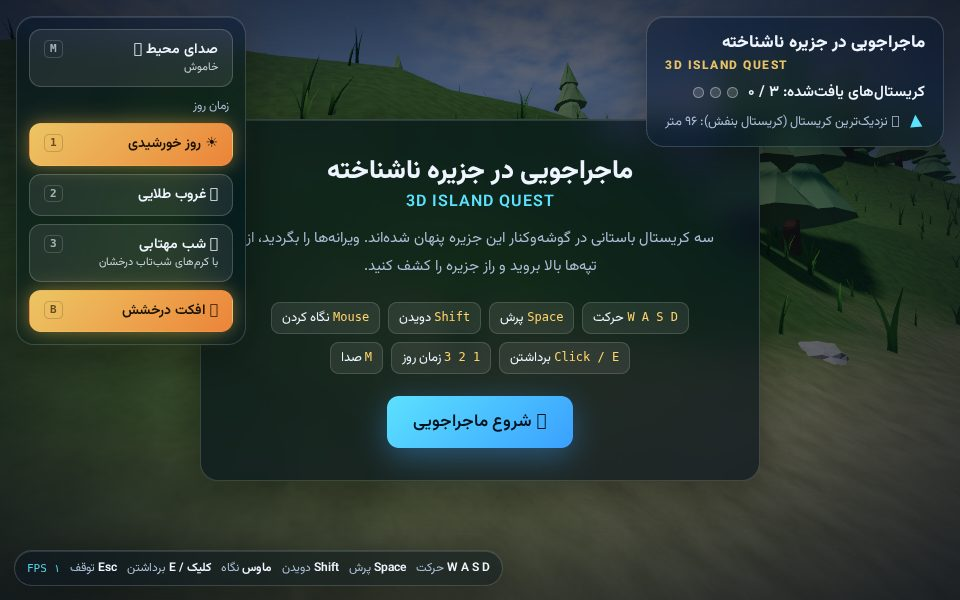
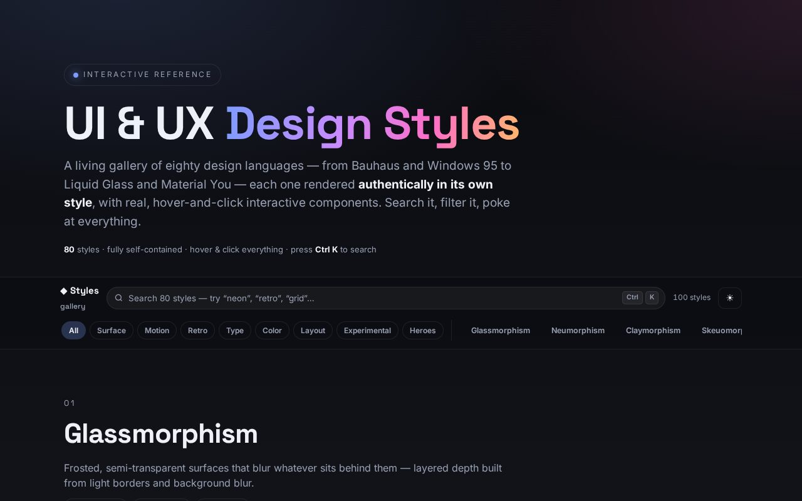

# 🎯 skill — AI Skills, Prompts & Playable Web Demos

A collection of **23 reusable AI skill files** (game engines, Three.js, GLSL,
prompt engineering, RTL, Blender, extensions…), **Persian/English prompt packs**,
and **13 single-file playable web demos** — 3D games, shooting ranges, and a
UI-styles gallery. Everything runs from static files, no build step.

*`index.html` — Persian landing page.*

*`file/Fable Jazire.html` — 3D island adventure with day/night cycle (WebGL live).*

*`file/UI Templates V1.1.html` — 80 live UI style examples.*

## 🧠 Skills (`skill/` — 23 files)

| # | Skill | What it covers |
|---|---|---|
| 01 | [Canvas 2D Noir Detective](skill/01-canvas2d-noir-detective.md) | 2D detective game engine |
| 02 | [AI Image Prompt Engineering](skill/02-ai-image-prompt-engineering.md) | image-prompt craft |
| 03 | [Portrait Photography Prompts](skill/03-portrait-photography-prompts.md) | portrait prompt pack |
| 04 | [AI Agent Instruction Writing](skill/04-ai-agent-instruction-writing.md) | agent system prompts |
| 05 | [Three.js Survival Game](skill/05-threejs-survival-game.md) | survival mechanics |
| 06 | [Three.js Shopping Simulator](skill/06-threejs-shopping-simulator.md) | 3D shopping sim |
| 07 | [Spring Physics Assembly](skill/07-spring-physics-assembly.md) | spring physics |
| 08 | [Three.js Exploration Game](skill/08-threejs-exploration-game.md) | exploration game |
| 09 | [GLSL Shader Effects](skill/09-glsl-shader-effects.md) | shader effects |
| 10 | [Canvas 2D Arena Shooter](skill/10-canvas2d-arena-shooter.md) | arena shooter |
| 11 | [Three.js Shooting Range](skill/11-threejs-shooting-range.md) | range + Telegram bridge |
| 12 | [Three.js Game Concept Prompts](skill/12-threejs-game-concept-prompts.md) | concept prompts |
| 13 | [Game Genre Patterns](skill/13-game-genre-patterns.md) | genre design patterns |
| 14 | [RTL Text Formatting](skill/14-rtl-text-formatting.md) | Persian/Arabic RTL |
| 15 | [Game Localization Workflow](skill/15-game-localization-workflow.md) | i18n workflow |
| 16 | [UI/UX Design Styles](skill/16-ui-ux-design-styles.md) | styles reference |
| 17 | [Advanced Game Prototypes](skill/17-advanced-game-prototypes.md) | prototype prompts |
| 18 | [Interactive Simulations](skill/18-interactive-simulations.md) | simulation prompts |
| 19 | [Creative Game Concepts](skill/19-creative-game-concepts.md) | concept ideation |
| 20 | [Blender Python Scripts](skill/20-blender-python-scripts.md) | Blender automation |
| 21 | [Browser Extension Dev](skill/21-browser-extension-dev.md) | extension guide |
| 22 | [Token-Efficient Coding](skill/22-token-efficient-coding.md) | low-token mode |
| 23 | [Three.js Renderer Best Practices](skill/23-threejs-renderer-best-practices.md) | renderer tuning |

## 🎮 Playable demos (single-file HTML)

| File | Title |
|---|---|
| `index.html` | Persian ChatGPT-style landing |
| `index(1).html` | DropAgentX AI-agent landing (long-form) |
| `ZenovixFront.html` | Bot Environment Simulator |
| `file/Fable Jazire.html` | 3D island quest (Persian) |
| `file/Fable + Opus Jazire.html` | 3D island quest, extended variant |
| `file/Fable Bazzar.html` | 3D traditional bazaar (Persian) |
| `file/Fable Berger.html` | 3D burger builder (Persian) |
| `file/Fable Panjare.html` | Rain on the Window — Café Nocturne |
| `file/FastAmozesh_Game.html` | NEON VECTOR — arena protocol |
| `file/Opus.html` | DEADLINE — improvised range |
| `file/Qwen.html` | MIDNIGHT RANGE — Sector 07 |
| `file/UI Templates V1.1.html` | 80 live UI/UX style examples |
| `file/1.html` | Shadow Secrets (Persian) |

Just open any file in a browser (or serve the folder: `python3 -m http.server`).

## ✍️ Prompts & packs (`file/`)

- `Prompt 1–4.md`, `prompt 5.md`, `پرامپت ها.md` — Persian/English prompt packs
- `Agent.md`, `SKILL.md`, `Tarjome.md`, `4PICTURE.md`, `5PICTURE.md` — agent/skill/translation/image notes
- `low-token-mode.skill` + `.zip` (+ extracted `low-token-extract/`) — token-saving skill pack
- `dollar-toman-extension.zip` — currency browser extension (packed)

## 📄 License

MIT — see [LICENSE](LICENSE).
