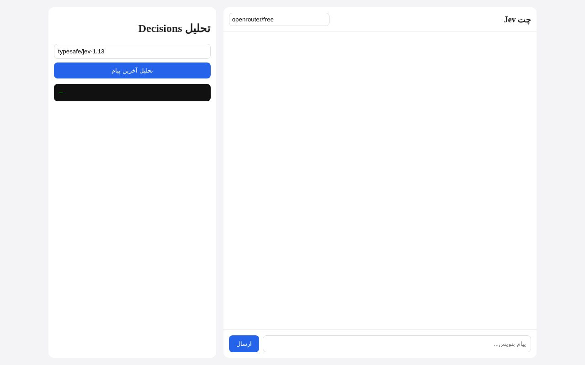
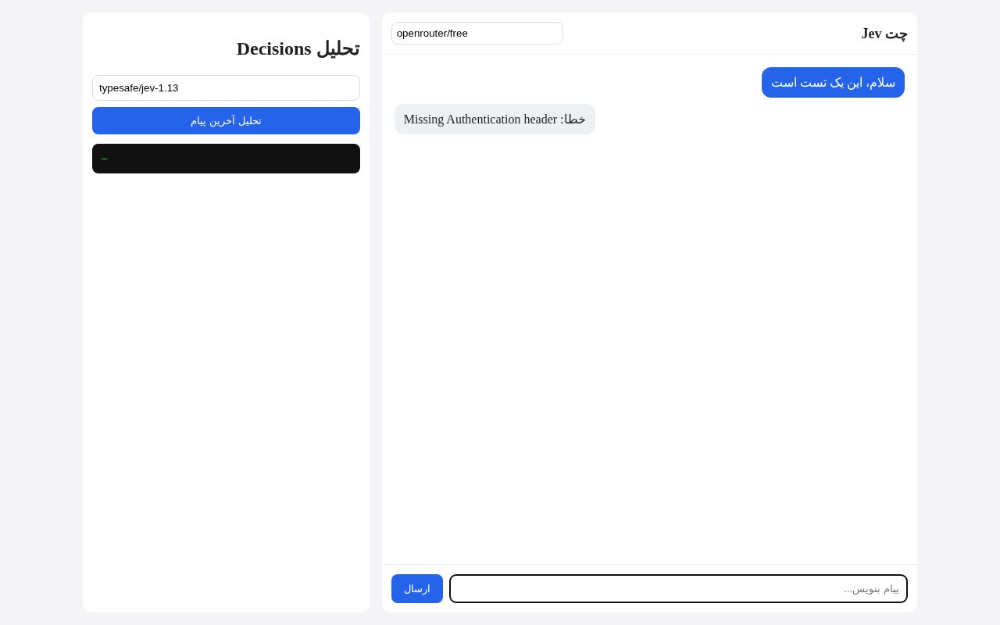

# Jev Chat App

Web chat + Decisions analysis via OpenRouter.

## Run

```
set OPENROUTER_API_KEY=sk-or-v1-xxx
py server.py
```

Open http://localhost:8000

## Screenshots

| Fresh | Conversation (keyless demo shows the auth error gracefully) |
|---|---|
|  |  |

## API

- `POST /api/chat` — `{message, history, model}`
- `POST /api/decisions` — `{state, questions, model}`
- `GET /api/health`
