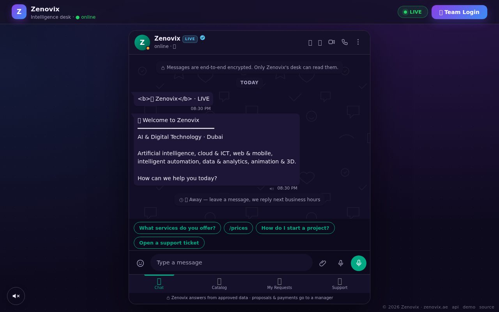
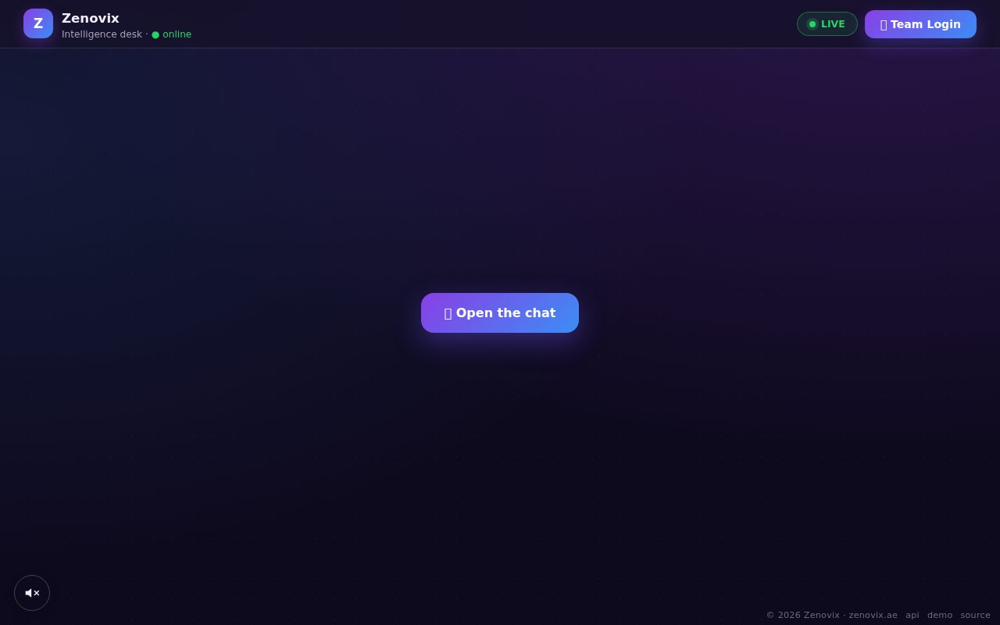
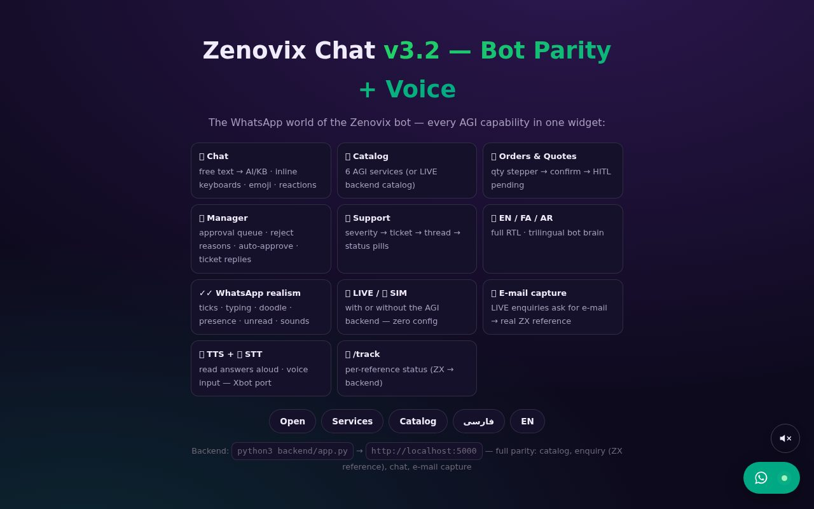

# 💬 Zenovix Chat Widget v3.2

[](https://github.com/ImXforever/zenovix/actions/workflows/ci.yml)
[](LICENSE)


A **WhatsApp-style chat widget** that reproduces the entire Zenovix AGI bot environment on any website — catalog, orders with real `ZX-` references, manager approvals (HITL), support tickets, 21 languages with full RTL, a read-aloud 🔊 button, voice input 🎤 and reference tracking.

> **One file of frontend. Zero dependencies.** Works with no backend at all (SIM mode), a lightweight Flask backend, or the full AGI platform on Railway.

---

## 📸 Screenshots



*`index.html` — the chat IS the page: welcome, quick replies, composer, Catalog/Quote/Support tabs.*



*Chat closed — one tap on "Open the chat" brings it back.*



*`frontend/demo.html` — every capability on one page, no backend needed.*

## ✨ Features

| | |
|---|---|
| 💬 **Smart chat** | free text → `/api/chat` (KB + optional LLM); offline → built-in trilingual knowledge (EN/FA/AR) |
| 🛍 **Shop flow** | catalog → details → quantity stepper → confirm → real submission |
| 📧 **E-mail capture** | in LIVE mode the bot asks for & validates the e-mail before submitting |
| 🧾 **Real ZX references** | orders go through `POST /api/public/enquiry` → `{"reference":"ZX-XXXXXXXX"}` |
| 👔 **Manager (HITL)** | approval queue, reject-with-reason, auto-approve, ticket replies |
| 🎫 **Support** | severity → ticket → thread → status pills |
| 🔊 **Read-aloud (TTS)** | a button next to the FAB auto-reads every answer + per-bubble 🔊 (Web Speech API — no server, no cost) |
| 🎤 **Voice input (STT)** | composer mic — speech-to-text in the UI language (Chrome/Edge) |
| 📦 **/track** | per-reference status list + a live backend check for ZX references |
| 🌍 **21 languages** | flag picker with native names; fa/ar with full RTL |
| ⌨️ **Slash commands** | `/start /help /prices /my /support /faq /contact /lang /track` |
| ✓✓ **WhatsApp realism** | delivery ticks, typing, doodle wallpaper, presence, unread badges, sounds, emoji, reactions |

## 🏗 Architecture

```
zenovix.ae (cPanel)                Railway
┌────────────────────────┐         ┌──────────────────────────────┐
│ site + frontend/       │  api    │  AGI platform (FastAPI)      │
│ zenovix-chat.js ───────┼────────▶│  ├─ /api/public/* (widget)   │
│                        │ apiBase │  ├─ /admin   (web panel)     │
│ backend/ (optional     │         │  ├─ /tg/webhook (bots)       │
│ Flask fallback) ◀──────┘ fallback│  ├─ Postgres + Redis + R2    │
└────────────────────────┘         └──────────────────────────────┘
```

The widget speaks the **exact public API contract of the AGI platform** (`/api/public/site`, `/catalog`, `/enquiry`, `/chat`) — switch hosts by changing two URLs. Full rationale: [`docs/architecture-blueprint.html`](docs/architecture-blueprint.html).

## 🚀 Quick start (local, 60 seconds)

**Demo mode — no backend:**

```bash
# just open the demo page in a browser
open frontend/demo.html
```

**Full stack + tests:**

```bash
pip install flask
python backend/app.py                 # → http://localhost:5000

cd tests && npm install && node suite.js   # → 72 passed, 0 failed
```

The test suite runs mocked browser scenarios (jsdom) plus live HTTP tests against the running backend — **72 checks** in total, the same suite GitHub Actions executes on every push.

## 🧪 Testing

```bash
cd tests
npm install
node suite.js        # 72 passed, 0 failed
```

CI (`.github/workflows/ci.yml`) checks: Python syntax · JS syntax · frontend/static copies identical · boots the backend · runs all 72 checks.

## ☁️ Deployment (summary)

| Piece | Where | Guide |
|---|---|---|
| 🧠 Brain (AGI platform) | Railway, auto-deployed from GitHub | [`docs/deployment-guide.html`](docs/deployment-guide.html) |
| 🔌 CORS patch for AGI | one file replaced in the AGI repo | [`deploy/AGI-CORS-PATCH.md`](deploy/AGI-CORS-PATCH.md) |
| ⚙️ Railway variables | ready-made env template | [`deploy/railway-variables.example.env`](deploy/railway-variables.example.env) |
| 💬 Widget on the site | cPanel: one JS file + a 2-line embed | [`docs/setup-guide.html`](docs/setup-guide.html) |

Widget embed (before `</body>`):

```html
<script>
  window.ZenovixChat = {
    api:     "https://zenovix-production.up.railway.app/api/chat",
    apiBase: "https://zenovix-production.up.railway.app/api/public"
  };
</script>
<script src="/js/zenovix-chat.js?v=3.2" defer></script>
```

All widget options: [`frontend/embed-snippet.html`](frontend/embed-snippet.html).

## 🔌 API contract (identical to the AGI platform)

```
GET  /health                      → {"ok": true, "kb_entries": 13}
GET  /api/public/site             → {"tenant","agent","currency","services",…}
GET  /api/public/catalog?lang=fa  → {"categories",…,"rtl":true}
POST /api/public/chat             → {"ok":true,"reply":"…","session":"…"}
POST /api/public/enquiry          → 201 {"ok":true,"reference":"ZX-XXXXXXXX"}
                                  → 400 {"ok":false,"detail":"…"}
GET  /api/public/track?ref=ZX-…   → {"found":true|false,"status":"…"}
```

## 📁 Repository layout

```
├── frontend/            widget (one file) + embed snippet + demo page
├── backend/             single-file Flask backend (optional fallback / local dev)
├── tests/               72-check parity suite (jsdom + real HTTP)
├── docs/                5 interactive guides (architecture, deploy, install, comparison)
├── index.html           ⭐ THE product page — a full-screen WhatsApp-style chat in the site's own theme, with the team-login button (served at / by the backend)
├── site-package/        the client site bundle: INSTALL-GUIDE.html + widget + embed code
├── telegram-platform/   reference copies of the live Telegram bot, admin bot & TWA sources (from the AGI repo)
├── deploy/              Railway env template + the AGI CORS patch
└── .github/workflows/   CI: syntax checks + the full parity suite
```

## 📚 Documentation

| Document | What's inside |
|---|---|
| [`docs/START-HERE.html`](docs/START-HERE.html) | ⭐ master roadmap — build the whole stack in 9 steps |
| [`docs/deployment-guide.html`](docs/deployment-guide.html) | the 9-phase Railway launch (28 steps + troubleshooting) |
| [`docs/setup-guide.html`](docs/setup-guide.html) | zero-to-hero widget install on cPanel |
| [`docs/architecture-blueprint.html`](docs/architecture-blueprint.html) | the reference architecture & design decisions |
| [`docs/comparison-report.html`](docs/comparison-report.html) | original platform vs this widget, code-to-code |

## 🤝 Contributing

Bug reports and pull requests are welcome — the 72-check suite is the safety net; please keep it green (`cd tests && node suite.js`).

## 📄 License

[MIT](LICENSE) © 2026 ImXforever (Zenovix)

## Telegram — the same brain, second entrance 🛒→✈️

The bot activates itself the moment `TELEGRAM_BOT_TOKEN` exists. One brain serves the
website widget **and** Telegram: same catalog, same ZX/Q references, same admin panel.

```
/customer → /start → menu (Products · Quote · Support · My requests · Language)
free text → KB/LLM answer (identical to the web chat)
quote flow → tracked ZX reference  ·  support flow → TKT ticket
```

Managers (`TELEGRAM_ADMIN_IDS`) get **every order & ticket as an instant push** and can
run `/stats` and `/leads` from their phone.

**Setup (5 min):** @BotFather → /newbot → token → Railway vars (`TELEGRAM_BOT_TOKEN`,
`TELEGRAM_ADMIN_IDS`, `TELEGRAM_WEBHOOK_SECRET`) → after deploy open once
`https://<app>/tg/set-webhook/<secret>` → done.
