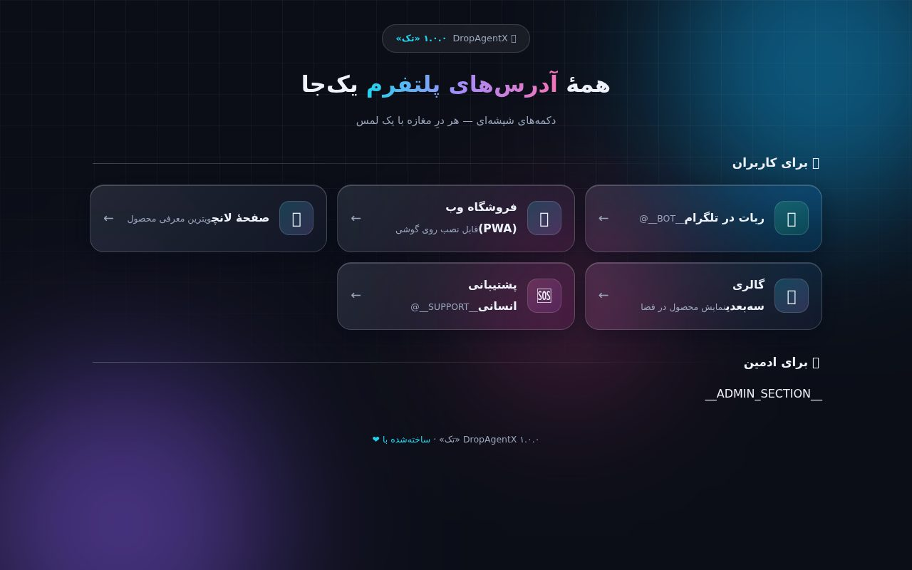
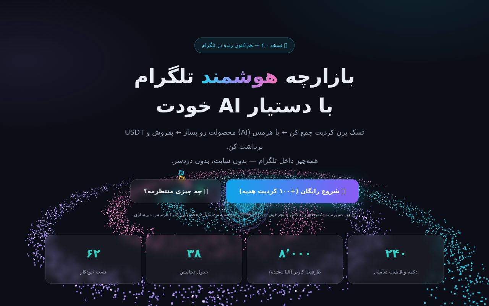
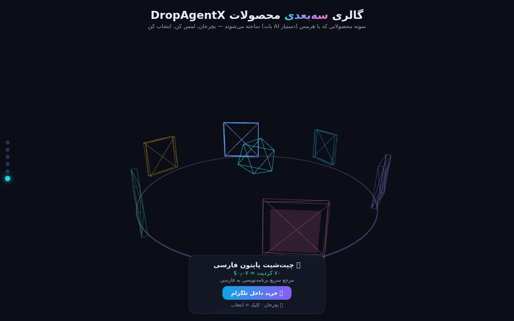

<div align="center">

# 🐘 DropAgentX

**یک پلتفرم تجارت‌الکترونیک حرفه‌ای داخل تلگرام — با هوش مصنوعی، کیف پول، سیستم ریفرال، بازی‌سازی و وب‌اپ کامل. آمادهٔ استقرار روی VPS یا Railway با یک دستور.**


**فارسی · [English](README.md)**

</div>

---

## ✨ نگاه کلی

DropAgentX یک **پلتفرم فروشگاهی کامل داخل تلگرام** است: فروشنده‌ها محصول منتشر می‌کنند، خریدارها با کیف پول درون‌باتی خرید می‌کنند و یک **دستیار هوش مصنوعی** در چت به کاربران کمک می‌کند. کل پروژه به‌صورت **monorepo** (بات، وب، موتور AI و گیت‌وی) بسته‌بندی شده و با یک دستور روی VPS (داکر) یا Railway مستقر می‌شود.

> **🆕 نسخه 1.0.0** — ریلیز کامل: هاب شیشه‌ای لینک‌های پلتفرم (`/links`) با دکمه‌های متحرک برای همه آدرس‌ها، میان‌برهای PWA، فیکس alias خروجی CSV و ۱۰۰/۱۰۰ تست.

---

## 📸 اسکرین‌شات‌ها



*هاب شیشه‌ای لینک‌ها (`links.html`) — همه آدرس‌های پلتفرم یکجا.*



*صفحه فرود (`landing.html`) با گوی ذرات متحرک و آمار زنده.*



*گالری سه‌بعدی محصولات (`showcase3d.html`) — چرخ‌وفلک چرخان سه‌بعدی.*

---

## 🚀 امکانات کلیدی

- **فروشگاه تلگرام**: کاتالوگ محصولات، جستجو، ویزارد ۵مرحله‌ای فروشنده، تحویل آنی با Telegram File ID
- **کیف پول درون‌باتی**: واریز/برداشت، تراکنش اتمیک (بدون دابل‌اسپند)، و ledger کامل
- **دستیار هوش مصنوعی (Hermes)**: چت چندمدلی با حافظه، یادگیری تقویتی هویت، و ۱۲ مهارت فروشنده
- **رشد و نگهداشت**: ریفرال، بونوس روزانه، کد هدیه کمپین، ماموریت و XP، قرعه‌کشی خودکار، وین‌بک
- **بازاریابی و مدیریت**: فیلتر ضدکلاهبرداری، پنل ادمین ۲۳ دکمه‌ای، داشبورد تحلیلی، بک‌آپ CSV
- **وب کامل**: فروشگاه PWA قابل نصب، نمایش سه‌بعدی Three.js، داشبورد زنده SSE، دو زبانه (fa/en)
- **امنیت**: فیکس ۹ آسیب‌پذیری کریتیکال، تراکنش اتمیک، سندباکس قفل‌شده، احراز fail-closed

---

## 📦 شروع سریع

```bash
git clone https://github.com/ImXforever/0.6.0.git
cd 0.6.0
cp .env.example .env     # BOT_TOKEN, ADMIN_IDS, WEB_PASSWORD, WEB_SECRET ...

pip install -r requirements-dev.txt
pytest                    # ۱۰۰ تست پاس
python bot.py             # بات + وب + A2A + MCP

# استقرار با داکر (یک دستور)
cd deploy && docker compose -f docker-compose.v3.yml up -d --build
```

## 🔑 متغیرهای کلیدی

- `BOT_TOKEN`, `ADMIN_IDS` — تلگرام (اجباری)
- `WEB_PASSWORD`, `WEB_SECRET` — پنل ادمین (اجباری در prod)
- `ROUTER_BASE_URL` — روتر LLM
- `GEMINI_API_KEY` — تصویر (پلن رایگان)
- `A2A_TOKEN`, `SANDBOX_ALLOW_LOCAL` — امنیت

## 📚 مستندات

| سند | توضیح |
|---|---|
| [`docs/ARCHITECTURE.md`](docs/ARCHITECTURE.md) | معماری، جریان داده، قراردادها |
| [`docs/COMMANDS-REFERENCE.md`](docs/COMMANDS-REFERENCE.md) | مرجع کامل دستورها |
| [`docs/DEPLOY-VPS-RAILWAY-FA.md`](docs/DEPLOY-VPS-RAILWAY-FA.md) | راهنمای استقرار VPS + Railway |
| [`CHANGELOG-1.0.0.md`](CHANGELOG-1.0.0.md) | چنج‌لاگ نسخه‌ها |

## 📄 لایسنس

توزیع تحت **MIT License**. — [LICENSE](LICENSE)
