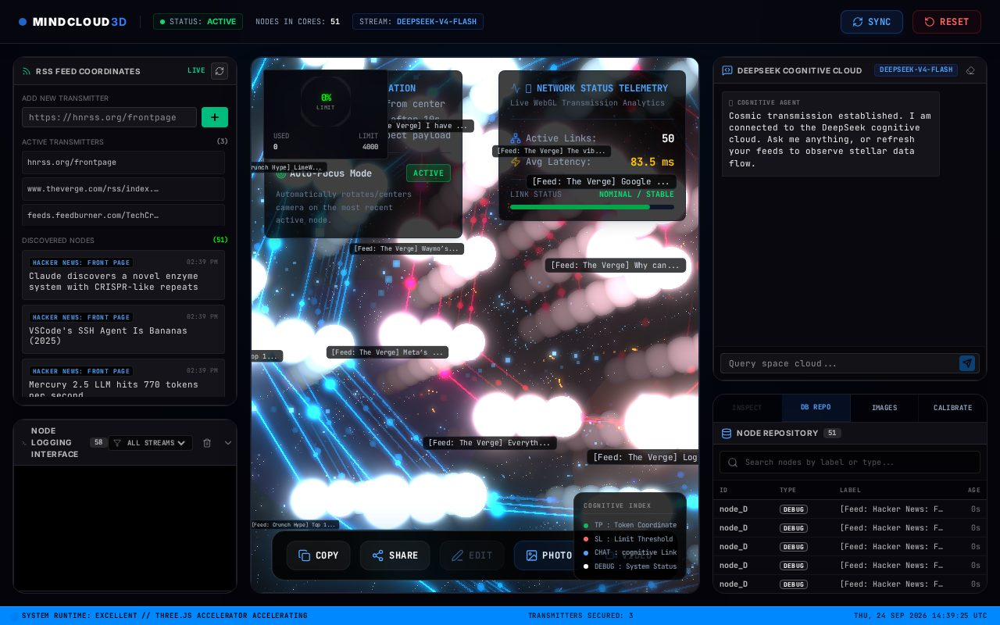
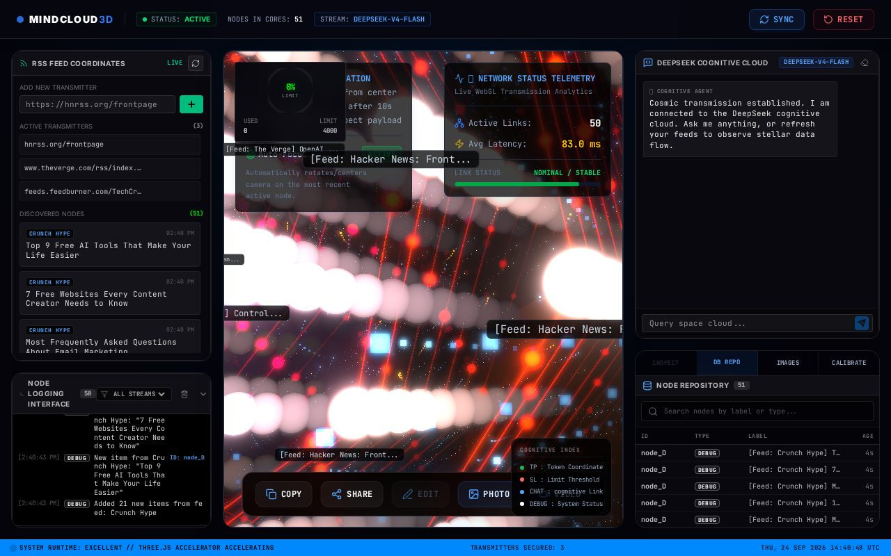
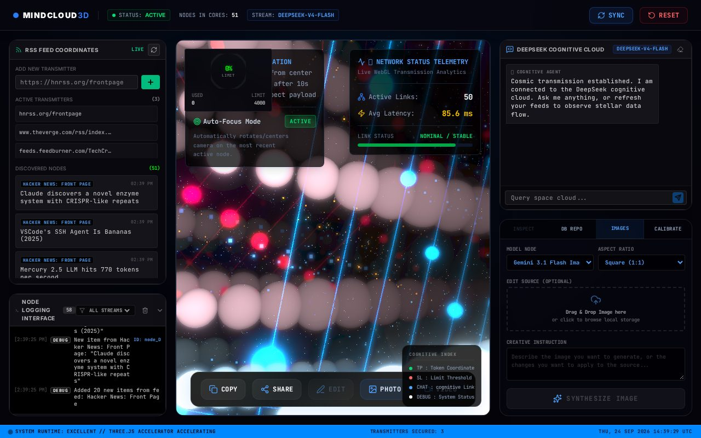

# 3DMIND — 3D Space Mind Cloud & RSS Explorer

An immersive **3D stellar mind-map** (React Three Fiber) fed by **live RSS streams**, with
**DeepSeek streaming chat** (Gemini fallback), **AI image synthesis**, token telemetry and a
real-time debug event console — served by an Express + Vite server.



## ✨ Features

- **MindCloud3D** — WebGL mind-cloud: RSS items materialize as nodes with links, auto-focus camera, post-processing
- **RSS engine** — CORS-bypass proxy (`/api/rss/fetch`) with `If-Modified-Since` support; HN / The Verge / TechCrunch presets
- **Cognitive chat** — DeepSeek streaming via SSE, seamless fallback to server-side Gemini when no DeepSeek key is set
- **Image studio** — generate / edit images with `gemini-3.1-flash-image` (aspect ratio + size controls, drag & drop source)
- **Observability** — token gauge, network telemetry, node repository (search/filter), debug console, event bus
- **Zero client secrets** — both API keys stay server-side; the browser never sees them




## 🚀 Run locally

**Prerequisites:** Node.js 20+

```bash
npm install
cp .env.example .env   # add your GEMINI_API_KEY / DEEPSEEK_API_KEY
npm run dev            # dev server on http://localhost:3000
```

Production:

```bash
npm run build
NODE_ENV=production npm start
```

### API

| Endpoint | Method | Description |
|---|---|---|
| `/api/health` | GET | Health check |
| `/api/rss/fetch?url=` | GET | RSS CORS proxy (304-aware) |
| `/api/chat/deepseek` | POST | SSE chat stream (DeepSeek → Gemini fallback) |
| `/api/images/process` | POST | Image generate / edit |

### Keyless behavior (verified)

- RSS explorer + 3D visualization work **fully without any API key**.
- Chat without keys returns a clean SSE error payload (`Fallback failed: …`) instead of crashing.

## 🛠 Tech stack

React 19 · TypeScript · Vite 6 · TailwindCSS 4 · Three.js / R3F / drei · Express · Zustand ·
`@google/genai` · `rss-parser` · motion · esbuild (CJS server bundle)

## 🔒 Security note

Past commits of this repo (and its `3dspace` twin) contain a tracked `.env` with live API keys.
The file has been removed from tracking (see `.env.example`), but the keys remain in git history —
**rotate both `GEMINI_API_KEY` and `DEEPSEEK_API_KEY`**.

## 📄 License

MIT — see [LICENSE](LICENSE).
