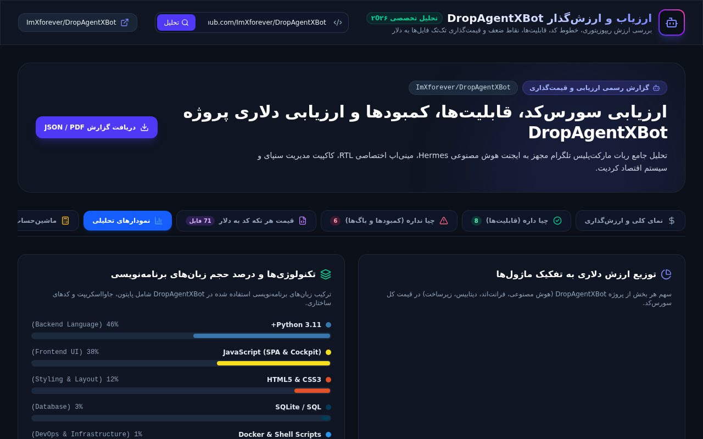

# 💰 DropAgentX — ارزیابی و ارزش‌گذاری دلاری سورس‌کد

داشبورد فارسی (راست‌به‌چپ) برای **تحلیل ریپو، ارزش‌گذاری دلاری کد، نمودارها و
ماشین‌حساب سفارشی** — ساخته‌شده با Next.js 16، Drizzle و PostgreSQL.

> **EN:** Persian (RTL) dashboard for repo analysis & USD source-code valuation —
> summary cards, per-file pricing, charts and an interactive valuation sandbox.

## Screenshots

| نمای کلی | نمودارها | ماشین حساب |
|---|---|---|
|  |  |  |

## امکانات

- 📊 کارت‌های ارزش‌گذاری: ارزش سورس‌کد، هزینه بازتوسعه، قیمت Turnkey
- ✅❌ تب‌های «چی داره (قابلیت‌ها)» و «چی نداره (کمبودها و باگ‌ها)»
- 📁 قیمت هر تکه کد: جدول ۷۱ فایل با مودال بازبینی سورس
- 📈 نمودارهای تحلیلی (ترکیب تکنولوژی، توزیع ارزش)
- 🧮 ماشین‌حساب تعاملی با نرخ LOC/$ قابل تنظیم
- 📥 خروجی گزارش JSON / PDF

## Quickstart

```bash
# 1. Install
npm install

# 2. Database (needs Postgres running)
cp .env.example .env.local   # set DATABASE_URL
npx drizzle-kit push         # create tables from src/db/schema.ts

# 3. Run
npm run dev                  # → http://localhost:3000
```

اولین بازدید دیتابیس را خودکار seed می‌کند (`DropAgentXBot`).

| Script | کار |
|---|---|
| `npm run dev` | سرور توسعه |
| `npm run build` / `npm start` | بیلد و اجرای پروداکشن |
| `npm run lint` / `npm run typecheck` | لینت و تایپ‌چک |

بدون `DATABASE_URL`، ایمپورت ماژول DB خطا نمی‌دهد (lazy) ولی اولین کوئری
با پیام واضح شکست می‌خورد.

## API

| Route | شرح |
|---|---|
| `GET /api/health` | سلامت سرویس |
| `GET /api/analysis?repo=` | خلاصه تحلیل یک ریپو |
| `GET /api/analysis/files?…` | تفکیک فایل‌ها (جستجو، دسته، مرتب‌سازی) |
| `GET /api/analysis/file-content?path=` | محتوای یک فایل |
| `POST /api/analysis/analyze` | تحلیل ریپوی سفارشی |

## ساختار

```text
src/
├── app/
│   ├── page.tsx                 # داشبورد (تب‌ها + داده اولیه)
│   └── api/analysis/… + health  # روت‌های داینامیک API
├── components/                  # کارت‌ها، جدول، نمودار، ماشین‌حساب، مودال، خروجی
└── db/                          # drizzle client (lazy)، schema، seed
```

## License

MIT
