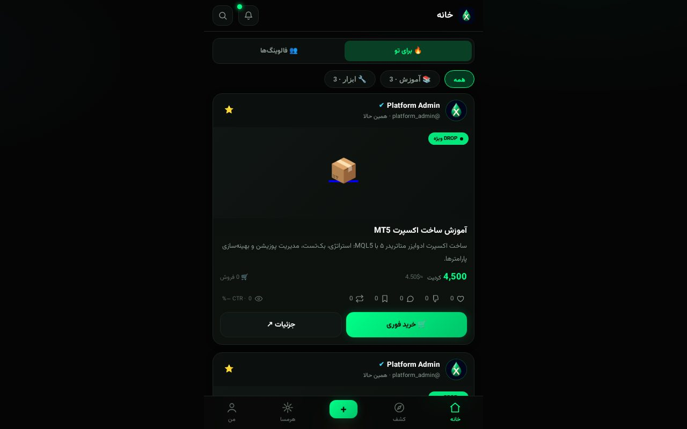
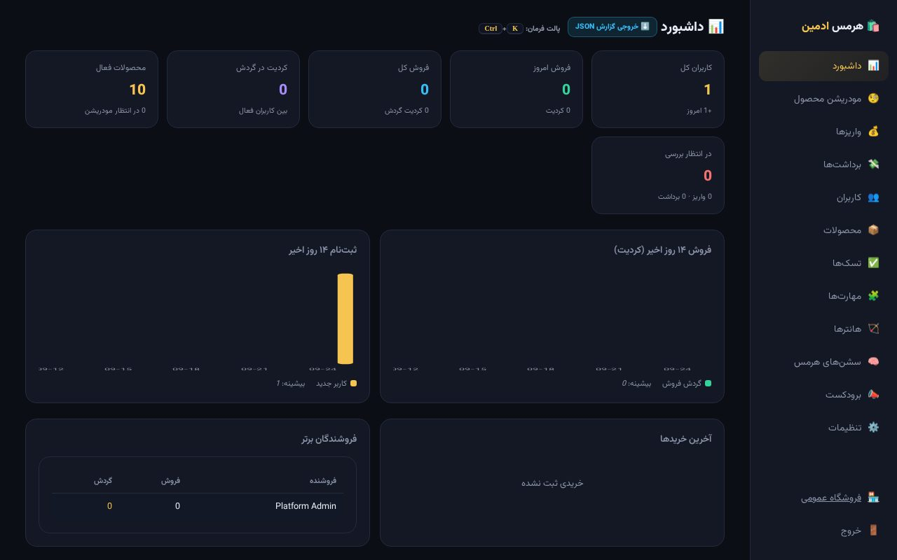
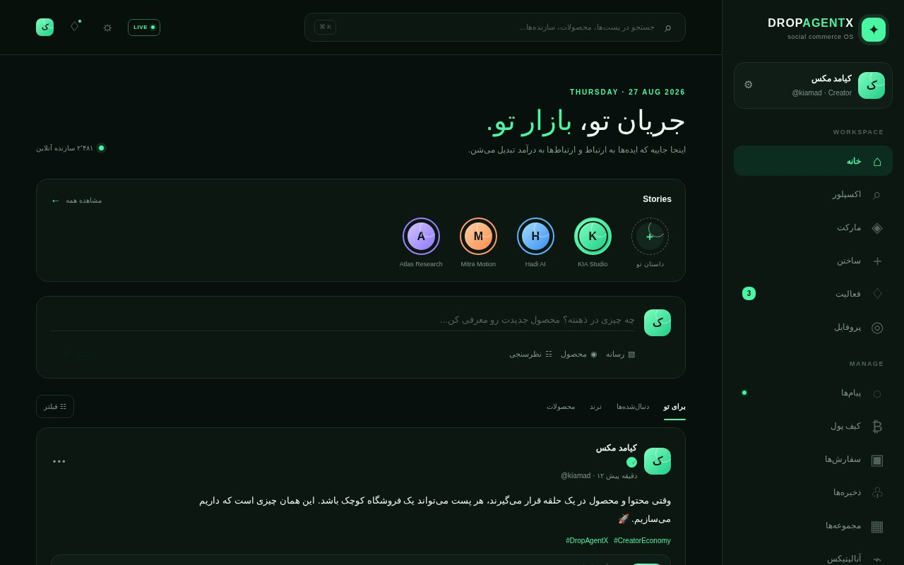

# 🐘 DropAgentX v3.0.0 — «غولِ واحد» (Monorepo)

DropAgentX نسخهی ۳: یک monorepo چندسرویسی که بات مارکتپلیس تلگرام را با یک
روتر LLM (9router)، هارنس ایجنت (hermes-agent) و قالب استقرار/کشف ایجنت (radius)
پشت **یک Gateway واحد** به هم وصل میکند — بدون شکستن پایهی سالم v2.

```
      کاربر
        │
        ▼
   ┌─────────────┐   ┌─────────────┐   ┌─────────────┐
   │  gateway    │──▶│  bot+web    │──▶│  hermes      │ (A2A/MCP)
   │  (تنها ورود) │──▶│  (9router)  │──▶│  (اجنت مجاور) │
   └─────────────┘   └─────────────┘   └─────────────┘
        │  /v1  │ /dashboard  │ /agent.json
        └──────▶ ROUTER_BASE_URL ──▶ 9router (فالبک ۳سطح + کیوتا + صرفهجویی توکن)
```

## 🌳 ساختار
```
gateway/        گیتوی واحد (پراکسی + کشف ایجنت)
bot/                <- در ریشه repo (ماژولهای بات در root میمانند تا تستها بشکنند)
shared/security/    skill_guard (پورت از هرمس)
shared/context/     context_compressor (پورت از هرمس)
shared/llm/         router_client (اتصال AI به 9router)
a2a_v2.py           A2A + agent card / .well-known (پورت از radius)
mcp_bridge.py       expose ابزارهای بات به هرمس
deploy/             docker-compose.v3.yml (3 service) + Dockerfile + railway.json
tests/              تست پایه + تست گلوها
```

## 🚀 اجرا
```bash
# 1) env را پر کن
cp .env.example .env     # BOT_TOKEN, ADMIN_IDS, ROUTER_BASE_URL, GEMINI_API_KEY, A2A_TOKEN...

# 2) محلی (بات + وب)
pip install -r requirements-dev.txt
pytest                    # 57 passed
python bot.py             # بات + وب + A2A + MCP (اگر ports ست باشد)

# گیتوی جداگانه
python -m uvicorn gateway.gateway:app --host 0.0.0.0 --port 8080

# 3) با داکر (۳ سرویس پشت گیتوی)
cd deploy
docker compose -f docker-compose.v3.yml up -d --build
```

## 📸 اسکرین‌شات‌ها

| فروشگاه (PWA قدیمی) | پنل ادمین | وب‌نکست (Social Commerce OS) |
|---|---|---|
|  |  |  |

## 🧪 وضعیت
- **57 تست پاس**
- `compileall` بدون خطا
- گیتوی: agent card + `/.well-known` + پراکسی `/v1` به 9router (تجزیه ✔)
- روتر: فالبک امن به `hermes_engine` وقتی 9router در دسترس نیست ✔

## 🔑 کلیدها (فقط `.env`)
- `BOT_TOKEN`, `ADMIN_IDS` — تلگرام (اجباری)
- `ROUTER_BASE_URL` — اشاره به 9router (مثلاً `http://router:20128`)
- `GEMINI_API_KEY` — تصویر Gemini (پلن رایگان)
- `A2A_TOKEN` — برای سطوح A2A/MCP (fail-closed، اجباری در prod)
- `WEB_PASSWORD`, `WEB_SECRET` — پنل ادمین

## 📚 مستندات
- `V3_BLUEPRINT.md` — نقشه و معماری کل
- `V3_CHANGELOG.md` — تغییرات
- `deploy/` — استقرار
