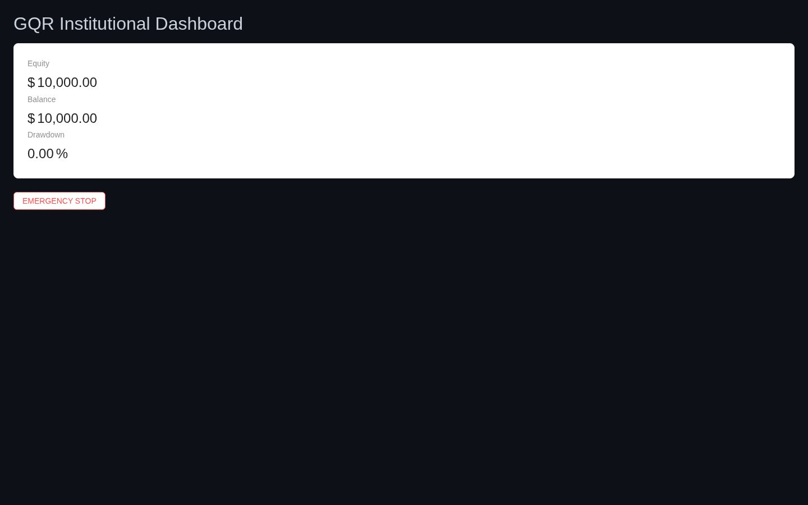
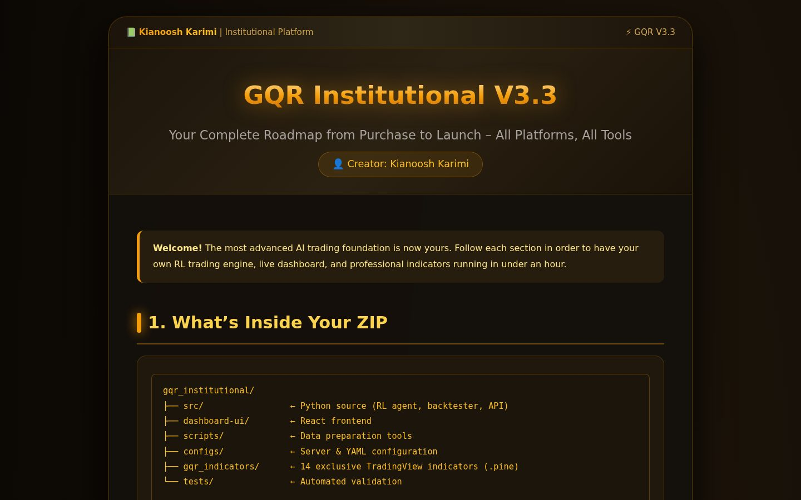

# 🚀 GQR Institutional V3.3

### 🧠 Multi-Asset Reinforcement Learning · Transformer PPO · Smart Money Engine · React Dashboard


> 🎯 Professional AI Trading Research Framework powered by Deep Reinforcement Learning, Transformers, and Smart Money Concepts.

| Live dashboard (real engine state) | Visual setup guide (`HowToUSe.HTML`) |
|---|---|
|  |  |

Prefer pictures over text? Open **`HowToUSe.HTML`** in a browser — it's the same quick start as below in a visual step-by-step guide.

---

## ✨ Features

### 🤖 Reinforcement Learning Engine
- PPO + GAE implementation
- Online learning, multi-asset support, continuous training
- **ModelGuard**: post-update Sharpe monitoring with automatic rollback to backed-up weights

### 🧠 Transformer Actor-Critic
- Multi-head attention + positional encoding
- Cross-asset fusion (gold features × DXY context via `DXYNexusFusion`)
- Xavier init, GELU, pre-norm Transformer blocks

### 🏦 Smart Money Engine
- Fair Value Gaps (FVG), Order Blocks (OB), Breaker Blocks
- Liquidity Sweeps, BOS / CHoCH Detection
- Rolling-window robust scaling for non-stationary prices

### 🛡️ Risk Management
- Daily drawdown protection + portfolio-wide kill switch
- Dynamic position sizing, emergency close (audited)

### 📊 Backtesting & Audit
- Event-driven simulation, Monte Carlo analysis, VaR / CVaR
- **Immutable audit trail**: hash-chained JSON-lines, verifiable via CLI:
  `python -m src.audit.audit_logger --verify logs/audit.jsonl`

### 📈 Real-Time Dashboard
- FastAPI backend (`/health` + WebSocket `/ws` streaming equity state)
- React + TypeScript + antd frontend with emergency-stop button
- Legacy Streamlit view (`src/monitoring/dashboard.py`)

### 🐳 Docker Deployment
- Engine + dashboard + nginx (SSL + basic-auth) via Docker Compose

---

## 🎯 Included TradingView Indicators

🔥 14 exclusive Pine Script v5 indicators in `tradingview_indicators/` (paste any `.txt` into the Pine Editor):

| Indicator | Purpose |
|------------|----------|
| 🔥 Smart FVG | Fair Value Gap Detection |
| 🏗️ Structure & OB Toolkit | Market Structure Analysis |
| ⚡ Breaker Block Detector | Breaker Entries |
| 📊 Volume Delta Candles | Buying vs Selling Pressure |
| 📈 Adaptive SuperTrend | Dynamic Trend Following |
| 💰 Money Flow Profile | Capital Flow Analysis |
| ⏰ ICT Killzones | Session Timing |
| 🌊 Liquidity Swings | Liquidity Sweeps |
| 🏦 Liquidity Pools | Pool Detection |
| 🌍 FVG Sessions | Session-Based FVGs |
| 📚 Depth of Market | DOM Visualization |
| 🌊 Elliott Wave | Wave Analysis |
| 📉 ZigZag Channels | Trend Channels |
| 🕒 Sessions | Session Tracking |

---

## 🚀 Quick Start

```bash
git clone https://github.com/ImXforever/GQR-v1.git
cd GQR-v1

python -m venv .venv
source .venv/bin/activate        # Windows: .venv\Scripts\activate

pip install -r requirements.txt  # needs Python 3.10+

cp .env.example .env             # then fill in your credentials/paths
```

Run the engine (simulation mode, always on for demo):

```bash
python -m src.multi_asset_runner   # XAUUSD + EURUSD agents with shared DXY feed
# or a single symbol:
python -m src.main                 # XAUUSD agent
```

> ⚠️ Always run with `python -m ...` from the repo root — plain `python src/main.py` cannot resolve the `src` package.

Live dashboard (two terminals):

```bash
# terminal 1 — API + WebSocket on :8000
uvicorn src.api.dashboard_server:app --host 0.0.0.0 --port 8000

# terminal 2 — React UI on :5173
cd dashboard-ui && npm install && npm run dev
```

Data prep + backtest helpers:

```bash
python scripts/convert_csv_to_parquet.py --input data/raw --output data/parquet
python scripts/precompute_features.py --input data/processed/XAUUSD.parquet --output data/processed/XAUUSD.features.parquet
```

Verify the audit trail:

```bash
python -m src.audit.audit_logger --verify logs/audit.jsonl
# OK  audit chain valid: True (...)      → exit 0
# TAMPERED  audit chain valid: False ... → exit 1
```

Run the tests:

```bash
pytest tests/ -q    # PPO weight-update + multi-asset startup/shutdown
```

Docker:

```bash
cp .env.example .env
docker compose up --build
# engine :8501 (logs) · dashboard API :8000 · nginx :80/:443 (needs ./certs + .htpasswd)
```

---

## ⚙️ Configuration

Two layers, later wins: **defaults → `.env`** (`GQR_` prefix, `__` nesting) **→ `configs/settings.yaml`**.

| Source | Example |
|---|---|
| `.env` | `GQR_RISK_MANAGEMENT__MAX_DAILY_DRAWDOWN=0.05` |
| `configs/settings.yaml` | `risk_management: {max_daily_drawdown: 0.05, ...}` |

Key knobs: `GQR_SIMULATION_ONLY=true` (demo safety), symbols/timeframe/lookback, PPO hyper-params, drawdown limits, Telegram/Discord alert credentials. See `.env.example` for the full list.

## 🔌 Dashboard API

| Endpoint | Purpose |
|---|---|
| `GET /health` | `{"status":"ok"}` liveness probe |
| `WS /ws` | 1-second frames: `{equity, balance, drawdown, kill_switch, trades[]}` |

The engine writes `data/dashboard_state.json`; the server streams it. The path is relative, so it works both locally and in Docker.

## 📁 Project Structure

```
GQR-v1/
├── src/                      # Python engine
│   ├── main.py               # single-symbol RL agent (entry: python -m src.main)
│   ├── multi_asset_runner.py # multi-asset orchestrator (entry: python -m src.multi_asset_runner)
│   ├── config.py             # pydantic-settings + YAML overrides
│   ├── data/                 # simulation / MT5-stub / parquet feeders
│   ├── features/             # SMC engine + rolling robust scaler
│   ├── models/               # transformer actor-critic + DXY fusion
│   ├── rl/                   # PPO trainer + model guard
│   ├── execution/            # trade executor + simulation gateway
│   ├── memory/               # SQLite experience vault
│   ├── audit/                # hash-chained audit log + --verify CLI
│   ├── backtest/             # event-driven backtester + Monte Carlo
│   ├── monitoring/           # LiveMonitor, AlertHub, Streamlit view
│   └── api/                  # FastAPI dashboard server
├── dashboard-ui/             # React + TS + antd frontend
├── tradingview_indicators/   # 14 × Pine Script v5 (.txt)
├── scripts/                  # CSV→parquet, feature precompute
├── configs/                  # settings.yaml, nginx.conf
├── tests/                    # pytest suite (rl + integration)
├── docs/                     # screenshots used above
├── HowToUSe.HTML             # visual setup guide (open in browser)
├── Dockerfile / docker-compose.yml
├── requirements.txt / .env.example
└── LICENSE.txt               # Proprietary
```

## 🎯 Honest notes

- **Simulation-first**: the gateway simulates fills; `MT5Feeder` is a stub awaiting a live connector. Backtest P&L uses a simplified mock until a strategy loop is wired in.
- **Research code, not financial advice** — see the disclaimer below.
- Pine files ship as `.txt` on purpose: TradingView has no file import, you paste them into the Pine Editor.

---

## ⚠️ Disclaimer

This project is intended for educational and research purposes only.

📉 Trading involves significant financial risk.
📊 Backtested results do not guarantee future performance.
💸 No profit or income guarantees are provided.

## 📜 License

🔒 Proprietary License — see LICENSE.txt for complete terms.

## 📞 Support

💬 Telegram: @NexusDigitalArtShop
