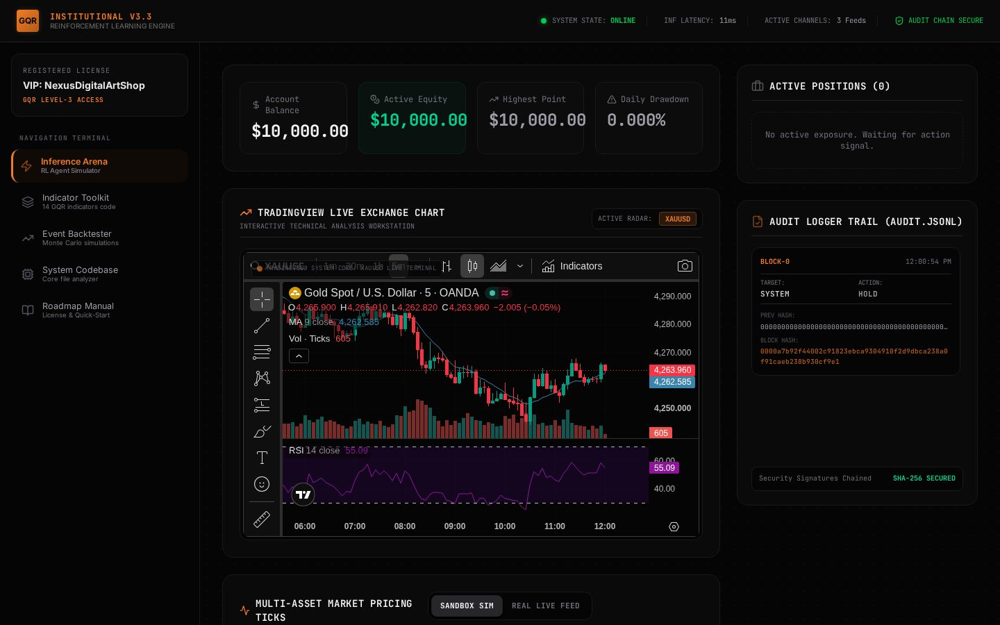
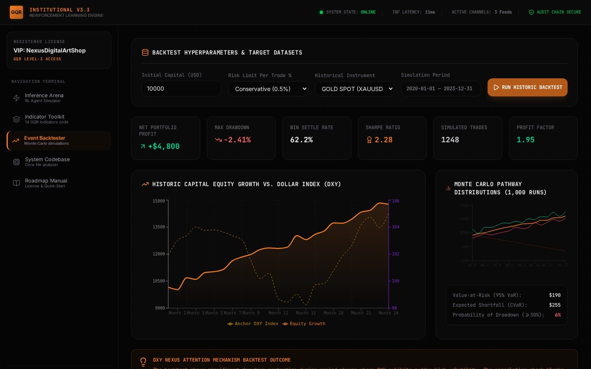
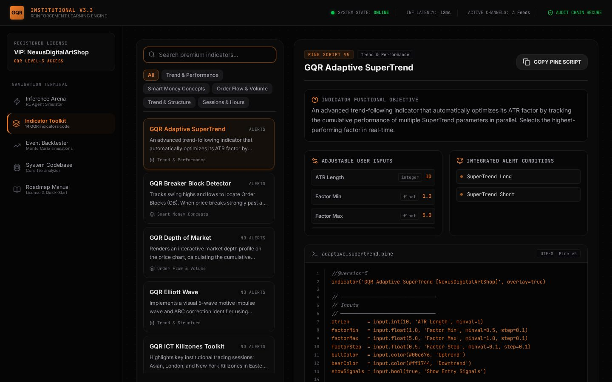
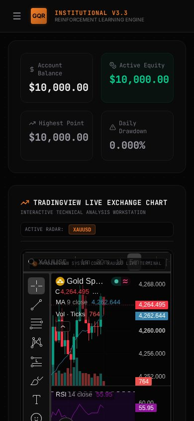

# ⚡ GQR-v2 — Institutional V3.3 Interactive Showcase

> **Front-end experience for the GQR trading engine**: a live RL agent simulator,
> 14 real TradingView indicators, a Monte Carlo backtester and a codebase explorer —
> all running locally in your browser. No backend required.


| Inference Arena (live) | Event Backtester |
|---|---|
|  |  |

| Indicator Toolkit | Mobile |
|---|---|
|  |  |

## ✨ What's inside (5 tabs)

- ⚡ **Inference Arena** — simulated RL agent: live price ticks, SMC feature panel,
  Transformer confidence gauge, positions with floating P&L, kill-switch + hash-chained audit trail,
  and an embedded **real TradingView chart**. Feed toggle: `Sandbox Sim` or `Real Live Feed`
  (real XAUUSD/EURUSD spot via public Coinbase API, DXY derived).
- 📚 **Indicator Toolkit** — all **14 full Pine Script v5 indicators** with search,
  category filters, inputs/alerts metadata and one-click copy.
- 📈 **Event Backtester** — capital / risk / instrument inputs → animated run →
  metrics (profit, drawdown, Sharpe, VaR/CVaR…) + equity-vs-DXY chart + Monte Carlo fan (recharts).
- 💻 **System Codebase** — 7 core engine files (incl. the real `settings.yaml`) with
  role notes, highlights and copy button.
- 📖 **Roadmap Manual** — deployment pipeline, `.env` variable registry and the license text.

**Deep links**: every tab is shareable — `#/arena`, `#/indicators`, `#/backtest`, `#/codebase`, `#/roadmap`
(back-button safe).

## 🛠 Tech stack

| Layer | Tech |
|---|---|
| UI | React 19, Vite 6, Tailwind CSS 4, TypeScript |
| Motion / icons / charts | motion, lucide-react, recharts |
| External (runtime) | TradingView widget (`s3.tradingview.com`), Coinbase spot API, Google Fonts |

## 🚀 Quickstart

```bash
npm install
npm run dev        # → http://localhost:3000/#/arena
```

```bash
npm run build      # tsc + vite build → dist/
npm run preview    # serve the production build
npm run lint       # tsc --noEmit
```

## 📁 Project structure

```
GQR-v2/
├── src/
│   ├── App.tsx            # shell + sidebar + hash-routed tabs
│   ├── types.ts           # PineIndicator, CodeFile, TradeRecord, chart points
│   ├── components/
│   │   ├── AgentSimulator.tsx    # RL arena (ticks, inference, positions, audit)
│   │   ├── TradingViewChart.tsx  # live TV widget loader (OANDA/FX/CAPITALCOM)
│   │   ├── BacktestEngine.tsx    # simulator + recharts visuals
│   │   ├── IndicatorExplorer.tsx # 14 pine scripts: search/filter/copy
│   │   ├── CodebaseExplorer.tsx  # 7 engine files viewer
│   │   └── QuickStartGuide.tsx   # deploy steps + .env registry + license
│   └── data/
│   │   ├── indicators.ts  # 14 complete Pine v5 sources (~1100 lines)
│   │   └── codebase.ts    # 7 engine file snapshots
├── docs/                  # screenshots used above
└── dist/                  # (build output, git-ignored)
```

## 🎯 Honest notes

- Everything except the TradingView widget and the optional live feed is **simulated locally**
  (Brownian ticks, synthetic backtest stats) — it's a showcase, not a trading terminal.
- The audit-trail hashes are a **visual demo** (toy hash, clearly labeled in code), not real SHA-256.
- Needs internet for the TradingView chart, live feed toggle and fonts; the rest works offline after `npm install`.
- Companion repo: the Python engine lives in **`GQR-v1`** (same account).

## ⚠️ Disclaimer

Educational and research showcase only. Trading involves significant financial risk;
simulated results do not guarantee future performance.

## 📜 License

🔒 Proprietary — see LICENSE.txt (same terms as the GQR engine).

## 📞 Support

💬 Telegram: @NexusDigitalArtShop
