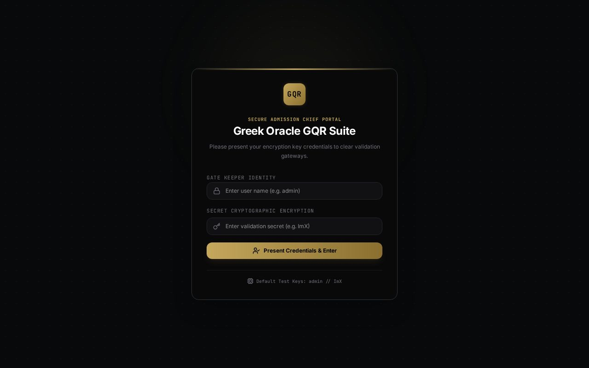
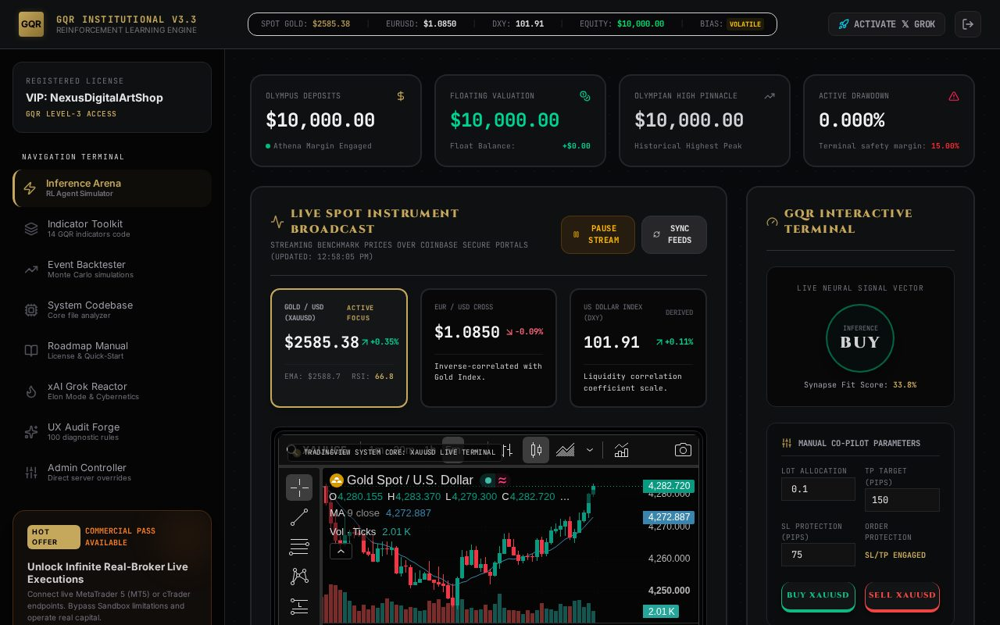
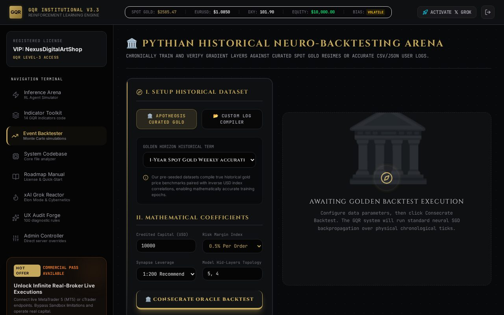
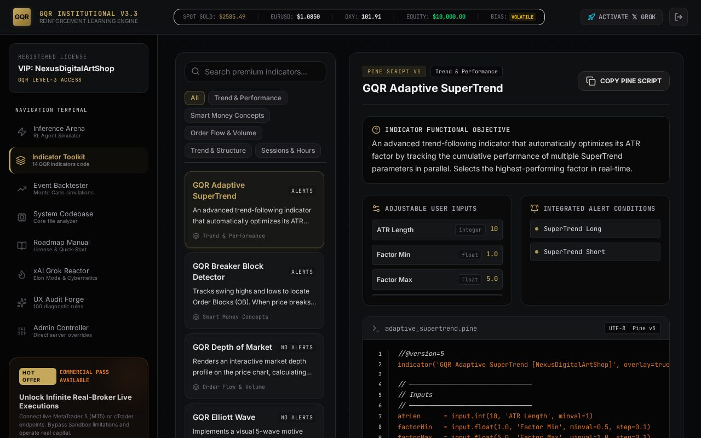
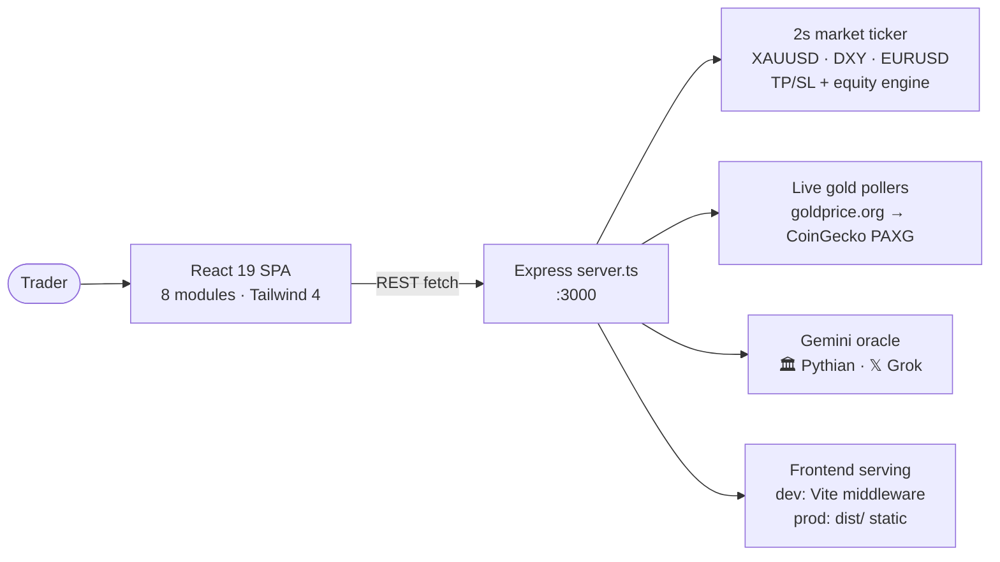

# ⚡ GQR-v3 — GQR Institutional V3.3 Platform

An interactive showcase of the **GQR Institutional V3.3** algorithmic trading engine:
a login-gated React + Express app with a live simulated gold market, an RL agent
trading arena, a Monte Carlo backtester, 14 TradingView indicators, a code explorer
and a Gemini-powered trading oracle with two personas.


## 📸 Screenshots



*Login gate — demo credentials below*



*Inference Arena — live XAUUSD ticker, TradingView chart, neural signal vector, BUY/SELL co-pilot*



*Event Backtester — Monte Carlo simulations over historical gold data*



*Indicator Toolkit — 14 GQR indicator scripts with code viewer*

## ✨ Modules (8)

| Tab | What it does |
|---|---|
| ⚡ Inference Arena | RL agent simulator: live gold/EURUSD/DXY feed, TradingView chart, manual BUY/SELL with lot + TP/SL |
| 📚 Indicator Toolkit | 14 GQR indicators with Pine Script source viewer |
| 📈 Event Backtester | Monte Carlo backtests over bundled historical gold data |
| 💻 System Codebase | Interactive explorer of the engine's core files |
| 📖 Roadmap Manual | License + quick-start guide |
| 🔥 xAI Grok Reactor | "Elon mode" — Grok-persona market copilot (needs `GEMINI_API_KEY`) |
| ✨ UX Audit Forge | 100-rule UX diagnostic questionnaire |
| 🎛️ Admin Controller | Live server overrides: trend bias, volatility, tick speed |

## 🏗️ Architecture



## 🔌 API endpoints

| Method | Path | Purpose |
|---|---|---|
| POST | `/api/auth/login` | Demo login (see credentials) |
| GET | `/api/market/state` | Full market snapshot (prices, positions, equity, logs) |
| POST | `/api/market/trade` | Open `BUY`/`SELL` with `lot`, `tp`, `sl` |
| POST | `/api/market/close` | Close a position by `id`, settle P&L |
| POST | `/api/market/reset` | Reset the $10,000 demo account |
| POST | `/api/market/config` | Admin tuning: `trendBias`, `volatility`, `tickIntervalMs` |
| POST | `/api/gemini/analyze` | Oracle report (live or backtest context, optional chart image) |

## 🚀 Run locally

**Prerequisites:** Node.js 20+

```bash
npm install
cp .env.example .env   # then add your GEMINI_API_KEY (only needed for the oracle tabs)
npm run dev            # full-stack dev server on http://localhost:3000
```

| Script | Purpose |
|---|---|
| `npm run dev` | Dev server (Express + Vite middleware via `tsx`) |
| `npm run build` | Build client to `dist/` + bundle server to `dist/server.cjs` |
| `npm start` | Run production build (`NODE_ENV=production`) |
| `npm run lint` | TypeScript check (`tsc --noEmit`) |

**Demo login:** username `admin` · password `ImX`
(overridable in production via `ADMIN_USER` / `ADMIN_PASS`)

| Env var | Default | Purpose |
|---|---|---|
| `GEMINI_API_KEY` | — | Enables the Pythian/Grok oracle; everything else works without it |
| `ADMIN_USER` / `ADMIN_PASS` | `admin` / `ImX` | Login credentials |
| `PORT` | `3000` | Server port |
| `GEMINI_MODEL` | `gemini-3.5-flash` | Oracle model |
| `NODE_ENV` | — | `production` serves `dist/` statically |

> Note: this is a full-stack app (it needs its Node server), so it can't be hosted
> on static-only GitHub Pages — deploy the production build on any Node host.

## 📦 Project structure

```
├── server.ts              # Express API + market ticker + gold pollers + Gemini oracle
├── src/
│   ├── App.tsx            # Login gate + 8-tab navigation terminal
│   ├── components/        # AgentSimulator, BacktestEngine, IndicatorExplorer,
│   │                      # CodebaseExplorer, AdminPanel, ElonGrokCouncil,
│   │                      # GqrTimeline, QuickStartGuide, UxAuditForge,
│   │                      # LoginGate, RlTrainingChart, TradingViewChart
│   └── data/              # historicalGold, indicators, codebase, uxQuestions
├── docs/                  # README screenshots
└── dist/                  # production build (git-ignored)
```

## 🛠️ Tech

React 19 · Vite 6 · TypeScript · Tailwind CSS 4 · Express 4 · Recharts ·
`@google/genai` · Lucide icons · Motion — Greek-gold dark theme
(Cinzel / Cormorant Garamond / Inter / JetBrains Mono).

## 🔧 Polish notes

- **Fixed production crash:** `server.ts` used ESM-only `import.meta` (bundled to CJS),
  so `npm start` died instantly with `TypeError` — removed the unused lines and
  smoke-tested `NODE_ENV=production` (`GET / → 200`, live market state ✅)
- **Security hygiene:** hardcoded `admin`/`ImX` moved to `ADMIN_USER`/`ADMIN_PASS`
  env vars (demo fallback + startup warning); added `.gitignore` (was missing —
  `node_modules`/`dist`/`.env` are now excluded) + `.env.example`
- **Deployability:** `PORT` and `GEMINI_MODEL` are env-configurable; fixed stale
  gold seed in `/api/market/reset` (2341.60 → 2585.50, same as fresh boot)
- **Branding:** package renamed `react-example` → `gqr-v3` @ `3.3.0`, real page
  `<title>` + meta description, full README with screenshots + architecture diagram
- **QA:** `tsc` clean, `vite build` clean, headless run of login + 3 modules with
  **0 console/page errors** ✅

## 📜 License

GQR Institutional V3.3 Software License Agreement — personal, educational and
demo-only use; no commercial trading or redistribution (see [LICENSE.txt](LICENSE.txt)).
© 2025 NexusDigitalArtShop / GQR Development Team.
