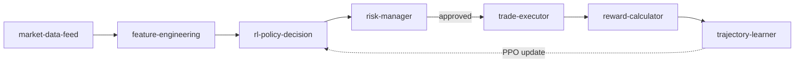

# Hermes × MT5 — GOLD SNIPER v9.0 Agent Skills

Seven **agent skills** (Claude Skills / Hermes compatible) that encode the full live-trading
loop of the **GOLD SNIPER v9.0** `FusedActorCritic` RL agent on MetaTrader 5 (XAUUSD + EURUSD cross-fusion).
Each skill mirrors the logic of its `GQRAgent` / `GoldEnvFusion` counterpart in the v9.0 codebase.

> ⚠️ **Risk Notice:** XAUUSD on low timeframes is extremely volatile and spread-sensitive.
> These skills are a technical reference for a trading agent — not trading advice.
> Always start on a **demo account**.

## 🔁 Trading loop



## 📚 Skills

| # | Skill | Role |
|---|---|---|
| 1 | [`market-data-feed`](market-data-feed.md) | Fetches MT5 OHLCV + bid/ask ticks for XAUUSD & EURUSD; builds the DataFrames the agent consumes |
| 2 | [`feature-engineering`](feature-engineering.md) | State constructor: 28-dim normalized feature vectors, ICT Order Blocks, FVG, Liquidity Sweeps |
| 3 | [`rl-policy-decision`](rl-policy-decision.md) | Fuses Actor-Critic inference with ICT signals → BUY/SELL/HOLD + SL/TP levels |
| 4 | [`risk-manager`](risk-manager.md) | Pre-trade filters (spread/ATR/session/news) + Kelly sizing + daily kill-switch |
| 5 | [`trade-executor`](trade-executor.md) | MT5 order execution: fill-mode detection, SL/TP construction, emergency close |
| 6 | [`reward-calculator`](reward-calculator.md) | RL reward signal: live equity-change + simulated PnL/Sharpe penalties |
| 7 | [`trajectory-learner`](trajectory-learner.md) | Online learning loop: SQLite vault, PPO updates, Sharpe-based rollback (ModelGuard) |

Every skill carries `name` / `description` / `version` frontmatter and documents its purpose,
inputs, outputs and failure modes.

## 🚀 Usage

Drop the repo (or individual skills) into your agent's skills directory:

```bash
# Claude Agent Skills
cp *.md ~/.claude/skills/hermes-mt5/

# or reference directly from Hermes Agent skill settings
```

No build step, no dependencies — pure Markdown.

## 🔗 Sibling project

- [**mt5-fetcher**](https://github.com/ImXforever/mt5-fetcher) (#16) — FastAPI + PWA service that
  collects the MT5 market data these skills reason about.

## 📄 License

MIT — see [LICENSE](LICENSE).
