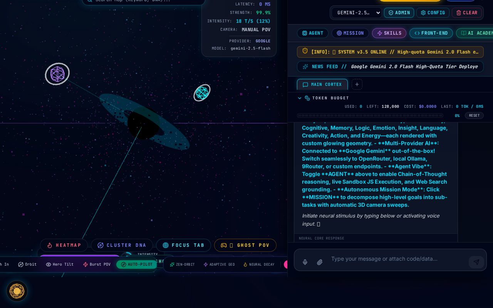
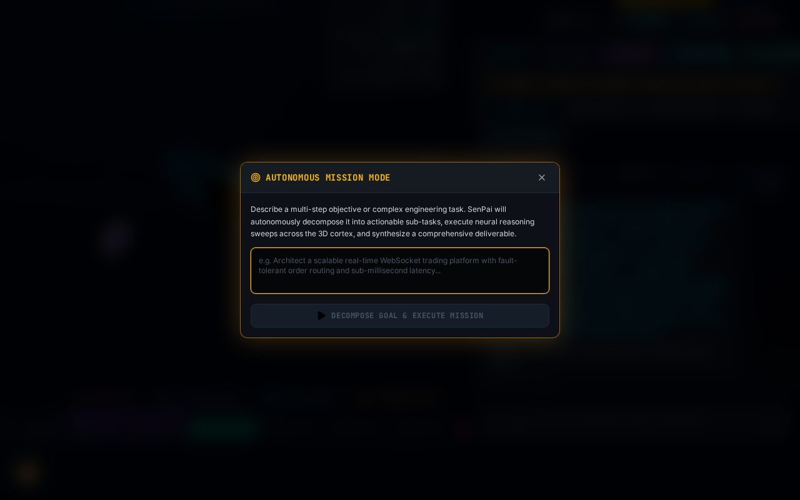
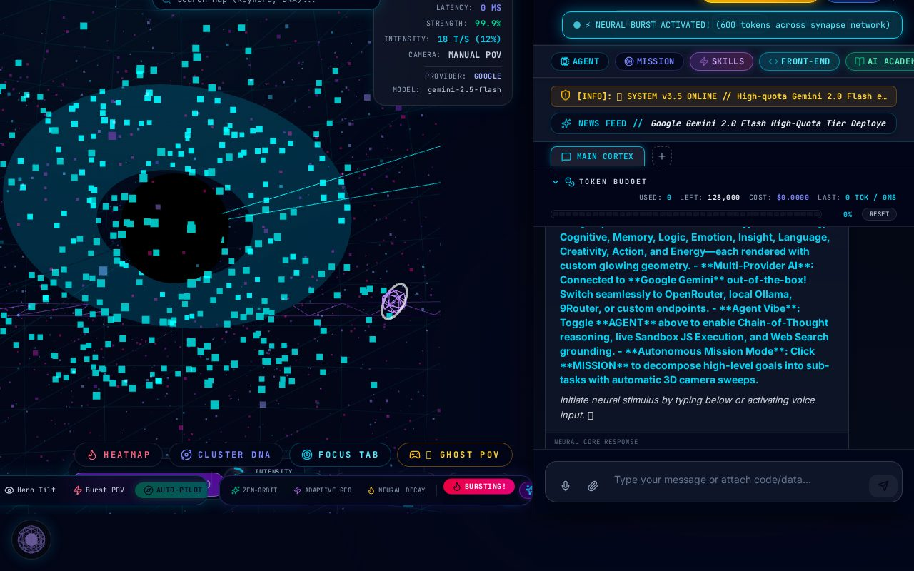

# SenP — 3D MIND LLM · SenPai Neural OS

A futuristic **3D neural-network LLM interface**: chat with multi-provider AI
(Gemini out-of-the-box, OpenRouter / Ollama / custom endpoints) while concepts
materialize as glowing geometry in an interactive 3D brain — with Chain-of-Thought
agent vibe, autonomous mission mode, token budgeting and an admin console.



## ✨ Features

- **BrainCanvas** — Three.js 3D cortex: planets, clusters, ghost POV, heatmaps, camera autopilot
- **Neural Burst & Pathfinding** — token shockwaves across the synapse network (600-token bursts)
- **Agent vibe** — Chain-of-Thought reasoning, live sandbox JS execution, web-search grounding
- **Autonomous Mission Mode** — decomposes engineering goals into sub-tasks with 3D camera sweeps
- **Multi-provider chat** — Gemini 2.5 Flash default; OpenRouter / Ollama / 9Router switchable
- **Ops built-in** — token budget meter, market ticker, conversation tabs, TTS/STT, admin console
  (announcements, news feed, skills, MCP servers, custom CLI commands)




## 🚀 Run locally

**Prerequisites:** Node.js 20+

```bash
npm install
cp .env.example .env   # add your GEMINI_API_KEY
npm run dev            # dev server on http://localhost:3000
```

Production:

```bash
npm run build
NODE_ENV=production npm start
```

### API

| Endpoint | Method | Description |
|---|---|---|
| `/api/health` | GET | Health check |
| `/api/gemini/chat` | POST | Chat / streaming completions (text + vision) |
| `/api/gemini/models` | GET | Available models |
| `/api/auth/url` | GET | OAuth URL (or sandbox demo fallback) |
| `/api/admin/*` | * | Login, config, news, skills (token-gated) |

### Keyless behavior (verified)

- Full 3D UI, mission planner, token meter and admin console work **without any API key**.
- Chat without a key returns a clean JSON error (`GEMINI_API_KEY is not configured…`).

## 🔒 Security notes

- Admin console defaults to `admin` / `1234` (demo). Override with `ADMIN_USERNAME` /
  `ADMIN_PASSWORD` env vars — the server warns on boot when defaults are active.
- The admin password is never exposed via API responses, and config saves preserve it
  server-side. Admin tokens are self-asserted demo tokens, not real sessions —
  do not expose this server to the public internet as-is.

## 🛠 Tech stack

React 19 · TypeScript · Vite 6 · TailwindCSS 4 · Three.js · Express · `react-markdown` ·
`recharts` · `motion` · `@google/genai` · esbuild (CJS server bundle)

## 📄 License

MIT — see [LICENSE](LICENSE).
