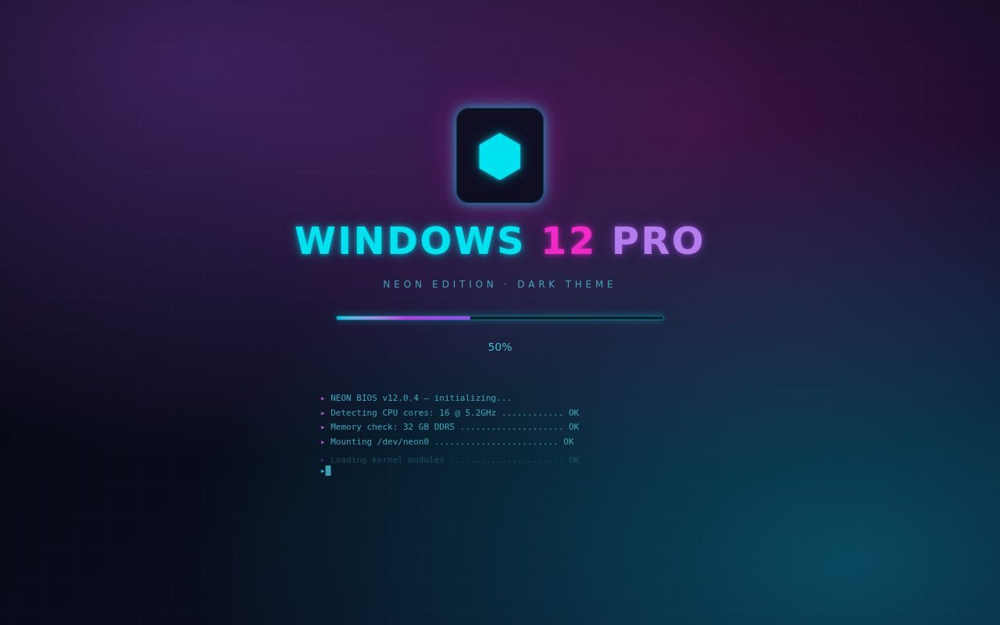
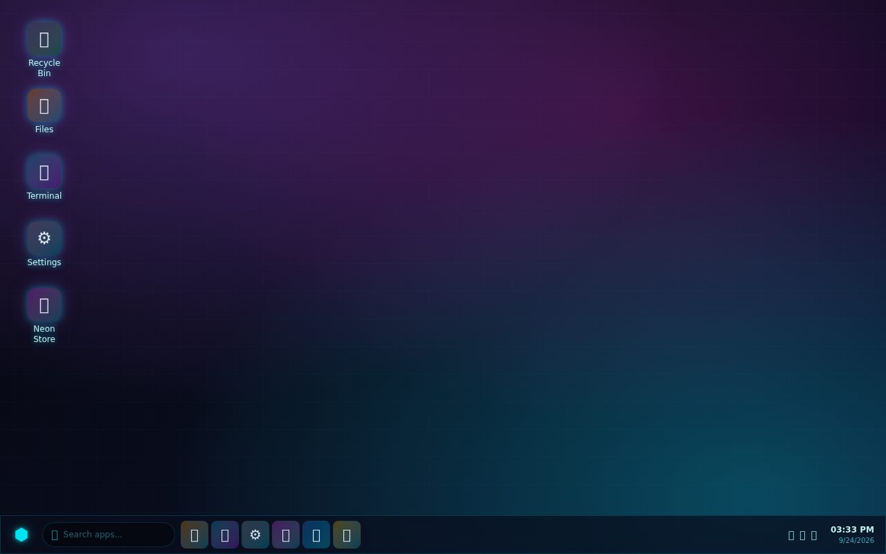
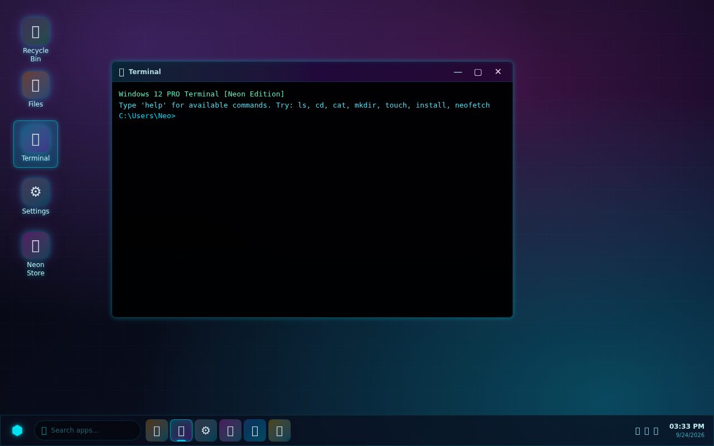

# Windows 12 PRO — Neon Edition

A dark neon-themed **web desktop simulator**: BIOS boot sequence, login screen,
draggable-window desktop with 20+ apps, start menu, taskbar and system settings —
built with Next.js as a **pure static export** (no server, no database needed).



## ✨ Features

- **Boot + login flow** — animated BIOS log, progress bar, optional PIN/password
- **Desktop** — draggable icons, right-click context menu, notification toasts
- **Windowing** — drag, focus, minimize, maximize, taskbar with live clock + search
- **20+ apps** — Terminal (virtual filesystem: `ls/cd/cat/mkdir/neofetch`),
  Files, Neon Store, Settings, Notepad, Calculator, Browser, Paint, Calendar,
  Music, Photos, Code editor, Mail, Chat, Games, Maps, Task Manager, Camera…
- **Persistent state** — settings, files and layout survive reloads via localStorage
  (zustand/persist)




## 🚀 Run locally

**Prerequisites:** Node.js 20+

```bash
npm install
npm run dev      # dev server with HMR
npm run build    # → static export in out/
```

Serve the export with any static server:

```bash
npx serve out
```

No backend, no API keys, no database — 100% client-side.

### Deploy

The build is a static export configured with `basePath: "/W12"`, ready for
GitHub Pages (project site) or any static host serving it under `/W12`.

## 🛠 Tech stack

Next.js 16 (static export) · React 19 · TypeScript · TailwindCSS 4 · Zustand

## 🐛 Cleanups in this polish

- Removed the entire unwired Postgres/Drizzle backend (4 API routes, schema, `pg`
  + `drizzle-orm` + `dotenv` deps) — the UI never called it; everything persists
  via localStorage. This also fixed a latent PK bug (`.default(genId())`
  evaluated once, so every insert would have reused the same id).
- Fixed the same stale-closure off-by-one as in `win12` (#22): the boot log now
  shows the first line instead of skipping it.

## 📄 License

MIT — see [LICENSE](LICENSE).
