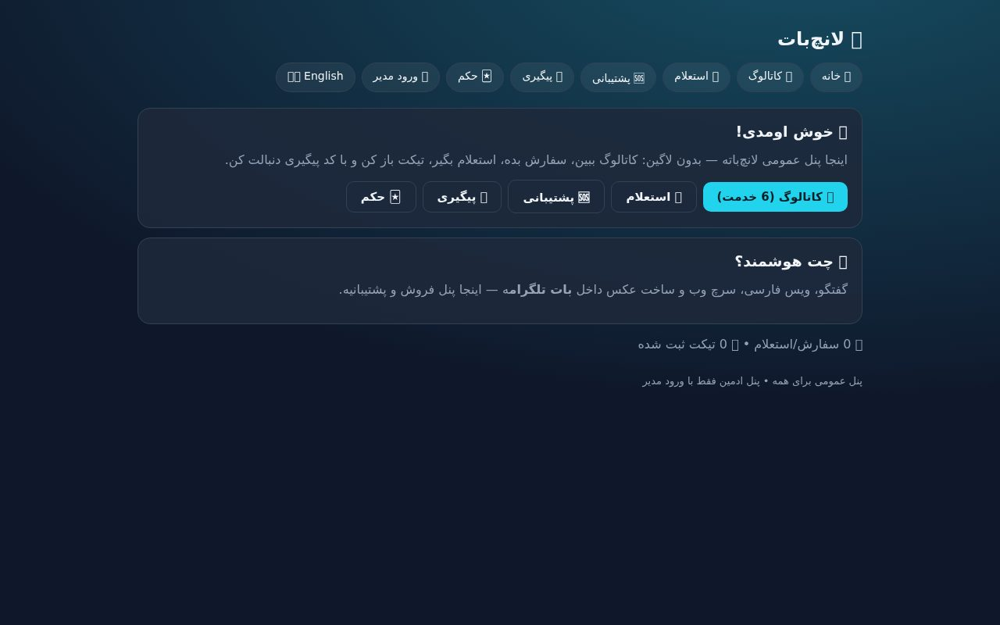
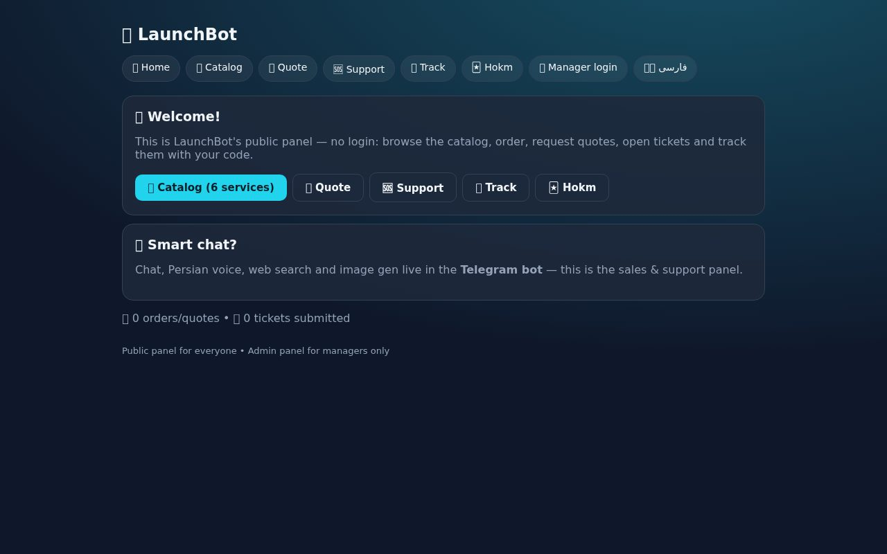
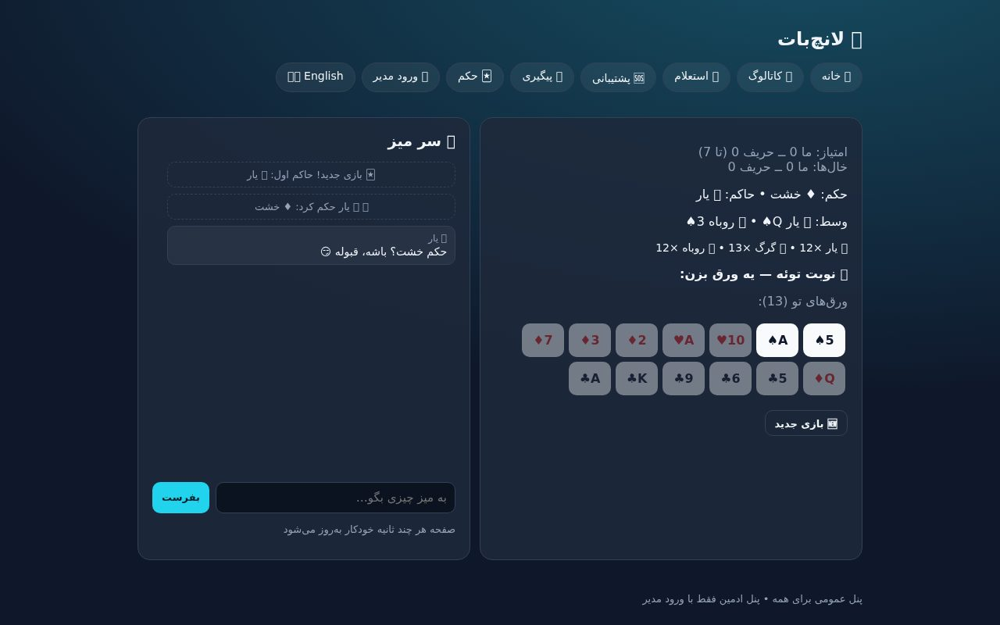

# 🚀 LaunchBot v3.1.0 «حکم» — بات + وب‌اپ + بازی حکم ۴ نفره، فارسی/انگلیسی

> **🆕 v3.1.0 «حکم»:** بازی حکم ۴ نفره — تو + ۳ ایجنت 🐺🤝🦊 — در بات (`/hokm`) و وب (`/hokm` دوپنلی: میز + چت) · موتور stdlib + ایجنت heuristic + کل‌کل LLM · **۶۸ تست سبز + ۹ تست وب در CI**
> v3.0.0 «دوزبانه»: معماری چهارلایه (front/back/data/llm) · سیستم زبان **موبه‌مو مکانیزم بات اصلی** (`t()` + `locales/` + فالبک دومرحله‌ای) · انتخاب زبان توسط یوزر در شروع (بات: `/start` → 🇮🇷/🇬🇧 · وب: سوییچ `?lang=`) · **۲۷ تست سبز + ۷ تست وب در CI**
> نسخه‌های قبلی: v3.0.0 «دوزبانه» (چهارلایه + دوزبانه) · v2.0.0 «دوجهانه» (بات+وب) · v1.0.0 «تک‌بات» — جزئیات: [CHANGELOG.md](CHANGELOG.md)

```
        ┌──────────────┐              ┌──────────────┐
        │  کاربر عادی  │              │    مدیر      │   🌍 fa/en (هرکس زبان خودش)
        └──────┬───────┘              └──────┬───────┘
               │                             │
               ▼                             ▼
   ┌───────────────────────────────────────────────────┐
   │  front/  بات تلگرام + وب‌اپ + i18n (t + locales)   │
   ├───────────────────────────────────────────────────┤
   │  back/   بیزینس‌لاجیک مشترک (تأیید/رد، تیکت، بج)   │
   ├───────────────────────────────────────────────────┤
   │  llm/    مدل‌ها: چت/بینایی/عکس/صدا + حافظه        │
   ├───────────────────────────────────────────────────┤
   │  data/   SQLite روی Volume (users/orders/tickets/  │
   │          settings/lang) + مایگریشن خودکار          │
   └───────────────────────────────────────────────────┘
```

<details>
<summary>📜 نسخه‌های قبلی (v2.0.0 «دوجهانه» و v1.0.0 «تک‌بات»)</summary>

# 🚀 LaunchBot v2.0.0 «دوجهانه» — بات تلگرام + وب‌اپ

> **🆕 v2.0.0:** وب‌اپ دونقشه (پابلیک/ادمین) · همه‌ی متغیرها قابل ادیت از ادمین · لانچر واحد `run.py` · ۱۴ تست

# 🚀 LaunchBot v1.0.0 «تک‌بات» — فقط تلگرام

> **🆕 v1.0.0:** بات پولینگ + ایجنت آرنا + فروش/تیکت + دکمه 🔊/📝 زیر هر جواب

</details>

## 📸 اسکرین‌شات‌ها



*خانه‌ی فارسی — ناوبری، خوش‌آمد، کاتالوگ.*



*خانه‌ی انگلیسی (`?lang=en`) — چپ‌به‌راست کامل.*



*بازی حکم ۴ نفره در وب — پنل میز + پنل چت با ایجنت‌ها.*

## 🌳 ساختار

```
bot.py                ورودی نازک تلگرام (چک env + polling) — منطق در front/
web.py                ورودی نازک وب (اپ در front/web.py)
run.py                لانچر واحد: بات + وب در یک پروسس (Railway/VPS)
config.py             همه‌ی تنظیمات از env (+ LAUNCH_LANG)
front/
  i18n.py             موتور زبان — دقیقاً مکانیزم بات اصلی (t/key/fa-fallback)
  bot_handlers.py     همه‌ی هندلرهای تلگرام (دوزبانه، انتخاب زبان در /start)
  web.py              وب‌اپ Flask دوزبانه (?lang + کوکی + سوییچ در منو)
back/services.py      قوانین کسب‌وکار: تأیید/رد، ترنزیشن تیکت، ولیدیشن، بج‌ها
back/games/           موتور حکم (stdlib خالص): قوانین + ایجنت‌ها + شخصیت‌ها + رندر مشترک بات/وب
data/store.py         تنها لایه‌ی دیتا (stdlib): SQLite + settings + کاتالوگ + lang
llm/client.py         مدل‌ها: chat/vision/image/transcribe/speak + حافظه‌ی گفتگو
locales/fa.json       ۳۳۱ کلید فارسی (نقطه‌ای، مثل بات اصلی)
locales/en.json       ۳۳۱ کلید انگلیسی (parity کامل با fa — تست‌شده)
catalog.json          سید اولیه‌ی کاتالوگ
tests/                test_store + test_i18n + test_services + test_hokm* (stdlib) + test_web (pytest)
docs/ADMIN-FA.md      راهنمای ادمین
.github/              CI: compileall + unittest + pytest
```

## 🚀 اجرا

```bash
# 1) env را پر کن
cp .env.example .env   # TELEGRAM_BOT_TOKEN, OPENAI_*, ADMIN_IDS, WEB_PASSWORD, WEB_SECRET...

# 2) محلی (بات + وب)
pip install -r requirements.txt
python -m unittest discover -s tests -t .   # 68 passed
pytest tests/test_web.py -q                  # 9 passed (نیاز به flask)
python run.py        # وب روی :5000 + بات (اگر توکن ست باشد)

# حالت‌های تکی: python bot.py (فقط بات) · python web.py (فقط وب)

# 3) با داکر
docker build -t launchbot . && docker run -p 5000:5000 --env-file .env launchbot

# 4) Railway — New Project → Deploy from Repo → Volume روی /app/data → Variables → Deploy
```

## 🌍 زبان — دقیقاً مکانیزم بات اصلی

- موتور: `front/i18n.py` = کپی منطقی `i18n.py` بات اصلی: `t(key, lang, **kw)` + `locales/*.json` + فالبک **زبان ← fa ← خود کلید** + `available()`.
- **انتخاب زبان توسط یوزر در شروع:** اولین `/start` → دکمه‌ی 🇮🇷/🇬🇧 → ذخیره در `users.lang`؛ بعداً با `/lang` قابل تعویض. منوی بات در هر دو زبان شناخته می‌شه (سوییچ وسط راه چیزی رو نمی‌شکنه).
- هر پیام به **زبان خودش** می‌رسه: مشتری به زبان خودش، هر ادمین به زبان خودش (نوتیف‌ها per-admin رندر می‌شن).
- وب: `?lang=fa|en` + کوکی + دکمه‌ی سوییچ در منو (fa=راست‌به‌چپ، en=چپ‌به‌راست).
- تست‌ها: parity کامل fa/en (۳۳۱=۳۳۱) + پوشش ۱۰۰٪ کلیدهای استفاده‌شده در کد + گارد رگرسیون.

## 🖥 وب‌اپ: دو شرط نقش

| نقش | شرط | دسترسی |
|---|---|---|
| 👤 عادی | بدون لاگین | **فقط پنل‌های پابلیک:** خانه، کاتالوگ، سفارش، استعلام، پشتیبانی، پیگیری با کد، 🃏 حکم |
| 👔 ادمین | لاگین با `WEB_PASSWORD` | همه‌ی پابلیک **+ پنل‌های ادمین:** داشبورد، سفارش‌ها، تیکت‌ها، کاتالوگ، تنظیمات، کاربران |

## ⚙️ همه‌ی متغیرها قابل ادیت توسط ادمین (بدون ری‌دیپلوی)

| گروه | کلیدها | از کجا |
|---|---|---|
| 🧠 AI | `chat_model`، `system_prompt`، `max_tokens`، `temperature`، `max_history` | بات `/set` + پنل وب |
| 🎙 مدیا | `image_model`، `tts_provider`، `tts_gender`، `edge_rate`، `default_mode` | بات `/set` + پنل وب |
| ✍️ متن‌ها | `welcome_text`، `welcome_text_en`، `help_text`، `help_text_en` | بات `/set` + پنل وب |
| 🧩 کاتالوگ | خدمات/قیمت‌ها (fa+en)، واحد پول، افزودن/حذف | پنل وب `/admin/catalog` |
| 🔑 اتصال | `*_api_key`، `*_base_url`، مدل‌های tts/stt | فقط `/set` داخل بات (حساس!) |

لیبل‌های فرم هم دوزبانه‌ان (از `locales/`). مقدار DB روی env می‌شینه؛ خالی/`-` = برگشت به پیش‌فرض.

## 🤖 دستورات بات

| دستور | کار |
|---|---|
| `/start` `/lang` `/help` `/id` `/new` `/mode` | شروع (+انتخاب زبان)، تعویض زبان، راهنما، آیدی، پاک‌حافظه، ویس/متن |
| `/ask` `/search` `/image` `/say` | چت، سرچ وب، ساخت عکس، متن‌به‌ویس |
| `/models` `/model` | لیست و تعویض مدل (به‌ازای هر کاربر) |
| `/catalog` `/quote` `/orders` | کاتالوگ و سفارش، استعلام، پیگیری |
| `/support` `/tickets` | تیکت، لیست و گفتگو |
| 🃏 `/hokm` | حکم ۴ نفره با ۳ ایجنت (`/hokm new` تازه · `/hokm stop` پایان) |
| 👔 `/admin` `/approvals` | پنل مدیر، صف تأیید |
| ⚙️ `/settings` `/set` | دیدن و تغییر همه‌ی متغیرها |

## 🧪 وضعیت + دیباگ نسخه‌ی نهایی

- **۶۸ تست پاس** (stdlib: استور/زبان/سرویس‌ها/حکم) + **۹ تست وب در CI** — جمعاً ۷۷
- `compileall` بدون خطا · `build_app` واقعی: ۲۷ هندلر رجیستر می‌شن · رندر دوزبانه‌ی per-admin ✔
- 🐞 باگ‌های گرفته‌شده در این نسخه:
  - `t(..., key=...)` با پارامتر `key` تداخل داشت (TypeError در `/set`) → پلسی‌هولدر `{name}` + تست رگرسیون استاتیک
  - دیتابیس‌های v1/v2 ستون `lang` نداشتن → مایگریشن خودکار `ALTER TABLE` در `init_db` (تست‌شده)
  - چک `is_new` بعد از get-or-create همیشه False می‌داد → چک قبل از ساخت (درس از BUG-REF-1 بات اصلی)
- ولیدیشن تنظیمات تک‌منبع شد (`back.services` — قبلاً بین بات و وب تکراری بود)

## 🔑 کلیدها (فقط `.env`)

- `TELEGRAM_BOT_TOKEN`، `OPENAI_API_KEY`، `OPENAI_BASE_URL`، `CHAT_MODEL` — اجباری
- `ADMIN_IDS` — مدیرها (با `/id` بگیر) · `WEB_PASSWORD`/`WEB_SECRET` — پنل ادمین
- `LAUNCH_LANG` — زبان پیش‌فرض (`fa`/`en`) · `BASE_URL` — آدرس عمومی (اختیاری)
- بقیه: `.env.example` — و همه‌شون بعداً از پنل هم قابل تغییرن!

## 📚 مستندات

- `CHANGELOG.md` — تغییرات نسخه‌ها · `docs/ADMIN-FA.md` — راهنمای ادمین
- `catalog.json` — سید کاتالوگ (۶ خدمت، قیمت `null` = استعلامی)

---
*ساختار این ریدمی و موتور `i18n` به‌سبک [DropAgentX](https://github.com/ImXforever) (پروژه‌ی خودم) است.* 💜
