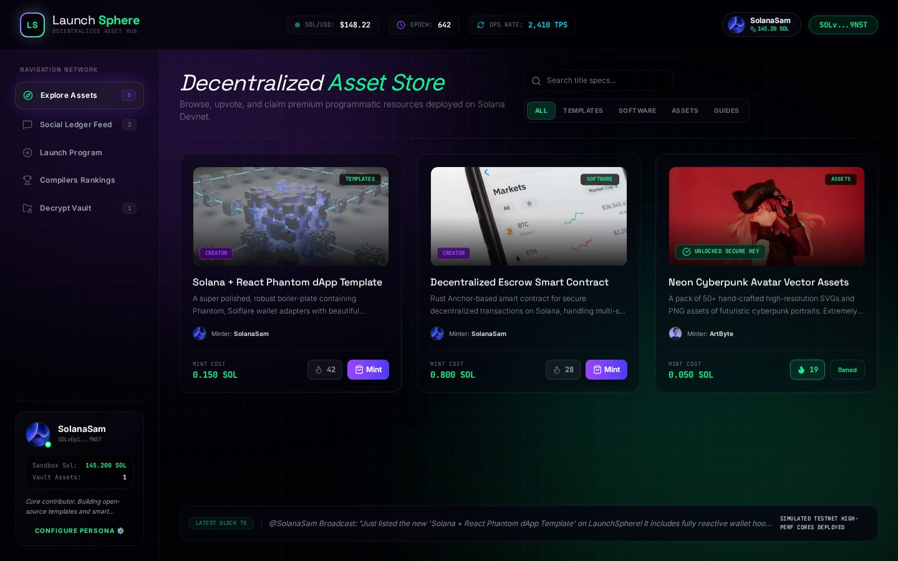
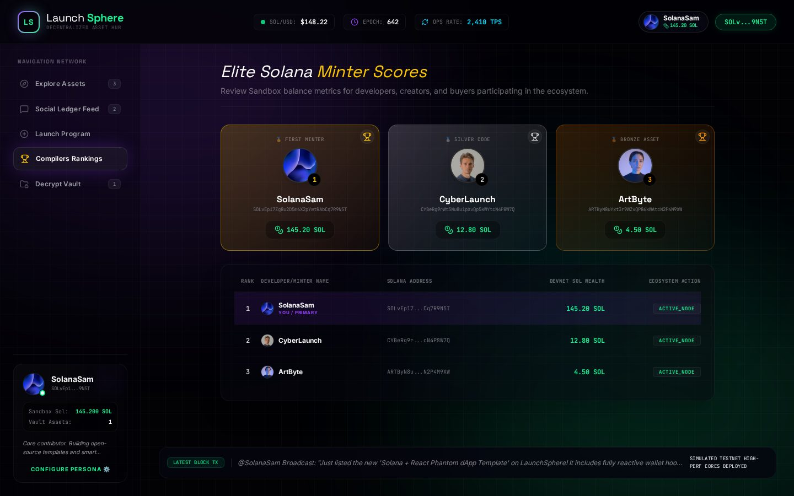
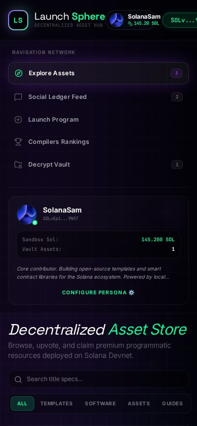

# 🚀 Xmarket — LaunchSphere v0.1

> **Web3 launchpad & digital asset marketplace** (Solana Devnet simulation).
> Browse, upvote, mint and collect programmatic resources — templates, smart contracts, vector assets.


| Explore (Asset Store) | Social Ledger Feed |
|---|---|
|  |  |

| Compilers Rankings | Mobile |
|---|---|
|  |  |

## ✨ Features

- 🏪 **Asset Store** — browse / search / filter products by category (Templates, Software, Assets, Guides)
- 👍 **Upvotes & Minting** — upvote products, mint with simulated SOL balance
- 📡 **Social Ledger Feed** — broadcast build updates, like posts
- 🚀 **Launch Program** — publish your own product with mint cost + category
- 🏆 **Compilers Rankings** — leaderboard podium + wealth table (balance-sorted)
- 🔐 **Decrypt Vault** — your purchased assets (seeded purchase included)
- ❤️ **Health endpoint** — `GET /api/health` with version, uptime and live DB counts

## 🛠 Tech stack

| Layer | Tech |
|---|---|
| Frontend | React 19, Vite 6, Tailwind CSS 4, lucide-react |
| Backend | Express 5, TypeScript, tsx |
| Data | File-backed JSON store (`server-db.json`, auto-seeded on first boot) |
| Identity | Simulated wallet address + localStorage persona |

## 🚀 Quickstart

```bash
npm install
npm run dev        # → http://localhost:3000
```

Production build:

```bash
npm run build
npm start          # serves dist/ via Express
```

Other scripts: `npm run lint` (tsc typecheck), `npm run preview`, `npm run clean`.

## 🔌 API

All routes live under `/api` and return `{ success, ... }` JSON.
Unknown API routes return JSON `404` (never an HTML page).

| Method | Route | Purpose |
|---|---|---|
| GET | `/api/health` | Liveness probe: status, version, uptime, DB counts |
| GET | `/api/products` | List products |
| POST | `/api/products` | Launch a product |
| POST | `/api/products/:id/upvote` | Upvote |
| POST | `/api/purchase` | Mint / buy a product |
| GET | `/api/posts` | Feed posts |
| POST | `/api/posts` | Broadcast an update |
| POST | `/api/posts/:id/like` | Like a post |
| GET | `/api/users` | Users (leaderboard source) |
| GET | `/api/purchases` | All purchases |
| GET | `/api/purchases/wallet/:address` | Purchases by wallet |
| PUT | `/api/users/profile` | Update persona |

```bash
curl localhost:3000/api/health
# {"status":"ok","version":"0.1.0","uptime":12,"db":{"users":3,"products":3,"posts":2,"purchases":1}}
```

## ⚙️ Configuration

| Variable | Default | Purpose |
|---|---|---|
| `PORT` | `3000` | Server port (PaaS injects this automatically) |
| `GEMINI_API_KEY` | _(empty)_ | Reserved for future AI features; currently unused |

Copy `.env.example` → `.env` for local overrides. `.env*` is git-ignored.

## 📁 Project structure

```
├── server.ts              # Express API + SPA serving + /api/health
├── server-db.json         # (runtime) file-backed store, git-ignored
├── src/
│   ├── App.tsx            # tab router + layout (explore/feed/launch/leaderboard/vault)
│   ├── api.ts             # typed API client
│   ├── mockData.ts        # seed fallback + persona helpers
│   └── components/        # Explore, Feed, Launchpad, Leaderboard, Vault, ...
├── docs/                  # screenshots used above
└── dist/                  # (build output, git-ignored)
```

## 🎯 Honest notes

- Wallet, SOL balances and Devnet traffic are **simulated** — no real chain calls.
- Persistence is a local JSON file; great for demo, not for multi-instance deploys (swap `loadDB`/`saveDB` for Postgres/Supabase when scaling).
- Product/seed images hotlink external CDNs (picsum, pravatar, seed URLs).

## 🗺 Roadmap ideas

- Real Phantom wallet adapter + Devnet RPC balance checks
- Postgres/Supabase persistence layer behind the current DB helpers
- Pagination + full-text search on products/posts
- Docker image + one-click deploy (Render/Railway-ready today via `PORT` + `/api/health`)

## 📄 License

MIT — see [LICENSE](LICENSE).
