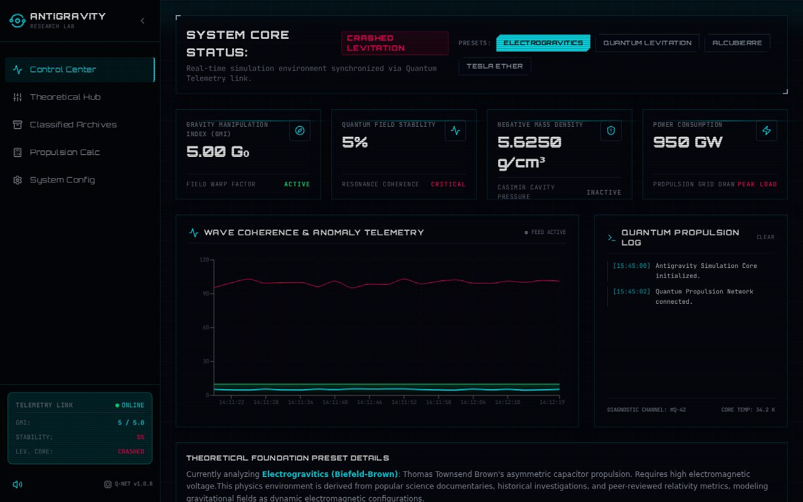
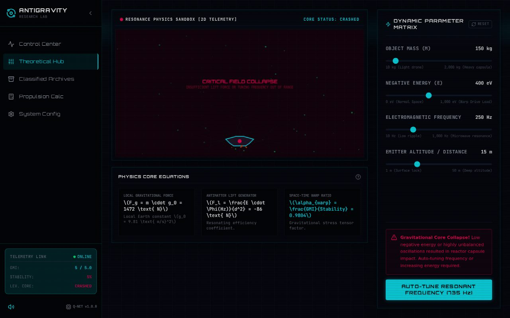
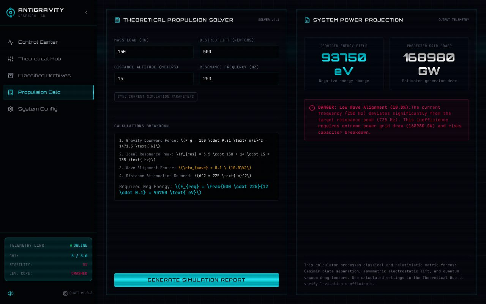
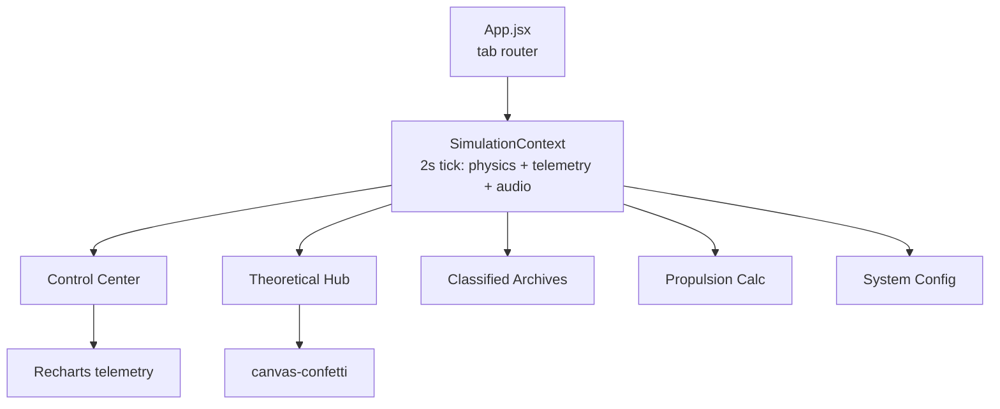

# 🛸 Telegram — Antigravity Research & Simulation Platform

> **Note:** despite the repo name, this app is a sci-fi **antigravity research
> simulator**, not a Telegram client — a mission-control dashboard with live
> telemetry, a physics sandbox, classified archives and a propulsion calculator.
> Live demo (after Pages activation): https://imxforever.github.io/antigravity-lab/


## 📸 Screenshots



*Control Center — core status, GMI/stability/density/power cards, telemetry chart, propulsion log*



*Theoretical Hub — mass/energy/frequency/distance sliders, levitation equation, auto-tune*



*Propulsion Calc — mission math console*

## ✨ Features

| Tab | What it does |
|---|---|
| 🛰️ Control Center | System-core status, 4 live gauges, wave-coherence telemetry chart, propulsion event log, theory preset briefings |
| 🧪 Theoretical Hub | Interactive physics sandbox (mass/energy/frequency/distance), levitation equation, auto-resonance tune, success confetti |
| 🗄️ Classified Archives | Mission log archive browser |
| 🧮 Propulsion Calc | Propulsion math console |
| ⚙️ System Config | Theme modes, sound toggles and simulation settings |

Under the hood: a central `SimulationContext` ticks the whole simulation
(telemetry history, notifications, synth-audio bleeps, theory presets like
Electrogravitics, Quantum Levitation, Alcubierre and Tesla Ether).

## 🏗️ Architecture



Pure client-side SPA — no backend, no API keys, no environment needed.

## 🚀 Run locally

**Prerequisites:** Node.js 20+

```bash
npm install
npm run dev        # http://localhost:5173
```

| Script | Purpose |
|---|---|
| `npm run dev` | Vite dev server |
| `npm run build` | Production build to `dist/` |
| `npm run preview` | Preview the production build |
| `npm run lint` | ESLint |

Static hosting ready: the build uses relative asset paths (`base: './'`), so
the `dist/` output works on GitHub Pages (project path), any domain root, or
even `file://` preview — no server required.

## 📦 Project structure

```
├── src/
│   ├── App.jsx                # tab router + layout
│   ├── context/SimulationContext.jsx  # physics engine + telemetry + audio
│   ├── components/            # Sidebar, Dashboard, Sandbox, Archives,
│   │                          # Calculator, Settings
│   └── assets/                # hero art + icons
├── docs/                      # README screenshots
└── dist/                      # production build (git-ignored)
```

## 🛠️ Tech

React 19 · Vite 8 · JavaScript · Tailwind CSS 4 · Recharts ·
canvas-confetti · Lucide icons — dark cyber-lab telemetry theme.

## 🔧 Polish notes

- **Fixed runtime crash:** the Theoretical Hub tab crashed on open
  (`frequencyDeviation is not defined` → blank app); the variable lived only
  inside the context file — now computed inline from `frequency`/`targetFrequency`
- **Repo hygiene:** untracked the committed 684 KB `dist/` build output
  (`.gitignore` already covered it); set portable `base: './'` and verified
  the production build loads with zero failed requests
- **Branding:** package renamed `tele` → `telegram` @ `1.0.0` (matches the
  in-app `v1.0` badge), meta description, MIT license, full README
- **QA:** `vite build` clean, headless run of 3 tabs with **0 console/page
  errors and 0 HTTP errors** ✅
- Known pre-existing: `npm run lint` reports 28 stylistic findings
  (mostly `react-refresh/only-export-components` + hook-dep suggestions) —
  intentionally left untouched (no runtime effect, fixing = pure churn)

## 📜 License

MIT — see [LICENSE](LICENSE). © 2026 ImXforever.
