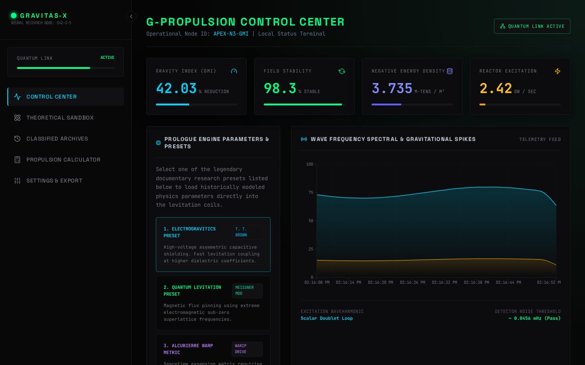
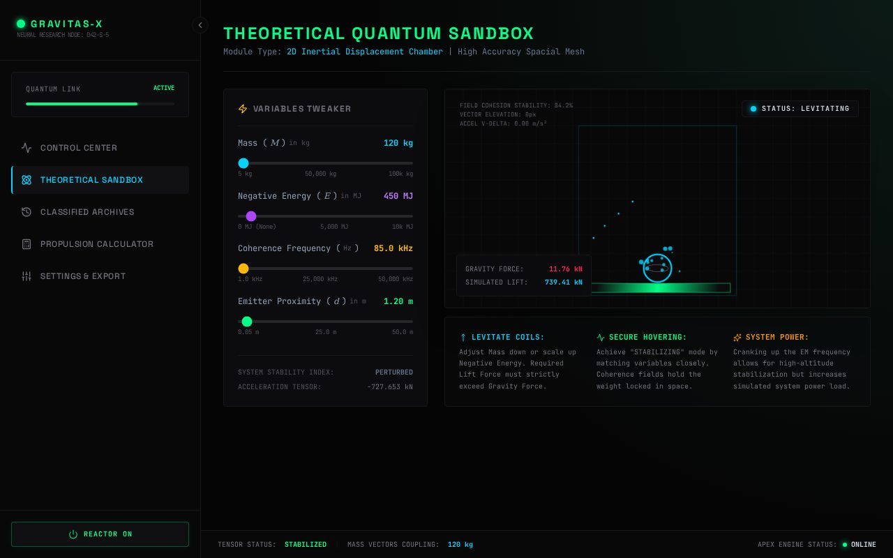
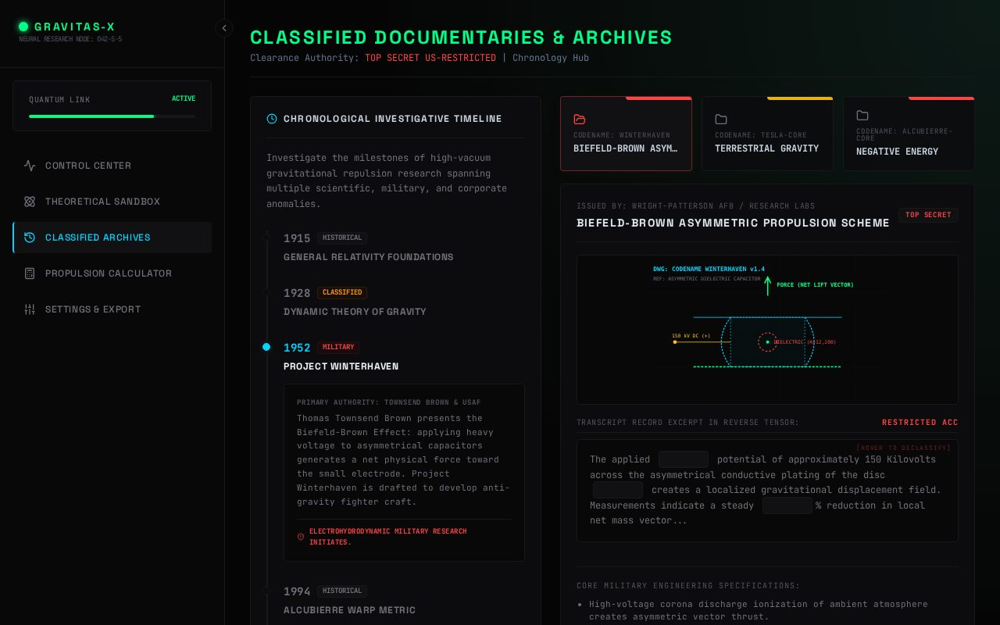
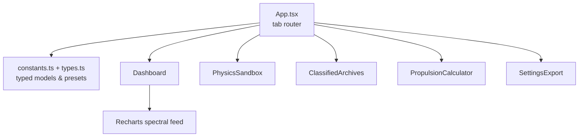

# 🛸 antigravity-ts — Antigravity Research Platform (TypeScript)

The TypeScript edition of the antigravity research simulator: a mission-control
dashboard (**GRAVITAS-X** node) with live telemetry, a theoretical physics
sandbox, classified documentary archives and a propulsion calculator.
Pure client-side React + Vite SPA — no backend, no keys needed.
Live demo (after Pages activation): https://imxforever.github.io/antigravity-ts/


> Sibling repo: [`antigravity-lab`](https://github.com/ImXforever/antigravity-lab)
> — the JavaScript edition with a different visual theme.

## 📸 Screenshots



*Control Center — GMI/stability/density/excitation gauges, engine presets, spectral chart*



*Theoretical Sandbox — interactive physics simulator*



*Classified Archives — documentaries & blueprint browser*

## ✨ Features

| Tab | What it does |
|---|---|
| 🛰️ Control Center | Live gauges (GMI, stability, density, excitation), legendary engine presets (Electrogravitics, Quantum Levitation, Alcubierre…), wave-frequency spectral chart |
| ⚛️ Theoretical Sandbox | Interactive physics simulator with typed state |
| 🗄️ Classified Archives | Documentary & blueprint archive browser |
| 🧮 Propulsion Calculator | Formula console with downloadable reports |
| ⚙️ Settings & Export | Display modes + full-state JSON export |

## 🏗️ Architecture



Fully typed (`types.ts`), zero backend calls.

## 🚀 Run locally

**Prerequisites:** Node.js 20+

```bash
npm install
npm run dev        # http://localhost:3000
```

| Script | Purpose |
|---|---|
| `npm run dev` | Vite dev server |
| `npm run build` | Production build to `dist/` |
| `npm run preview` | Preview the production build |
| `npm run lint` | TypeScript check (`tsc --noEmit`) |

Static hosting ready: relative asset paths (`base: './'`) — the `dist/`
output works on GitHub Pages (project path), any domain root, or `file://`.

## 📦 Project structure

```
├── src/
│   ├── App.tsx                # tab router + layout
│   ├── constants.ts           # engine presets & static data
│   ├── types.ts               # shared TypeScript models
│   └── components/            # Sidebar, Dashboard, PhysicsSandbox,
│                              # ClassifiedArchives, PropulsionCalculator,
│                              # SettingsExport
├── docs/                      # README screenshots
└── dist/                      # production build (git-ignored)
```

## 🛠️ Tech

React 19 · Vite 6 · TypeScript 5 · Tailwind CSS 4 · Recharts ·
Lucide icons — dark green terminal theme.

## 🔧 Polish notes

- **Pruned 4 unused dependencies** (`express`, `dotenv`, `@google/genai`,
  `motion` + `@types/express`) — leftover server/AI scaffolding with zero
  imports; manifest now matches the actual pure-frontend app
- **Branding:** package renamed `react-example` → `antigravity-ts` @ `0.1.0`,
  repo renamed `3d` → `antigravity-ts`, meta description, MIT license
- **Hygiene:** added missing `.gitignore`; portable `base: './'`, verified
  the production build loads with zero failed requests
- **QA:** `tsc` clean, `vite build` clean, headless run of 3 tabs with
  **0 console/page errors and 0 HTTP errors** ✅ · no secrets ✅

## 📜 License

MIT — see [LICENSE](LICENSE). © 2026 ImXforever.
