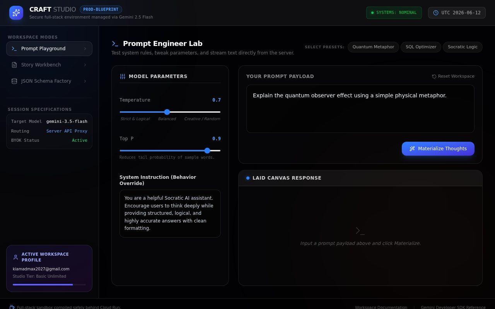
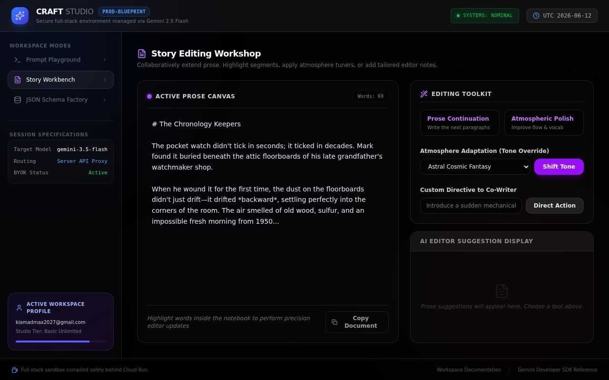
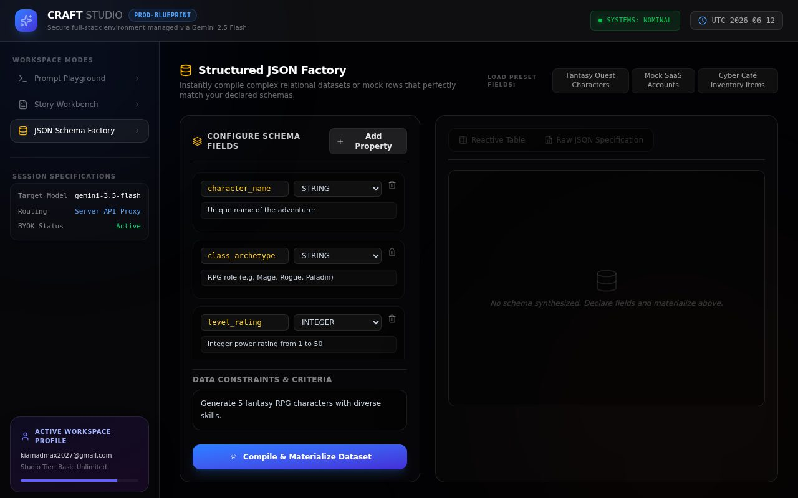
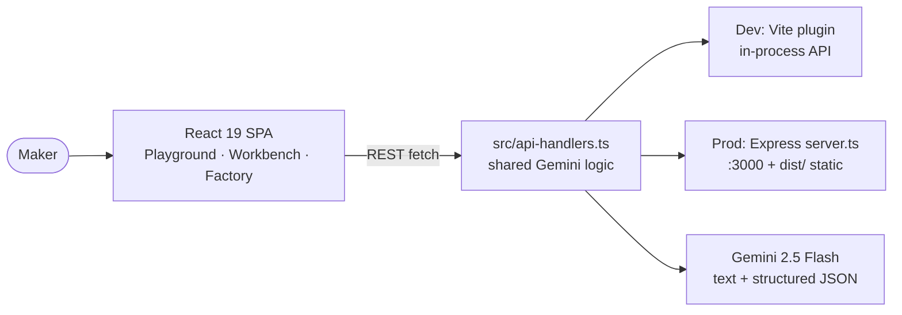

# 🛠️ craft — Craft Studio

**Craft Studio** is a full-stack Gemini playground with three workspace modes:
a **Prompt Playground** (system rules, temperature/top-P tuning, presets), a
**Story Workbench** for collaborative writing, and a **JSON Schema Factory**
that generates typed datasets (with CSV export). React 19 + Express, sharing
one server-side API-handler module between dev and prod.


## 📸 Screenshots



*Prompt Playground — model parameters, system instruction, prompt payload, response canvas*



*Story Workbench — collaborative writing surface*



*JSON Schema Factory — typed dataset generation with table/raw views + CSV export*

## ✨ Features

| Mode | What it does |
|---|---|
| 🧪 Prompt Playground | Presets (Quantum, SQL, Socratic…), temperature/top-P sliders, system-instruction override, live server generation |
| 📖 Story Workbench | Collaborative story drafting surface with AI continuation |
| 🗄️ JSON Schema Factory | Define schema fields (name/type/description) → Gemini returns typed record arrays → table/raw views + one-click CSV export |

## 🏗️ Architecture



One handler module (`handleGenerate`, `handleGenerateJson`) serves both the
Vite dev plugin and the Express production server — no logic drift.

## 🔌 API endpoints

| Method | Path | Purpose |
|---|---|---|
| POST | `/api/generate` | Text generation (`prompt`, `systemInstruction`, `temperature`, `topP`) |
| POST | `/api/generate-json` | Structured generation (`instruction`, `schemaFields[]`) → typed JSON array |

Both require `GEMINI_API_KEY`; without it the API returns a clear JSON error
(there is no mock mode — the UI shell still works for exploration).

## 🚀 Run locally

**Prerequisites:** Node.js 20+

```bash
npm install
cp .env.example .env   # add your GEMINI_API_KEY (required for generation)
npm run dev            # Vite dev server on http://localhost:3000 (API in-process)
```

| Script | Purpose |
|---|---|
| `npm run dev` | Vite dev (API served by the in-process plugin) |
| `npm run build` | Build client to `dist/` |
| `npm start` | Production Express server (`tsx server.ts`, serves `dist/`) |
| `npm run lint` | TypeScript check (`tsc --noEmit`) |

| Env var | Default | Purpose |
|---|---|---|
| `GEMINI_API_KEY` | — | **Required** for any generation |
| `PORT` | `3000` | Prod server port |

> Note: full-stack app (needs its Node server) — not hostable on static-only
> GitHub Pages; deploy `dist/` + `server.ts` on any Node host.

## 📦 Project structure

```
├── server.ts              # Prod Express server (API + dist/ static + SPA fallback)
├── src/
│   ├── App.tsx            # 3-mode workspace shell
│   ├── api-handlers.ts    # Shared Gemini handlers (dev plugin + prod server)
│   └── main.tsx / index.css
├── docs/                  # README screenshots
└── dist/                  # production build (git-ignored)
```

## 🛠️ Tech

React 19 · Vite 6 · TypeScript · Tailwind CSS 4 · Express 4 ·
`@google/genai` · Lucide icons · Motion — dark blueprint studio theme.

## 🔧 Polish notes

- **Branding:** package renamed `react-example` → `craft` @ `0.1.0`, real page
  `<title>` + meta description, MIT license
- **Hygiene:** cleaned `.env.example` (dropped unused `APP_URL` + AI-Studio-only
  comments); `.gitignore` was already correct ✅; no secrets in code or history
- **Docs:** full README with screenshots + architecture diagram
- **QA:** `tsc` clean, `vite build` clean, prod smoke test
  (`GET / → 200`, keyless `/api/generate` returns clean JSON error ✅),
  headless run of all 3 modes with **0 console/page errors** ✅

## 📜 License

MIT — see [LICENSE](LICENSE). © 2026 ImXforever.
