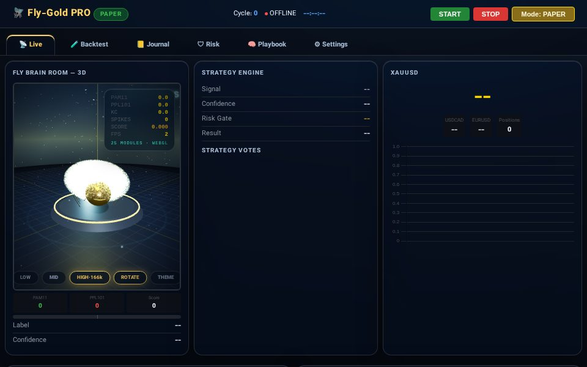
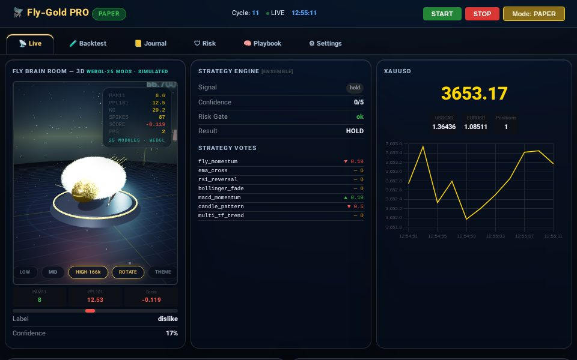
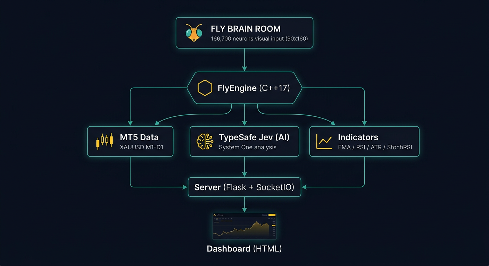

# Fly-Gold-Trader PRO

**Neural Fly Brain (166,700 neurons) + 20-Pattern Jev Playbook + 7 Strategy Ensemble + TypeSafe Jev + Prism Gate + Risk Manager + MT5/Paper**

High-frequency gold trading with a real biological neural network, multi-strategy ensemble, 20-pattern market analysis, and account-level risk management.


## Screenshots

| Dashboard (idle) | Live paper trading |
|---|---|
|  |  |

---

## Quick Start

| Platform | Command |
|----------|---------|
| Windows | Double-click **`setup.bat`** |
| Linux/macOS | **`./setup.sh`** |
| Any OS | `python install.py --run` |

Then open **http://127.0.0.1:5000**

---

## What's Inside

### Core Engine
| Module | Purpose |
|--------|---------|
| `src/server.py` | Flask+SocketIO server, trading loop, 16 API endpoints |
| `src/config.py` | Typed, validated config with runtime updates |
| `src/indicators.py` | 14 indicators: EMA, RSI, ATR, MACD, Bollinger, CCI, Williams %R, OBV, StochRSI, pivots, momentum, volume, candle patterns |
| `src/strategies.py` | 7 strategies + weighted ensemble voting |
| `src/risk_manager.py` | Daily loss cap, max drawdown, cooldown, session & spread filters |
| `src/backtest.py` | Candle-accurate backtester with intra-bar TP/SL/trailing + parameter sweep |
| `src/journal.py` | Persistent SQLite trade journal + equity curve |
| `src/notifications.py` | Webhook / Telegram alerts |
| `src/mt5_trader.py` | MetaTrader 5 interface with built-in SimBroker for paper trading |
| `src/fly_brain.py` | 166,700-neuron fly connectome processing + deterministic fallback |

### Playbook (20 Patterns)
| Pattern | Name | Purpose |
|---------|------|---------|
| P01 | Ultrafast | Latency-tiered decision path |
| P02 | Compaction | Prune low-info indicators |
| P03 | JSON Render | Generative UI widget specs |
| P04 | MCP Bridge | Tool descriptors for AI agents |
| P05 | Toolkit | 5 judgments per cycle |
| P06 | SemDecide | Semantic classify/score/filter |
| P07 | Router | Market difficulty to strategy tier |
| P08 | Winnow | Context garbage collection |
| P09 | Review | Pre-trade order triage |
| P10 | Blink | Timeframe relevance ranking |
| P11 | Autopilot | Account tree to next best action |
| P12 | Arcade | Micro market game simulation |
| P13 | Drone | Layered control safety audit |
| P14 | TickBench | Decision-tick latency benchmark |
| P15 | Market Maker | Spread+flow quote generation |
| P16 | Prism | Market-quality entry gate (LIVE) |
| P17 | Neo4Graph | Knowledge-graph regime walk |
| P18 | Curate | Journal trade quality tagging |
| P19 | Canny | Loop health watchdog |
| P20 | KillFixShip | Strategy KILL/FIX/SHIP verdict |

### Dashboard (6 Tabs)
1. **Live** - Real-time price, 3D fly brain room, trading signals
2. **Backtest** - Strategy testing with metrics
3. **Journal** - Trade history with equity curve
4. **Risk** - Account risk metrics and blocks
5. **Playbook** - 20-pattern market analysis
6. **Settings** - All config editable from UI

---

## Deployment

### Local (Recommended)
```bash
# Windows
setup.bat

# Linux/macOS
./setup.sh

# Any OS
python install.py --run
```

### Railway
1. Fork this repo on GitHub
2. Go to [railway.app](https://railway.app)
3. Click "New Project" > "Deploy from GitHub"
4. Select your fork
5. Add environment variables in Settings:
   - `TRADE_MODE=paper` (or `live`)
   - `TYPESAFE_API_KEY=your_key`
   - `PORT=5000`
6. Railway auto-deploys on push

### Netlify (Dashboard only)
1. Fork this repo
2. Go to [app.netlify.com](https://app.netlify.com)
3. "Add new site" > "Import from GitHub"
4. Build settings:
   - Build command: `echo "static site"`
   - Publish directory: `.`
5. The dashboard HTML can be served statically

### GitHub Pages
1. Push to `main` branch
2. Go to repo Settings > Pages
3. Source: Deploy from branch `main`, folder `/ (root)`
4. Your site will be at `https://username.github.io/fly-gold-trader/`

---

## API Endpoints

| Endpoint | Method | Description |
|----------|--------|-------------|
| `/` | GET | Dashboard |
| `/api/state` | GET | Full trading state |
| `/api/start` | GET | Start trading loop |
| `/api/stop` | GET | Stop trading loop |
| `/api/mode` | GET/POST | Toggle paper/live mode |
| `/api/config` | GET/POST | Read/update config at runtime |
| `/api/config` | POST | Update config values |
| `/api/strategies` | GET | List strategies and weights |
| `/api/risk` | GET | Risk manager stats |
| `/api/journal` | GET | Trade journal |
| `/api/backtest` | POST | Run backtest |
| `/api/sweep` | GET | TP/SL parameter sweep |
| `/api/notify` | POST | Send test notification |
| `/api/playbook` | GET | 20-pattern analysis |

---

## Configuration

All settings can be changed from the **Settings tab** in the dashboard or via environment variables:

| Variable | Default | Description |
|----------|---------|-------------|
| `TRADE_MODE` | `paper` | `paper` (simulator) or `live` (real MT5) |
| `STRATEGY` | `ensemble` | Strategy to use |
| `BASE_VOLUME` | `0.01` | Trade volume |
| `MAX_POSITIONS` | `5` | Maximum simultaneous positions |
| `TP_USD` | `8.0` | Take profit in USD |
| `SL_USD` | `4.0` | Stop loss in USD |
| `TRAIL_USD` | `3.0` | Trailing stop in USD |
| `LOOP_DELAY` | `2` | Seconds between cycles |
| `RISK_PCT` | `0.5` | Risk percentage per trade |
| `MAX_DAILY_LOSS_USD` | `60` | Daily loss cap |
| `MAX_DRAWDOWN_PCT` | `10` | Max drawdown percentage |
| `COOLDOWN_AFTER_LOSSES` | `3` | Cooldown after N losses |
| `COOLDOWN_SEC` | `300` | Cooldown duration in seconds |

---

## CLI

```bash
python src/cli.py serve              # Start server
python src/cli.py backtest           # Run backtest
python src/cli.py sweep              # TP/SL parameter sweep
python src/cli.py journal            # Show trade journal
python src/cli.py stats              # Show statistics
python src/cli.py config             # Show config
python src/cli.py test               # Run unit tests
```

---

## Architecture

```
Fly Brain (166,700 neurons)     MT5 Live/Paper Data
         |                              |
    [price_to_image]            [get_multi_tf_data]
         |                              |
    [FlyEngine]              [14 Indicators + 7 Strategies]
         |                              |
    [PAM11/PPL101 signals]      [Ensemble voting]
         |                              |
         +--------> [Prism Gate] <------+
                        |
                  [Risk Manager]
                        |
                  [Execution]
```



---

## Requirements

- Python 3.9+
- MetaTrader 5 (Windows, optional - paper mode works everywhere)
- TypeSafe API key (optional - ensemble strategies work without it)

---

## License

MIT License

---

## Credits

- [Fly Wirehead](https://github.com/mattyhempstead/fly-wirehead) - Neural fly brain simulation
- [TypeSafe](https://typesafe.ai) - AI analysis engine
- [MetaTrader 5](https://www.metatrader5.com) - Trading platform
- [MaleCNS v1.0](https://neuprint.janelia.org) - Fly connectome dataset
