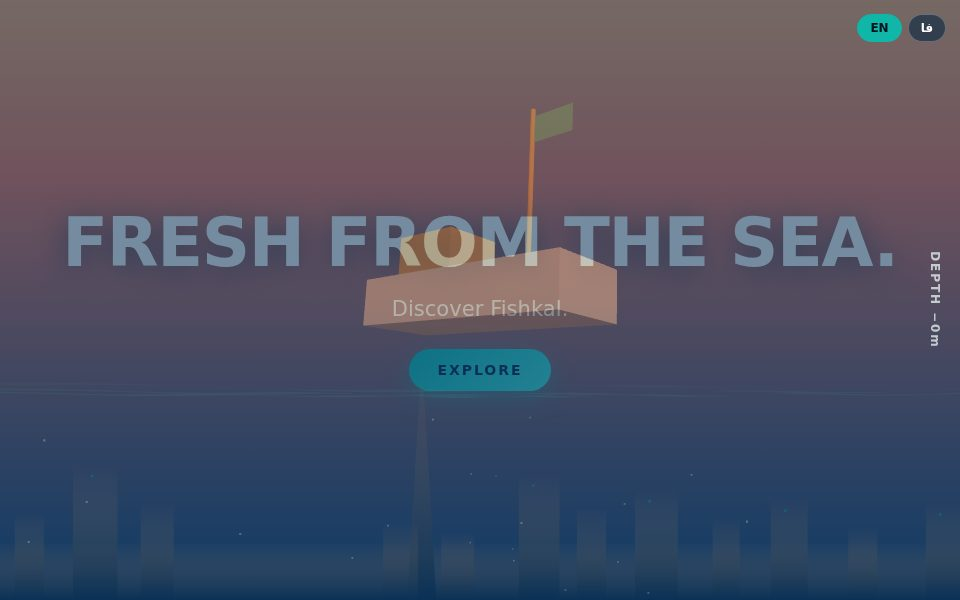
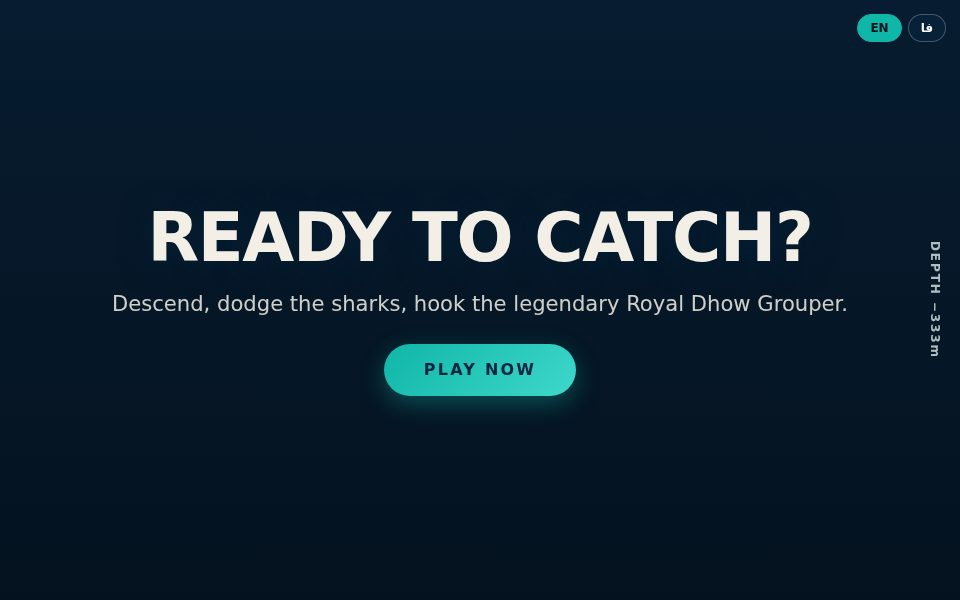
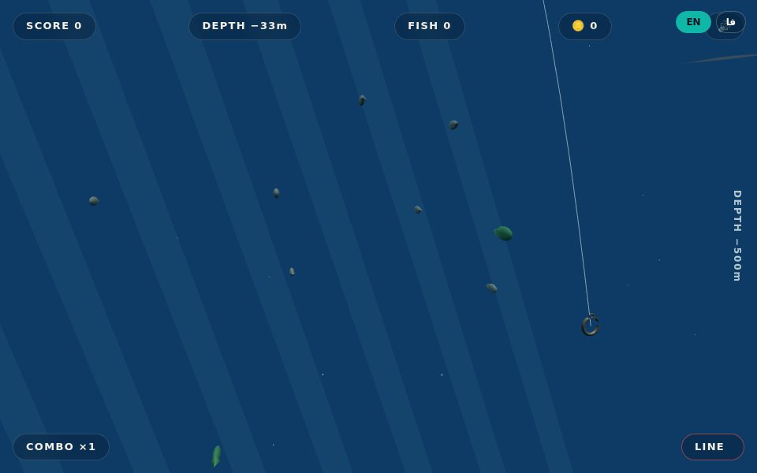

# 🐟 FISHKAL

**Premium Digital Seafood Experience — Dubai / UAE**

One ecosystem: cinematic website ↔ **FISHKAL: DEEP CATCH** (3D fishing game) ↔
Telegram (Mini App + Bot) ↔ seafood shop ↔ rewards ↔ leaderboard ↔ analytics.

> Full build directive: `All_260911_050538.txt` · Architecture: `docs/ARCHITECTURE.md`
> Game design: `docs/GAME_DESIGN.md` · Status: `docs/BUILD_STATE.md` · Roadmap to 100%: `docs/ROADMAP.md`

## Screenshots

| Cinematic site | Ready to catch | Live gameplay |
|---|---|---|
|  |  |  |

## Quickstart

```bash
# 1. Install
pnpm install

# 2. Start Postgres + Redis
docker compose up -d

# 3. Configure
cp .env.example .env        # edit values as needed

# 4. Database (needs Docker running)
pnpm db:migrate             # prisma migrate dev
pnpm db:seed                # fish catalog + game config

# 5. Run everything (website :3000, api :4000, mini-app :3001)
pnpm dev

# Or individually
pnpm dev:website
pnpm dev:api
```

The game is playable immediately at `http://localhost:3000` → scroll to
**READY TO CATCH?** → **PLAY NOW**. Without Postgres the API uses an
in-memory store (logged); scores persist once Docker is up.

## Controls

| Action | Mobile | Desktop |
|---|---|---|
| Steer hook | drag / swipe | mouse move · A/D · ←/→ |
| Reel (while hooked) | hold touch | hold mouse button |

## Monorepo

```
apps/website      cinematic site + web game (Next.js 15)
apps/mini-app     Telegram Mini App (Next.js 15, port 3001)
apps/api          Fastify API — server-authoritative runs (port 4000)
apps/bot          Telegram bot (grammY) — enable with TELEGRAM_BOT_TOKEN
packages/         game-core · game-renderer · design-system · api-client
                  validation · config · database · shared
```

## Verification

```bash
pnpm typecheck   # all workspaces
pnpm test        # Vitest (game-core engine suite)
pnpm build       # turbo build
```

## Guardrails honored (from the spec)

- No invented business data (prices/delivery/payment — §42, §104)
- No fake production assets; procedural placeholders tracked in `assets/README.md` (§103)
- Server validates every reward; client score is never trusted (§58–60)
- Score and credits are separate currencies end-to-end (§21)
