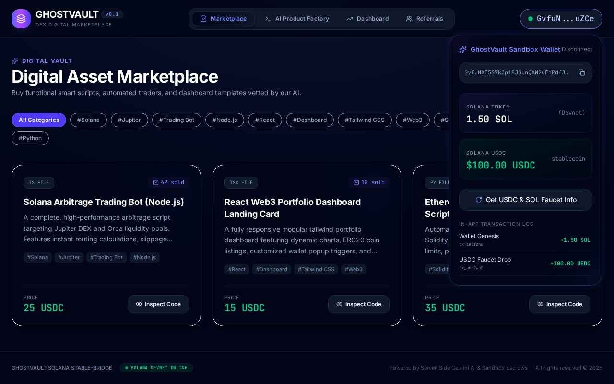
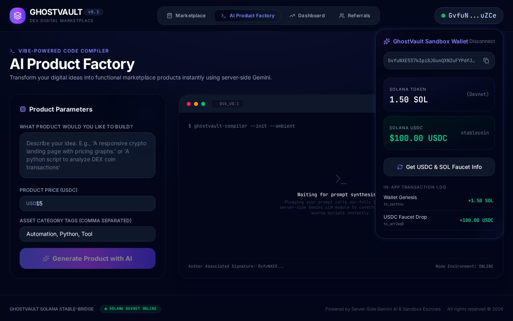
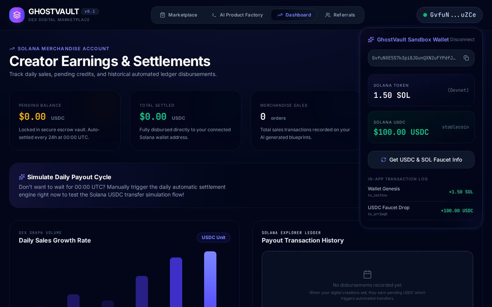
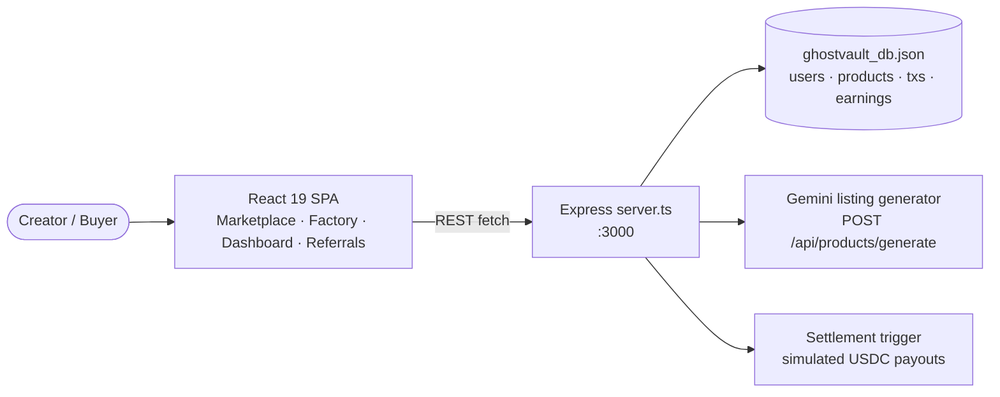

# 👻 ghost — GhostVault Marketplace v0.1

**GhostVault** is an AI-powered digital-products marketplace: creators list code
templates, trading bots and dashboards; buyers purchase them with (simulated)
USDC; sellers get (simulated) Solana settlements, and referrers earn rewards.
React 19 + Express + Gemini, with a zero-setup JSON-file database.


## 📸 Screenshots



*Marketplace — category filters, product cards with USDC prices, sandbox wallet*



*AI Product Factory — Gemini generates the listing (title, description, tags, file)*



*Seller dashboard — sales, earnings and settlement status*

## ✨ Features

| Area | What it does |
|---|---|
| 🛍️ Marketplace | Browse seeded digital products, filter by tag, inspect code, buy with USDC |
| 🤖 AI Product Factory | Describe a product → Gemini writes title, description, tags and file content |
| 📊 Dashboard | Seller view: sales count, gross/net earnings, settlement history |
| 🤝 Referrals | Referral codes + rewards tracked per wallet |
| 👛 Sandbox wallet | One-click devnet wallet with SOL + USDC faucet balances (in-browser demo) |
| 💸 Settlements | One-click payout trigger — **simulated** Solana USDC transfers (mock signatures, no real chain) |
| 💾 Zero-setup DB | All users/products/transactions persist in `ghostvault_db.json` (git-ignored) |

## 🏗️ Architecture



## 🔌 API endpoints

| Method | Path | Purpose |
|---|---|---|
| POST | `/api/auth/login` | Wallet login — creates a user + referral code from a Solana address |
| GET | `/api/products` | List products (seeded with 3 demo listings on first run) |
| POST | `/api/transactions/buy` | Buy a product (fee split, mock tx signature) |
| GET | `/api/earnings/:solanaAddress` | Seller earnings + settlement records |
| POST | `/api/settlement/trigger` | Settle all outstanding balances (simulated) |
| POST | `/api/products/generate` | Gemini-generated product listing (needs `GEMINI_API_KEY`) |

## 🚀 Run locally

**Prerequisites:** Node.js 20+

```bash
npm install
cp .env.example .env   # add GEMINI_API_KEY to enable the AI Product Factory
npm run dev            # full-stack dev server on http://localhost:3000
```

| Script | Purpose |
|---|---|
| `npm run dev` | Dev server (Express + Vite middleware via `tsx`) |
| `npm run build` | Build client to `dist/` + bundle server to `dist/server.cjs` |
| `npm start` | Run production build (`NODE_ENV=production`) |
| `npm run lint` | TypeScript check (`tsc --noEmit`) |
| `npm run clean` | Remove `dist/` and the local DB |

| Env var | Default | Purpose |
|---|---|---|
| `GEMINI_API_KEY` | — | Enables AI listing generation; everything else works without it |
| `PORT` | `3000` | Server port |
| `NODE_ENV` | — | `production` serves `dist/` statically |

> Note: this is a full-stack app (it needs its Node server + JSON DB), so it
> can't be hosted on static-only GitHub Pages — deploy on any Node host.

## 📦 Project structure

```
├── server.ts              # Express API + JSON-file DB + settlement sim + Gemini
├── src/
│   ├── App.tsx            # 4-tab shell + wallet state
│   ├── components/        # Marketplace, CreatorTerminal, Dashboard,
│   │                      # ReferralHub, WalletWidget
│   └── types.ts           # Product/User/Transaction types
├── docs/                  # README screenshots
├── ghostvault_db.json     # runtime database (git-ignored, auto-created)
└── dist/                  # production build (git-ignored)
```

## 🛠️ Tech

React 19 · Vite 6 · TypeScript · Tailwind CSS 4 · Express 4 ·
`@google/genai` · Lucide icons · Motion — dark violet Solana-style theme.

## 🔧 Polish notes

- **Fixed production crash:** same ESM-`import.meta`-in-CJS bug as GQR-v3 —
  `npm start` died on boot; removed the unused lines, smoke-tested prod
  (`GET / → 200`, seeded products API ✅)
- **Hygiene:** added missing `.gitignore` (`node_modules`, `dist`,
  `ghostvault_db.json`, `.env*`) + `.env.example`; `PORT` is env-configurable
- **Branding:** package renamed `react-example` → `ghost` @ `0.1.0`, real page
  `<title>` + meta, MIT license, full README with screenshots + diagram
- **QA:** `tsc` clean, `vite build` clean, headless run of 3 tabs with
  **0 console/page errors** ✅ · no secrets in code or history ✅

## 📜 License

MIT — see [LICENSE](LICENSE). © 2026 ImXforever.
