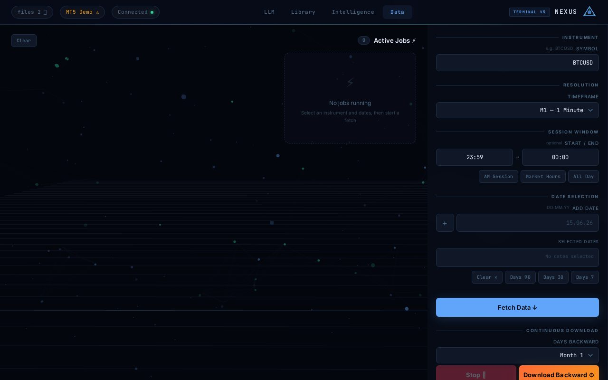
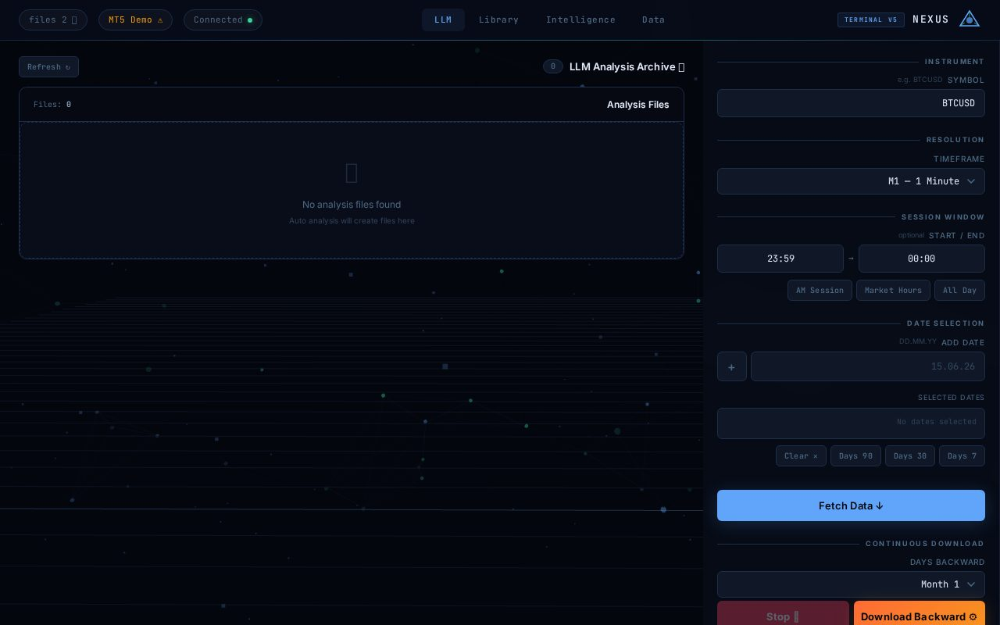

# 📈 MT5 Raw Data Fetcher — Nexus Terminal

> **English summary:** A FastAPI + PWA dashboard for downloading raw MetaTrader 5
> market data (per symbol / timeframe / date) for RL trading-agent training.
> Works in demo mode with synthetic data when MT5 is unavailable, and can
> auto-analyze fresh data with an LLM via OpenRouter. Full-stack app — needs
> its Python server (not static-hostable).

ابزار دانلود داده خام از MetaTrader 5 برای پروژه RL Trading Agent — با داشبورد
تحت وب (Nexus Terminal)، حالت دمو بدون MT5، و تحلیل خودکار LLM.

## 📸 نماها



*تب Data — انتخاب نماد، تایم‌فریم، ساعات سشن و تاریخ‌ها + دانلود*



*تب LLM — تحلیل‌های خودکار ذخیره‌شده*

## ✨ امکانات

| تب | کار |
|---|---|
| 📥 Data | دانلود تکی/مداوم داده (نماد + تایم‌فریم + بازه ساعتی + تاریخ‌ها)، صف jobها |
| 🧠 Intelligence | نمودار و آمار داده‌های دانلودشده |
| 📚 Library | مرور و حذف فایل‌های CSV (`data/`) |
| 🤖 LLM | تحلیل خودکار داده تازه با OpenRouter + آرشیو تحلیل‌ها (`data/llm/`) |

- حالت **دمو**: بدون MT5 داده مصنوعی واقع‌نما تولید می‌کند (روی لینوکس/مک هم کار می‌کند)
- **PWA**: مانیفست + سرویس‌ورکر با کش آفلاین، قابل نصب
- کلید OpenRouter از داخل UI داده می‌شود و جایی ذخیره نمی‌شود

## 🚀 نصب و راه‌اندازی

### ۱. پیش‌نیازها
- Python 3.10+
- (اختیاری، فقط ویندوز) MetaTrader 5 نصب، باز و لاگین‌شده

### ۲. نصب و اجرا

```bash
pip install -r requirements.txt
python server.py
# → http://localhost:8000
```

> پکیج `MetaTrader5` فقط روی ویندوز نصب می‌شود؛ روی سیستم‌های دیگر سرور
> خودکار در حالت دمو بالا می‌آید.

## 📁 ساختار فایل‌های خروجی

```
data/
└── XAUUSD!/
    └── M1/
        ├── 14.06.26.csv   ← داده ۱۴ ژوئن ۲۰۲۶
        ├── 15.06.26.csv
        └── ...
└── llm/
    └── XAUUSD!/
        └── M1/
            └── analysis_YYYYMMDD_HHMMSS.txt
```

هر CSV شامل ستون‌های `time, open, high, low, close, volume` است.

## 🐍 استفاده در Python (برای training)

```python
import pandas as pd
from pathlib import Path

def load_symbol_data(symbol: str, timeframe: str, dates: list[str]) -> pd.DataFrame:
    dfs = []
    for date in dates:
        path = Path(f"data/{symbol}/{timeframe}/{date}.csv")
        if path.exists():
            df = pd.read_csv(path, parse_dates=['time'])
            dfs.append(df)
    return pd.concat(dfs).sort_values('time').reset_index(drop=True)

# مثال
df = load_symbol_data("XAUUSD!", "M1", ["14.06.26", "15.06.26"])
print(df.shape)
```

## 🔌 API

| Method | Path | کار |
|---|---|---|
| GET | `/api/status` | وضعیت سرور + در دسترس بودن MT5 |
| POST | `/api/fetch` | دانلود یک تاریخ |
| POST | `/api/fetch_continuous` | دانلود مداوم (N روز به عقب) |
| POST | `/api/stop_continuous` | توقف دانلود مداوم |
| POST | `/api/auto_download` | دانلود خودکار + تحلیل دوره‌ای |
| POST | `/api/stop_auto_download` | توقف حالت خودکار |
| GET | `/api/job_status/{key}` | وضعیت یک job |
| GET | `/api/auto_download_status/{symbol}` | وضعیت دانلود خودکار نماد |
| GET | `/api/jobs` | همه jobها |
| GET | `/api/files` | فهرست CSVها |
| GET | `/api/llm_files/{symbol}` | فهرست تحلیل‌ها |
| DELETE | `/api/files/{symbol}/{timeframe}/{date}` | حذف یک CSV |
| POST | `/api/data` | خواندن کندل‌ها (یا مصنوعی اگر فایل نباشد) |

## 🛠️ فناوری

FastAPI · Uvicorn · MetaTrader5 (اختیاری) · OpenRouter · Vanilla JS + Three.js
پس‌زمینه سه‌بعدی · PWA (manifest + service worker).

## 🔧 پولیش فنی

- **تعمیر سرو فرانت‌اند:** فایل‌های وب در ریشه ریپو بودند ولی سرور دنبال پوشه
  `static/` می‌گشت — `http://localhost:8000/` همیشه 404 می‌داد. حالا ۶ فایل
  در `static/` هستند (با `git mv`) و صفحه اصلی ۲۰۰ می‌دهد ✅
- **تعمیر PWA:** آدرس آیکون‌ها در مانیفست، سرویس‌ورکر و HTML اشتباه بود
  (`/icons/…` ناموجود) — چون `cache.addAll` با یک 404 کلاً می‌شکند، آفلاین‌کش
  هیچ‌وقت نصب نمی‌شد. مسیرها اصلاح و نصب SW تأیید شد ✅
- **وابستگی گمشده:** `requests` در کد استفاده ولی در requirements نبود —
  نصب تازه روی لینوکس با ImportError می‌مرد. اضافه شد ✅
- **مقاومت در برابر قطعی CDN:** اگر three.js لود نشود، کل جاوااسکریپت صفحه
  می‌مرد — حالا پس‌زمینه سه‌بعدی با یک guard رد می‌شود
- **مستندات:** مسیرهای `data/` در README و اسنیپت training اشتباه بود
  (سطح تایم‌فریم جا افتاده بود) — اصلاح شد + اسکرین‌شات و جدول API
- **QA:** smoke test سرور + اجرای headless دو تب با **۰ خطا** ✅

## 📜 مجوز

MIT — فایل [LICENSE](LICENSE). © 2026 ImXforever.
