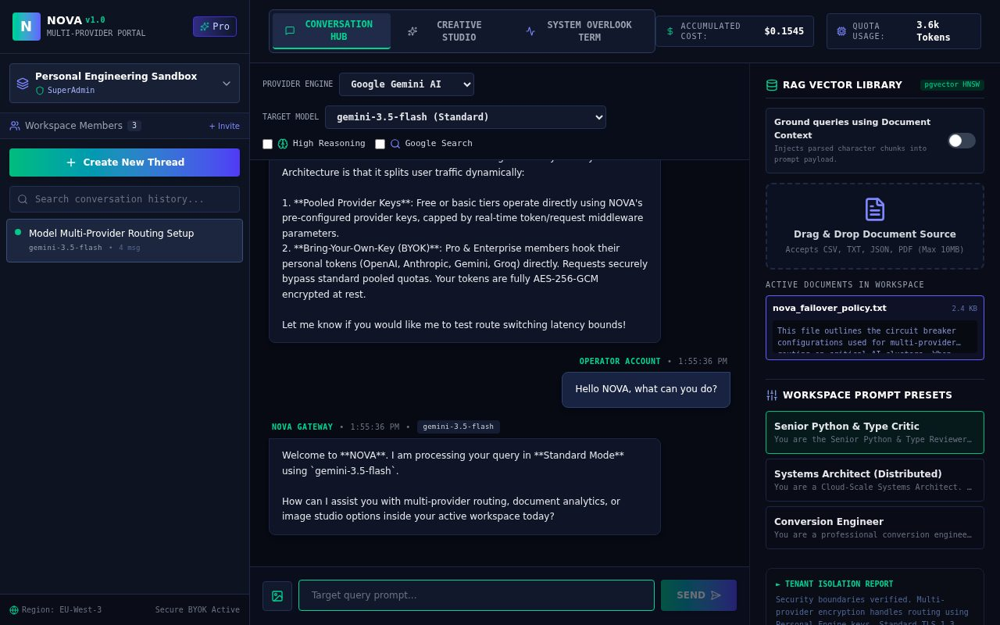
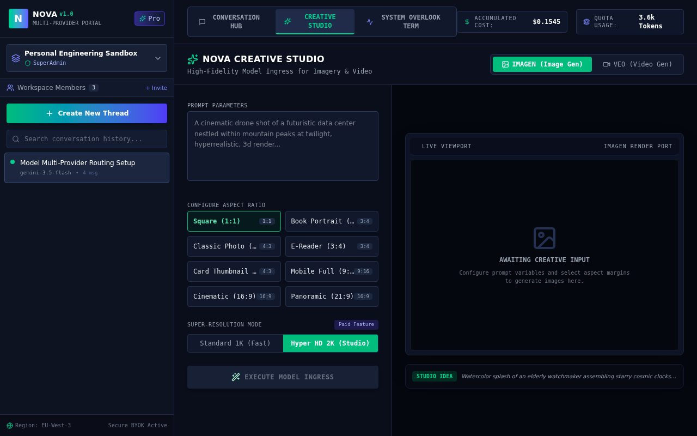
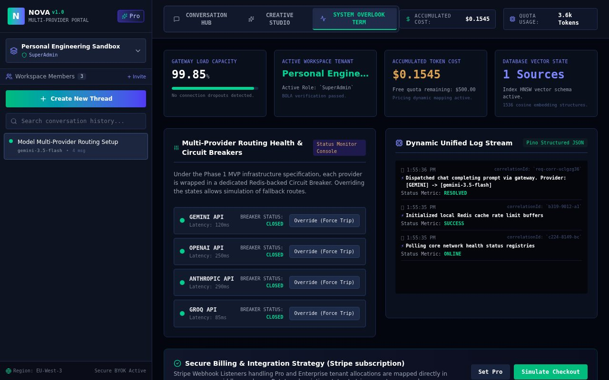
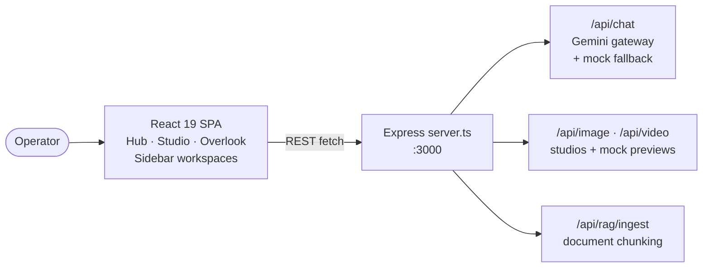

# ⚡ nova — NOVA Multi-Provider AI Platform v1.0

**NOVA** is a multi-provider AI chat portal: secure workspaces with roles,
provider/model routing (Gemini, OpenAI, Anthropic, Groq), RAG document grounding,
thinking modes, and image/video creative studios. React 19 + Express, with
graceful **mock modes** so the whole UI is demoable without any API key.


## 📸 Screenshots



*Conversation Hub — provider/model pickers, RAG panel, prompt presets, live mock reply*



*Creative Studio — image & video generation (mock previews without a key)*



*System Overlook Term — provider health, cost and quota monitors*

## ✨ Features

| Area | What it does |
|---|---|
| 💬 Conversation Hub | Multi-turn chat with provider engine + target-model pickers, thinking mode, search grounding |
| 🗂️ Workspaces | Personal/team/enterprise workspaces with roles (SuperAdmin → Guest), members, threads |
| 📚 RAG Vector Library | Drag-&-drop docs (CSV/TXT/JSON/PDF) to ground queries with parsed chunks |
| 🎨 Creative Studio | Image + video generation panels (mock previews when unconfigured) |
| 🖥️ System Overlook | Provider health board, accumulated-cost and quota meters |
| 🔑 BYOK-ready design | Bring-your-own-key routing UI for OpenAI/Anthropic/Gemini/Groq |

> **Implementation note (read before deploying):** the client is fully
> multi-provider, but the server gateway currently implements **Gemini only**
> (`OPENAI`/`ANTHROPIC`/`GROQ` keys are not consumed yet), provider health is
> static demo data, and video generation is force-simulated. Without
> `GEMINI_API_KEY` the server falls back to high-quality **mock responses**,
> so every screen works out of the box for demos.

## 🏗️ Architecture



## 🔌 API endpoints

| Method | Path | Purpose |
|---|---|---|
| GET | `/api/health` | Status + (demo) provider health board |
| POST | `/api/chat` | Chat completion (`model`, `messages`, `thinkingMode`, `searchGrounding`, `systemPrompt`) — mock reply without a key |
| POST | `/api/image/generate` | Image studio (`prompt`, `aspectRatio`) — mock preview without a key |
| POST | `/api/video/generate` | Video studio — currently simulated |
| POST | `/api/rag/ingest` | Ingest a document for grounded queries |

## 🚀 Run locally

**Prerequisites:** Node.js 20+

```bash
npm install
cp .env.example .env   # add GEMINI_API_KEY for live answers (optional — mocks work without)
npm run dev            # full-stack dev server on http://localhost:3000
```

| Script | Purpose |
|---|---|
| `npm run dev` | Dev server (Express + Vite middleware via `tsx`) |
| `npm run build` | Build client to `dist/` + bundle server to `dist/server.cjs` |
| `npm run start` | Run production build (`NODE_ENV=production`) |
| `npm run lint` | TypeScript check (`tsc --noEmit`) |

| Env var | Default | Purpose |
|---|---|---|
| `GEMINI_API_KEY` | — | Live Gemini answers; mock mode without it |
| `PORT` | `3000` | Server port |
| `NODE_ENV` | — | `production` serves `dist/` statically |

> Note: full-stack app (needs its Node server) — not hostable on static-only
> GitHub Pages; deploy the production build on any Node host.

## 📦 Project structure

```
├── server.ts              # Express API: chat gateway + studios + RAG + mocks
├── src/
│   ├── App.tsx            # 3-tab shell (hub / studio / overlook)
│   ├── components/        # AIStudio, WorkspaceSidebar
│   └── types.ts           # Provider/Role/Message/Workspace models
├── docs/                  # README screenshots
└── dist/                  # production build (git-ignored)
```

## 🛠️ Tech

React 19 · Vite 6 · TypeScript · Tailwind CSS 4 · Express 4 ·
`@google/genai` · Lucide icons · Motion — dark navy + emerald terminal theme.

## 🔧 Polish notes

- **Branding:** package renamed `react-example` → `nova` @ `1.0.0` (matches the
  in-app `v1.0` badge), page `<title>` + meta description, MIT license
- **Hygiene:** added missing `.gitignore` + `.env.example`; `PORT` is
  env-configurable; no secrets in code or history
- **Docs:** full README with screenshots + architecture diagram, including an
  honest implementation-status note (Gemini-only gateway, demo health board)
- **QA:** `tsc` clean, `vite build` clean, prod smoke test
  (`GET / → 200`, `/api/health`, live mock-chat round-trip ✅), headless run
  of all 3 tabs with **0 console/page errors** ✅

## 📜 License

MIT — see [LICENSE](LICENSE). © 2026 ImXforever.
