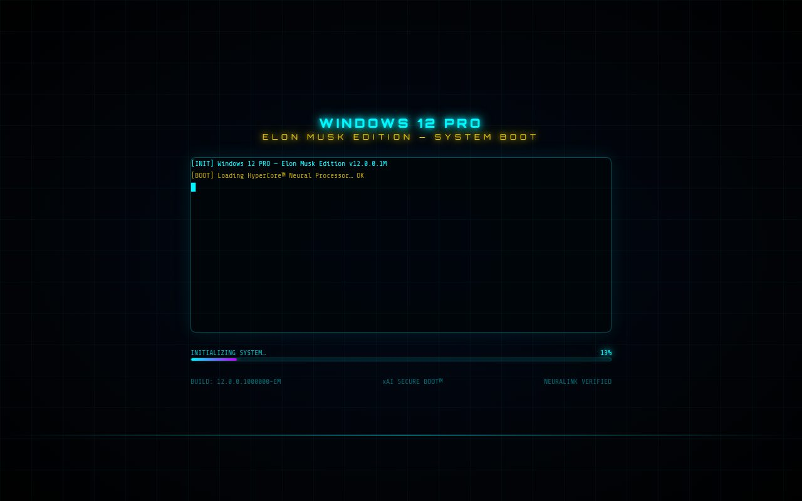
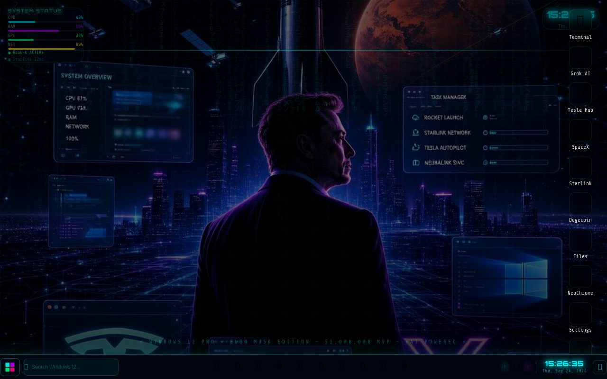
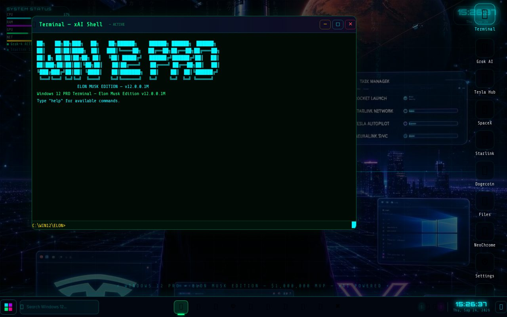

# Windows 12 PRO — Elon Musk Edition

A fictional **web-based desktop OS** parody: animated secure-boot sequence, neon
Elon-themed desktop with live HUD widgets, draggable windows, start menu, taskbar
and 9 built-in apps — all compiled to a **single self-contained HTML file** (no server needed).



## ✨ Features

- **BootScreen** — staged xAI secure-boot with terminal log + progress bar
- **Desktop** — live system-status HUD, task-manager widget, notifications, context menu
- **Windowing** — drag, minimize, focus, taskbar with clock + search
- **Start menu & Matrix rain** background effect



### Built-in apps

| App | Description |
|---|---|
| Terminal — xAI Shell | Fake shell with ASCII banner + `help` commands |
| Grok AI | xAI neural assistant window |
| Tesla Hub / SpaceX / Starlink | Themed company dashboards |
| Dogecoin | Wallet node gag |
| Files / NeoChrome / Settings | Explorer, browser and OS settings parodies |



## 🚀 Run locally

**Prerequisites:** Node.js 20+

```bash
npm install
npm run dev      # dev server with HMR
npm run build    # → dist/index.html (single file, ~560KB, works from file:// too)
```

No backend, no API keys, no environment — pure frontend.

### Deploy anywhere

`dist/index.html` is fully self-contained (JS, CSS, wallpaper and fonts inlined),
so it works on GitHub Pages, any static host, or straight from disk.

## 🛠 Tech stack

React 19 · TypeScript · Vite 7 · TailwindCSS 4 · `vite-plugin-singlefile`

## 🐛 Bug fixed in this polish

The boot animation crashed 100% of the time on React 18+: the line-pushing effect
read `bootMessages[idx]` **inside** the state updater, which React executes
asynchronously — after the synchronous `idx++`. Every line was shifted by one and the
final push was `undefined`, crashing the render. Fix: capture the line in a local
*before* calling `setLines`.

## 📄 License

MIT — see [LICENSE](LICENSE).
