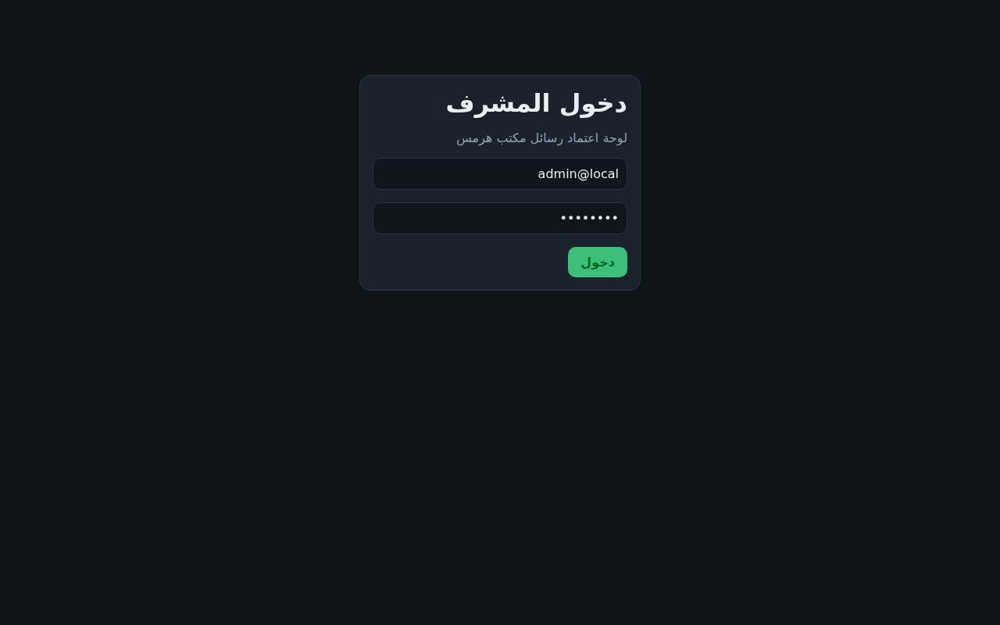
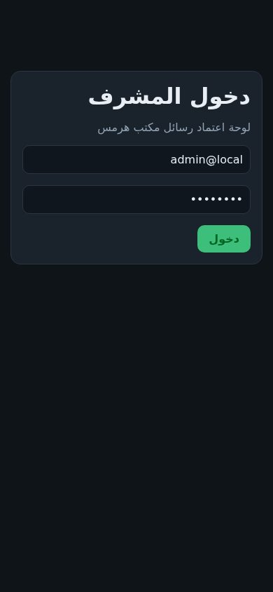

# مكتب هرمس / Hermes Desk — MVP

منصة خدمة عملاء ومبيعات متعددة القنوات لشركات النفط والتزييت في الشرق الأوسط.  
العميل يكتب بالعربية على تيليغرام / واتساب / البريد. هرمس يجهّز الرد. **لا يُرسل شيء قبل موافقة المشرف.**

هذا المستودع هو تنفيذ الـ MVP الكامل حسب `docs/MVP-TECHNICAL-SPEC.md`.

## ماذا يشتمل عليه (مكتمل)

- قنوات: Telegram webhook، WhatsApp (Meta Cloud API أو Twilio)، Email (Resend/SendGrid)
- HITL: لوحة ويب RTL + Telegram Mini App (نفس الواجهة)
- دماغ: خدمة Hermes داخلية OpenAI-compatible مع ٥ مهارات نفطية + `base_url` قابل للتبديل
- Redis صف arq، Postgres، R2/S3 (MinIO محلياً)، Qdrant
- أرشيف JSON + Parquet
- Docker Compose محلي، Dockerfiles لـ Railway
- اختبارات وحدة

## لقطات



*شاشة دخول المشرف (RTL) — تُبنى من `apps/admin` وتُقدَّم على `/admin`.*



*نفس الشاشة على الجوال.*

## تشغيل محلي

```bash
cd hermes-desk
cp .env.example .env
# ضع OPENAI_API_KEY إن أردت ردود نموذج حقيقي — بدون مفتاح يعمل المسار الاحتياطي
docker compose up --build
```

- الصحة: http://localhost:8080/health  
- لوحة المشرف: http://localhost:8080/admin  
- دخول افتراضي: `admin@local` / `changeme`

اختبار تيليغرام محلي (بدون بوت):

```bash
curl -X POST http://localhost:8080/webhooks/telegram \
  -H 'content-type: application/json' \
  -H 'X-Telegram-Bot-Api-Secret-Token: change-me-telegram-secret' \
  -d '{"message":{"message_id":1,"text":"ما لزوجة SAE لمحرك ديزل ثقيل في الصيف؟","from":{"id":1,"first_name":"علي"},"chat":{"id":1}}}'
```

ثم افتح اللوحة → موافقة.

## الاختبارات

```bash
pip install pydantic pydantic-settings pytest
PYTHONPATH=packages/core:apps/api:apps/worker pytest tests -q
```

## Railway

ثلاث خدمات من نفس الريبو:

| خدمة | Dockerfile | عام؟ |
|---|---|---|
| app | `apps/api/Dockerfile` | نعم — `/health` |
| worker | `apps/worker/Dockerfile` | لا |
| hermes | `apps/hermes/Dockerfile` | لا — شبكة خاصة |

أضف Postgres و Redis من Railway، وR2/S3 وQdrant خارجياً.  
`HERMES_BASE_URL=http://hermes.railway.internal:8088/v1`  
لا تضع Volume للبيانات التجارية.

سجّل ويب‌هوك تيليغرام:

```text
https://api.telegram.org/bot<TOKEN>/setWebhook
?url=https://<app>/webhooks/telegram
&secret_token=<TELEGRAM_CUSTOMER_SECRET_TOKEN>
```

Mini App للمشرف: URL = `https://<app>/admin` على بوت المشرف (بوت مختلف عن بوت العملاء).

## تبديل النموذج

```env
OPENAI_BASE_URL=https://openrouter.ai/api/v1   # أو vLLM / DeepSeek / OpenAI
OPENAI_API_KEY=...
LLM_MODEL=openai/gpt-4o
```

## العقد غير القابل للتفاوض

1. العميل لا يتحدث مع هرمس مباشرة.
2. بلا موافقة مشرف لا رد ولا عرض سعر ولا تذكرة دعم تُنفَّذ للخارج.
3. عند انتهاء ١٠ دقائق يُرسل اعتذار، **ليس** مسودة الذكاء الاصطناعي.
4. الحريق/الإصابة/التسرّب = `critical` وتصعيد فوري.

## هيكل المجلدات

انظر الشجرة في `docs/MVP-TECHNICAL-SPEC.md`. الكود الحي:

- `packages/core/hermesdesk` المجال
- `apps/api` الويب‌هوك وAPI واللوحة
- `apps/worker` صف arq
- `apps/hermes` الدماغ (مهارات النفط)
- `apps/admin` React RTL
